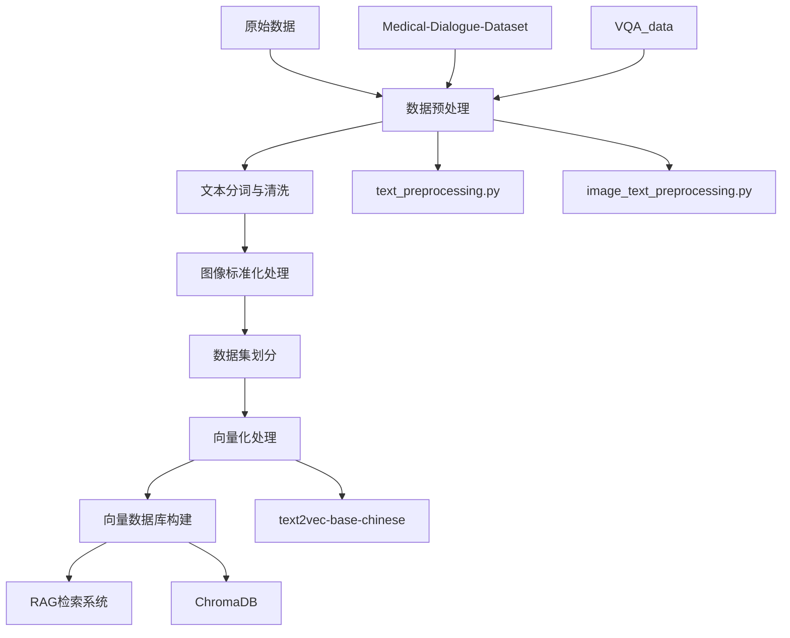
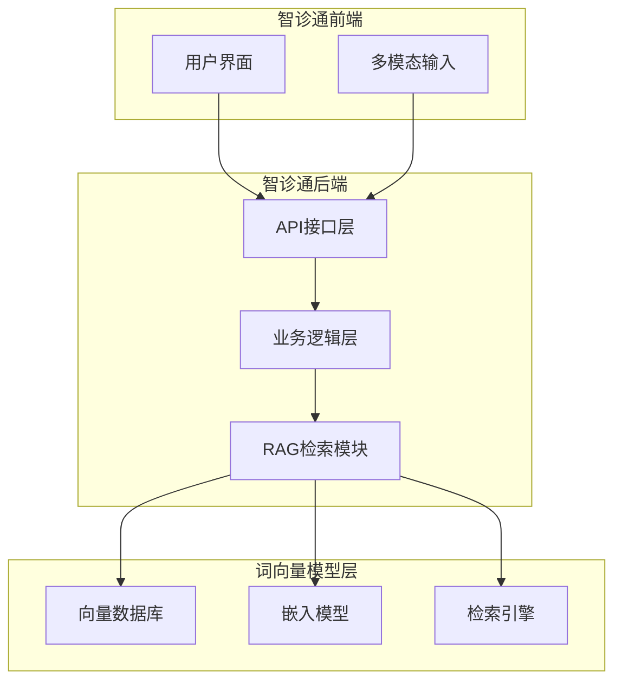

# 智诊通系统 - 词向量模型分析报告

## 1. 项目概述

本文档对智诊通系统中的词向量模型实现进行全面分析，包括文件结构、数据处理流程、模型实现逻辑以及与主系统的集成方案。

## 2. 文件夹结构分析

### 2.1 整体结构

```
embedding_models/
├── Medical-Dialogue-Dataset-Chinese/    # 中文医疗对话数据集
├── VQA_data/                            # 医学图像问答数据集
├── processed_vqa_data/                  # 数据预处理模块
├── vector_database/                     # 向量数据库构建模块
├── models/                              # 预训练模型存储
└── README.md                            # 项目说明
```

### 2.2 各文件夹详细分析

#### 2.2.1 Medical-Dialogue-Dataset-Chinese
**作用**: 存储中文医疗对话文本数据集
**内容**: 
- 2010.txt - 2020.txt: 11年的医疗对话记录
- 每个文件包含大量医患对话数据，格式化为结构化文本

**数据格式示例**:
```
id=12345
Doctor faculty
内科
疾病：感冒
病情描述：患者主诉发热、咳嗽3天...
希望获得的帮助：请医生诊断并给出治疗建议
既往病史：无特殊病史
病情摘要及初步印象：上呼吸道感染
总结建议：建议多休息，多喝水...
```

#### 2.2.2 VQA_data
**作用**: 存储医学图像问答数据集，支持多模态学习
**主要子目录**:
- `ChestX-rays/`: 胸部X光片数据集
  - `images/images_normalized/`: 7470张标准化X光片图像
  - `indiana_reports.csv`: 对应的医疗报告
- `VQA-Med-2019-master/`: 2019年医学VQA竞赛数据
- `VQA-RAD/`: 放射学VQA数据集
- `pvqa/`: 病理VQA数据集
- `pathVqaData/`: 病理学问答数据
- `COV-CTR/`: COVID-CT相关数据
- `LAVIS-main/`: 视觉语言模型框架

#### 2.2.3 processed_vqa_data
**作用**: 数据预处理核心模块
**核心文件**:
- `text_preprocessing.py`: 文本数据预处理
- `image_text_preprocessing.py`: 图像文本预处理
- `preprocess_all.py`: 统一预处理控制器
- `standalone_preprocessing.py`: 独立预处理脚本

#### 2.2.4 vector_database
**作用**: 向量数据库构建和管理
**核心文件**:
- `build_vector_database.py`: 向量数据库构建主脚本
- `run_vector_db.py`: Python运行脚本
- `download_model.py`: 模型下载脚本
- `config.json`: 配置文件
- `chroma_db/`: ChromaDB向量数据库存储

#### 2.2.5 models
**作用**: 存储预训练模型
**内容**:
- `text2vec-base-chinese/`: 中文文本向量化模型
  - 包含完整的Hugging Face模型文件
  - 支持ONNX和OpenVINO格式优化

## 3. 数据处理流程分析

### 3.1 整体数据流程



### 3.2 文本数据处理流程

#### 3.2.1 MedicalTextPreprocessor类功能
```python
class MedicalTextPreprocessor:
    def load_data()           # 加载医疗对话数据
    def parse_dialogues()     # 解析对话结构
    def clean_data()          # 数据清洗
    def text_enhancement()    # 文本增强（分词）
    def save_results()        # 保存处理结果
    def visualize_data()      # 数据可视化
```

**关键处理步骤**:
1. **数据加载**: 读取2010-2020年医疗对话文本
2. **结构化解析**: 提取医生科室、疾病、病情描述、诊断建议等字段
3. **数据清洗**: 去重、处理缺失值、过滤无效记录
4. **中文分词**: 使用jieba对description、diagnosis、suggestions字段分词
5. **数据保存**: 输出为CSV格式的结构化数据

### 3.3 图像文本数据处理流程

#### 3.3.1 MedicalImageTextPreprocessor类功能
```python
class MedicalImageTextPreprocessor:
    def load_reports()        # 加载医疗报告
    def clean_reports()       # 清洗报告文本
    def process_images()      # 处理图像数据
    def save_processed_data() # 保存处理结果
    def visualize_samples()   # 样本可视化
```

**关键处理步骤**:
1. **报告加载**: 读取indiana_reports.csv医疗报告
2. **文本清洗**: 去除特殊字符，对findings和impression字段分词
3. **图像处理**: 
   - 统一尺寸为224x224
   - RGB转换和标准化
   - 数据增强（水平翻转等）
4. **图文对齐**: 确保图像与对应报告正确匹配
5. **数据集划分**: 70%训练集，15%验证集，15%测试集

### 3.4 向量数据库构建流程

#### 3.4.1 核心组件
```python
# 配置管理
class Config:
    - 数据路径配置
    - 模型配置
    - 向量数据库配置

# 主要功能函数
def load_data()              # 加载预处理数据
def init_vector_db()         # 初始化向量数据库
def prepare_documents()      # 准备文档数据
def add_documents_to_db()    # 批量添加到数据库
```

**处理流程**:
1. **数据加载**: 读取处理后的reports和images数据
2. **模型初始化**: 加载text2vec-base-chinese嵌入模型
3. **文档准备**: 将findings和impression字段组合成文档
4. **向量化**: 使用HuggingFaceEmbeddings生成向量
5. **存储**: 使用ChromaDB持久化向量数据

## 4. 核心代码实现逻辑

### 4.1 文本预处理核心逻辑

```python
def parse_dialogues(self, content):
    """解析对话内容的核心正则表达式"""
    # 分割对话记录
    dialogues = re.split(r'id=\d+', content)
    
    # 提取关键信息
    doctor_faculty = re.search(r'Doctor faculty\n(.*?)\n', dialog)
    disease = re.search(r'疾病：\s*(.*?)\n', dialog)
    description = re.search(r'病情描述：\s*(.*?)\n希望获得的帮助', dialog, re.DOTALL)
    # ... 其他字段提取
```

### 4.2 图像预处理核心逻辑

```python
def process_images(self):
    """图像处理的核心流程"""
    # 建立图像文件映射
    image_file_map = {}
    for file_name in files:
        if file_name.lower().endswith(('.png', '.jpg', '.jpeg')):
            parts = file_name.split('_')
            if len(parts) > 0 and parts[0].isdigit():
                number = parts[0]
                image_file_map[number] = os.path.join(self.images_dir, file_name)
    
    # 图像预处理变换
    self.transform = transforms.Compose([
        transforms.ToPILImage(),
        transforms.Resize((224, 224)),
        transforms.RandomHorizontalFlip(),
        transforms.ToTensor(),
        transforms.Normalize(mean=[0.485, 0.456, 0.406], 
                           std=[0.229, 0.224, 0.225])
    ])
```

### 4.3 向量数据库构建逻辑

```python
def prepare_documents(reports_df, images=None, dataset_type="processed"):
    """文档准备的核心逻辑"""
    documents = []
    metadatas = []
    
    for idx, row in tqdm(reports_df.iterrows(), total=len(reports_df)):
        # 组合文档内容
        content_parts = []
        if pd.notna(row['findings']):
            content_parts.append(f"检查结果: {row['findings']}")
        if pd.notna(row['impression']):
            content_parts.append(f"印象: {row['impression']}")
        
        content = "\n".join(content_parts)
        
        # 创建元数据
        metadata = {
            "document_id": f"{dataset_type}_doc_{idx}",
            "dataset_type": dataset_type,
            "index": idx
        }
```

## 5. 与智诊通系统集成分析

### 5.1 集成架构设计



### 5.2 集成方案

#### 5.2.1 API集成
在智诊通后端中集成向量检索功能：

```python
# backend/app/services/rag_service.py
from langchain_community.vectorstores import Chroma
from langchain_community.embeddings import HuggingFaceEmbeddings

class RAGService:
    def __init__(self):
        self.embeddings = HuggingFaceEmbeddings(
            model_name="shibing624/text2vec-base-chinese"
        )
        self.vector_db = Chroma(
            persist_directory="./chroma_db",
            embedding_function=self.embeddings
        )
    
    def search_similar_cases(self, query, k=5):
        """检索相似病例"""
        results = self.vector_db.similarity_search(query, k=k)
        return results
```

#### 5.2.2 数据库集成
将向量数据库集成到智诊通的数据架构中：

```python
# backend/app/models/medical_knowledge.py
class MedicalKnowledge(Base):
    __tablename__ = "medical_knowledge"
    
    id = Column(Integer, primary_key=True)
    document_id = Column(String, unique=True)
    content = Column(Text)
    vector_id = Column(String)  # ChromaDB中的向量ID
    metadata = Column(JSON)
    created_at = Column(DateTime, default=datetime.utcnow)
```

### 5.3 数据集评估与建议

#### 5.3.1 当前数据集分析

**优点**:
1. **数据量充足**: Medical-Dialogue-Dataset包含11年的医疗对话数据
2. **多模态支持**: VQA数据集提供图文结合的医疗数据
3. **专业性强**: 数据来源于真实医疗场景
4. **结构化良好**: 包含完整的医患对话流程

**不足**:
1. **数据时效性**: 部分数据较老，可能不包含最新医疗知识
2. **专科覆盖**: 主要集中在常见疾病，专科深度不够
3. **数据质量**: 部分对话可能存在非标准表达
4. **图像质量**: X光片数据集相对单一，缺乏其他影像类型

#### 5.3.2 数据集优化建议

1. **数据更新**:
   - 补充2021-2024年的医疗对话数据
   - 整合最新的医疗指南和诊疗标准

2. **专科扩展**:
   - 增加心血管、神经科、肿瘤科等专科数据
   - 补充儿科、妇科等特殊人群医疗数据

3. **多模态增强**:
   - 添加CT、MRI、超声等多种影像数据
   - 整合病理切片、内镜图像等专科影像

4. **数据质量提升**:
   - 医疗专家审核和标注
   - 统一医疗术语和表达规范

## 6. 跨平台兼容性解决方案

### 6.1 问题分析
原始代码中的Windows批处理文件(.bat)在macOS和Linux上无法运行。

### 6.2 解决方案

创建跨平台启动脚本 `run_cross_platform.py`:

```python
#!/usr/bin/env python3
import os
import sys
import subprocess
import platform
from pathlib import Path

class CrossPlatformRunner:
    def __init__(self):
        self.system = platform.system().lower()
        self.script_dir = Path(__file__).parent
        self.python_cmd = self._get_python_command()
        
    def _get_python_command(self):
        """获取Python命令，兼容不同平台"""
        commands = ['python3', 'python']
        for cmd in commands:
            try:
                result = subprocess.run([cmd, '--version'], 
                                      capture_output=True, text=True)
                if result.returncode == 0:
                    return cmd
            except FileNotFoundError:
                continue
        return 'python'
    
    def run_preprocessing(self):
        """运行数据预处理"""
        scripts = [
            'processed_vqa_data/text_preprocessing.py',
            'processed_vqa_data/image_text_preprocessing.py'
        ]
        
        for script in scripts:
            script_path = self.script_dir / script
            if script_path.exists():
                self.run_script(script_path)
    
    def run_vector_db_build(self):
        """构建向量数据库"""
        script_path = self.script_dir / 'vector_database/build_vector_database.py'
        if script_path.exists():
            self.run_script(script_path)
```

### 6.3 Shell脚本替代方案

创建 `run_all.sh` (适用于macOS/Linux):

```bash
#!/bin/bash

echo "智诊通词向量模型处理脚本"
echo "检测到操作系统: $(uname -s)"

# 检查Python环境
if command -v python3 &> /dev/null; then
    PYTHON_CMD=python3
elif command -v python &> /dev/null; then
    PYTHON_CMD=python
else
    echo "错误: 未找到Python环境"
    exit 1
fi

echo "使用Python命令: $PYTHON_CMD"

# 安装依赖
echo "安装依赖..."
$PYTHON_CMD -m pip install -r processed_vqa_data/requirements.txt

# 运行预处理
echo "运行文本预处理..."
$PYTHON_CMD processed_vqa_data/text_preprocessing.py

echo "运行图像预处理..."
$PYTHON_CMD processed_vqa_data/image_text_preprocessing.py

# 构建向量数据库
echo "构建向量数据库..."
$PYTHON_CMD -m pip install -r vector_database/requirements.txt
$PYTHON_CMD vector_database/build_vector_database.py

echo "处理完成!"
```

## 7. 运行测试指南

### 7.1 环境准备

```bash
# 1. 确保Python环境
python3 --version  # 需要Python 3.8+

# 2. 安装基础依赖
pip install -r processed_vqa_data/requirements.txt

# 3. 检查数据目录
ls -la Medical-Dialogue-Dataset-Chinese/
ls -la VQA_data/
```

### 7.2 逐步运行

#### 步骤1: 文本数据预处理
```bash
cd processed_vqa_data/
python3 text_preprocessing.py
```
**预期输出**: 生成 `processed_medical_dialogues.csv`

#### 步骤2: 图像数据预处理
```bash
python3 image_text_preprocessing.py
```
**预期输出**: 
- `processed_reports.csv`
- `processed_images.npy`
- `train_reports.csv`, `test_reports.csv`
- `train_images.npy`, `test_images.npy`

#### 步骤3: 构建向量数据库
```bash
cd ../vector_database/
pip install -r requirements.txt
python3 build_vector_database.py
```
**预期输出**: `chroma_db/` 目录及相关向量数据库文件

### 7.3 测试验证

#### 验证向量检索功能
```python
from langchain_community.vectorstores import Chroma
from langchain_community.embeddings import HuggingFaceEmbeddings

# 加载向量数据库
embeddings = HuggingFaceEmbeddings(
    model_name="shibing624/text2vec-base-chinese"
)
vector_db = Chroma(
    persist_directory="./chroma_db",
    embedding_function=embeddings
)

# 测试检索
query = "胸痛患者的诊断"
results = vector_db.similarity_search(query, k=3)
for result in results:
    print(f"相似度文档: {result.page_content[:100]}...")
```

## 8. 性能优化建议

### 8.1 数据处理优化
1. **并行处理**: 使用多进程处理大批量图像数据
2. **内存优化**: 分批加载和处理数据，避免内存溢出
3. **缓存机制**: 缓存预处理结果，避免重复计算

### 8.2 向量检索优化
1. **索引优化**: 使用FAISS等高效向量索引
2. **模型量化**: 使用量化模型减少内存占用
3. **批量检索**: 支持批量查询提高吞吐量

### 8.3 系统集成优化
1. **异步处理**: 使用异步框架处理检索请求
2. **缓存策略**: 实现多级缓存机制
3. **负载均衡**: 支持多实例部署

## 9. 总结与建议

### 9.1 项目优势
1. **完整的数据处理流程**: 从原始数据到向量数据库的完整链路
2. **多模态支持**: 同时处理文本和图像数据
3. **专业医疗领域**: 针对医疗场景的专门优化
4. **可扩展架构**: 模块化设计便于扩展和维护

### 9.2 改进建议
1. **跨平台兼容性**: 使用Python脚本替代Windows批处理文件
2. **数据质量提升**: 增加数据验证和清洗机制
3. **性能优化**: 实现并行处理和缓存机制
4. **监控和日志**: 增加详细的处理日志和错误处理

### 9.3 集成路径
1. **短期**: 将向量检索功能集成到现有RAG模块
2. **中期**: 优化数据集质量和覆盖范围
3. **长期**: 构建端到端的多模态医疗AI系统

这套词向量模型实现为智诊通系统提供了坚实的基础，通过合理的集成和优化，可以显著提升系统的智能诊断能力。
## 1. 项目概述

本文档对智诊通系统中的词向量模型实现进行全面分析，包括文件结构、数据处理流程、模型实现逻辑以及与主系统的集成方案。

## 2. 文件夹结构分析

### 2.1 整体结构

```
embedding_models/
├── Medical-Dialogue-Dataset-Chinese/    # 中文医疗对话数据集
├── VQA_data/                            # 医学图像问答数据集
├── processed_vqa_data/                  # 数据预处理模块
├── vector_database/                     # 向量数据库构建模块
├── models/                              # 预训练模型存储
└── README.md                            # 项目说明
```

### 2.2 各文件夹详细分析

#### 2.2.1 Medical-Dialogue-Dataset-Chinese
**作用**: 存储中文医疗对话文本数据集
**内容**: 
- 2010.txt - 2020.txt: 11年的医疗对话记录
- 每个文件包含大量医患对话数据，格式化为结构化文本

**数据格式示例**:
```
id=12345
Doctor faculty
内科
疾病：感冒
病情描述：患者主诉发热、咳嗽3天...
希望获得的帮助：请医生诊断并给出治疗建议
既往病史：无特殊病史
病情摘要及初步印象：上呼吸道感染
总结建议：建议多休息，多喝水...
```

#### 2.2.2 VQA_data
**作用**: 存储医学图像问答数据集，支持多模态学习
**主要子目录**:
- `ChestX-rays/`: 胸部X光片数据集
  - `images/images_normalized/`: 7470张标准化X光片图像
  - `indiana_reports.csv`: 对应的医疗报告
- `VQA-Med-2019-master/`: 2019年医学VQA竞赛数据
- `VQA-RAD/`: 放射学VQA数据集
- `pvqa/`: 病理VQA数据集
- `pathVqaData/`: 病理学问答数据
- `COV-CTR/`: COVID-CT相关数据
- `LAVIS-main/`: 视觉语言模型框架

#### 2.2.3 processed_vqa_data
**作用**: 数据预处理核心模块
**核心文件**:
- `text_preprocessing.py`: 文本数据预处理
- `image_text_preprocessing.py`: 图像文本预处理
- `preprocess_all.py`: 统一预处理控制器
- `standalone_preprocessing.py`: 独立预处理脚本

#### 2.2.4 vector_database
**作用**: 向量数据库构建和管理
**核心文件**:
- `build_vector_database.py`: 向量数据库构建主脚本
- `run_vector_db.py`: Python运行脚本
- `download_model.py`: 模型下载脚本
- `config.json`: 配置文件
- `chroma_db/`: ChromaDB向量数据库存储

#### 2.2.5 models
**作用**: 存储预训练模型
**内容**:
- `text2vec-base-chinese/`: 中文文本向量化模型
  - 包含完整的Hugging Face模型文件
  - 支持ONNX和OpenVINO格式优化

## 3. 数据处理流程分析

### 3.1 整体数据流程


### 3.2 文本数据处理流程

#### 3.2.1 MedicalTextPreprocessor类功能
```python
class MedicalTextPreprocessor:
    def load_data()           # 加载医疗对话数据
    def parse_dialogues()     # 解析对话结构
    def clean_data()          # 数据清洗
    def text_enhancement()    # 文本增强（分词）
    def save_results()        # 保存处理结果
    def visualize_data()      # 数据可视化
```

**关键处理步骤**:
1. **数据加载**: 读取2010-2020年医疗对话文本
2. **结构化解析**: 提取医生科室、疾病、病情描述、诊断建议等字段
3. **数据清洗**: 去重、处理缺失值、过滤无效记录
4. **中文分词**: 使用jieba对description、diagnosis、suggestions字段分词
5. **数据保存**: 输出为CSV格式的结构化数据

### 3.3 图像文本数据处理流程

#### 3.3.1 MedicalImageTextPreprocessor类功能
```python
class MedicalImageTextPreprocessor:
    def load_reports()        # 加载医疗报告
    def clean_reports()       # 清洗报告文本
    def process_images()      # 处理图像数据
    def save_processed_data() # 保存处理结果
    def visualize_samples()   # 样本可视化
```

**关键处理步骤**:
1. **报告加载**: 读取indiana_reports.csv医疗报告
2. **文本清洗**: 去除特殊字符，对findings和impression字段分词
3. **图像处理**: 
   - 统一尺寸为224x224
   - RGB转换和标准化
   - 数据增强（水平翻转等）
4. **图文对齐**: 确保图像与对应报告正确匹配
5. **数据集划分**: 70%训练集，15%验证集，15%测试集

### 3.4 向量数据库构建流程

#### 3.4.1 核心组件
```python
# 配置管理
class Config:
    - 数据路径配置
    - 模型配置
    - 向量数据库配置

# 主要功能函数
def load_data()              # 加载预处理数据
def init_vector_db()         # 初始化向量数据库
def prepare_documents()      # 准备文档数据
def add_documents_to_db()    # 批量添加到数据库
```

**处理流程**:
1. **数据加载**: 读取处理后的reports和images数据
2. **模型初始化**: 加载text2vec-base-chinese嵌入模型
3. **文档准备**: 将findings和impression字段组合成文档
4. **向量化**: 使用HuggingFaceEmbeddings生成向量
5. **存储**: 使用ChromaDB持久化向量数据

## 4. 核心代码实现逻辑

### 4.1 文本预处理核心逻辑

```python
def parse_dialogues(self, content):
    """解析对话内容的核心正则表达式"""
    # 分割对话记录
    dialogues = re.split(r'id=\d+', content)
    
    # 提取关键信息
    doctor_faculty = re.search(r'Doctor faculty\n(.*?)\n', dialog)
    disease = re.search(r'疾病：\s*(.*?)\n', dialog)
    description = re.search(r'病情描述：\s*(.*?)\n希望获得的帮助', dialog, re.DOTALL)
    # ... 其他字段提取
```

### 4.2 图像预处理核心逻辑

```python
def process_images(self):
    """图像处理的核心流程"""
    # 建立图像文件映射
    image_file_map = {}
    for file_name in files:
        if file_name.lower().endswith(('.png', '.jpg', '.jpeg')):
            parts = file_name.split('_')
            if len(parts) > 0 and parts[0].isdigit():
                number = parts[0]
                image_file_map[number] = os.path.join(self.images_dir, file_name)
    
    # 图像预处理变换
    self.transform = transforms.Compose([
        transforms.ToPILImage(),
        transforms.Resize((224, 224)),
        transforms.RandomHorizontalFlip(),
        transforms.ToTensor(),
        transforms.Normalize(mean=[0.485, 0.456, 0.406], 
                           std=[0.229, 0.224, 0.225])
    ])
```

### 4.3 向量数据库构建逻辑

```python
def prepare_documents(reports_df, images=None, dataset_type="processed"):
    """文档准备的核心逻辑"""
    documents = []
    metadatas = []
    
    for idx, row in tqdm(reports_df.iterrows(), total=len(reports_df)):
        # 组合文档内容
        content_parts = []
        if pd.notna(row['findings']):
            content_parts.append(f"检查结果: {row['findings']}")
        if pd.notna(row['impression']):
            content_parts.append(f"印象: {row['impression']}")
        
        content = "\n".join(content_parts)
        
        # 创建元数据
        metadata = {
            "document_id": f"{dataset_type}_doc_{idx}",
            "dataset_type": dataset_type,
            "index": idx
        }
```

## 5. 与智诊通系统集成分析

### 5.1 集成架构设计


### 5.2 集成方案

#### 5.2.1 API集成
在智诊通后端中集成向量检索功能：

```python
# backend/app/services/rag_service.py
from langchain_community.vectorstores import Chroma
from langchain_community.embeddings import HuggingFaceEmbeddings

class RAGService:
    def __init__(self):
        self.embeddings = HuggingFaceEmbeddings(
            model_name="shibing624/text2vec-base-chinese"
        )
        self.vector_db = Chroma(
            persist_directory="./chroma_db",
            embedding_function=self.embeddings
        )
    
    def search_similar_cases(self, query, k=5):
        """检索相似病例"""
        results = self.vector_db.similarity_search(query, k=k)
        return results
```

#### 5.2.2 数据库集成
将向量数据库集成到智诊通的数据架构中：

```python
# backend/app/models/medical_knowledge.py
class MedicalKnowledge(Base):
    __tablename__ = "medical_knowledge"
    
    id = Column(Integer, primary_key=True)
    document_id = Column(String, unique=True)
    content = Column(Text)
    vector_id = Column(String)  # ChromaDB中的向量ID
    metadata = Column(JSON)
    created_at = Column(DateTime, default=datetime.utcnow)
```

### 5.3 数据集评估与建议

#### 5.3.1 当前数据集分析

**优点**:
1. **数据量充足**: Medical-Dialogue-Dataset包含11年的医疗对话数据
2. **多模态支持**: VQA数据集提供图文结合的医疗数据
3. **专业性强**: 数据来源于真实医疗场景
4. **结构化良好**: 包含完整的医患对话流程

**不足**:
1. **数据时效性**: 部分数据较老，可能不包含最新医疗知识
2. **专科覆盖**: 主要集中在常见疾病，专科深度不够
3. **数据质量**: 部分对话可能存在非标准表达
4. **图像质量**: X光片数据集相对单一，缺乏其他影像类型

#### 5.3.2 数据集优化建议

1. **数据更新**:
   - 补充2021-2024年的医疗对话数据
   - 整合最新的医疗指南和诊疗标准

2. **专科扩展**:
   - 增加心血管、神经科、肿瘤科等专科数据
   - 补充儿科、妇科等特殊人群医疗数据

3. **多模态增强**:
   - 添加CT、MRI、超声等多种影像数据
   - 整合病理切片、内镜图像等专科影像

4. **数据质量提升**:
   - 医疗专家审核和标注
   - 统一医疗术语和表达规范

## 6. 跨平台兼容性解决方案

### 6.1 问题分析
原始代码中的Windows批处理文件(.bat)在macOS和Linux上无法运行。

### 6.2 解决方案

创建跨平台启动脚本 `run_cross_platform.py`:

```python
#!/usr/bin/env python3
import os
import sys
import subprocess
import platform
from pathlib import Path

class CrossPlatformRunner:
    def __init__(self):
        self.system = platform.system().lower()
        self.script_dir = Path(__file__).parent
        self.python_cmd = self._get_python_command()
        
    def _get_python_command(self):
        """获取Python命令，兼容不同平台"""
        commands = ['python3', 'python']
        for cmd in commands:
            try:
                result = subprocess.run([cmd, '--version'], 
                                      capture_output=True, text=True)
                if result.returncode == 0:
                    return cmd
            except FileNotFoundError:
                continue
        return 'python'
    
    def run_preprocessing(self):
        """运行数据预处理"""
        scripts = [
            'processed_vqa_data/text_preprocessing.py',
            'processed_vqa_data/image_text_preprocessing.py'
        ]
        
        for script in scripts:
            script_path = self.script_dir / script
            if script_path.exists():
                self.run_script(script_path)
    
    def run_vector_db_build(self):
        """构建向量数据库"""
        script_path = self.script_dir / 'vector_database/build_vector_database.py'
        if script_path.exists():
            self.run_script(script_path)
```

### 6.3 Shell脚本替代方案

创建 `run_all.sh` (适用于macOS/Linux):

```bash
#!/bin/bash

echo "智诊通词向量模型处理脚本"
echo "检测到操作系统: $(uname -s)"

# 检查Python环境
if command -v python3 &> /dev/null; then
    PYTHON_CMD=python3
elif command -v python &> /dev/null; then
    PYTHON_CMD=python
else
    echo "错误: 未找到Python环境"
    exit 1
fi

echo "使用Python命令: $PYTHON_CMD"

# 安装依赖
echo "安装依赖..."
$PYTHON_CMD -m pip install -r processed_vqa_data/requirements.txt

# 运行预处理
echo "运行文本预处理..."
$PYTHON_CMD processed_vqa_data/text_preprocessing.py

echo "运行图像预处理..."
$PYTHON_CMD processed_vqa_data/image_text_preprocessing.py

# 构建向量数据库
echo "构建向量数据库..."
$PYTHON_CMD -m pip install -r vector_database/requirements.txt
$PYTHON_CMD vector_database/build_vector_database.py

echo "处理完成!"
```

## 7. 运行测试指南

### 7.1 环境准备

```bash
# 1. 确保Python环境
python3 --version  # 需要Python 3.8+

# 2. 安装基础依赖
pip install -r processed_vqa_data/requirements.txt

# 3. 检查数据目录
ls -la Medical-Dialogue-Dataset-Chinese/
ls -la VQA_data/
```

### 7.2 逐步运行

#### 步骤1: 文本数据预处理
```bash
cd processed_vqa_data/
python3 text_preprocessing.py
```
**预期输出**: 生成 `processed_medical_dialogues.csv`

#### 步骤2: 图像数据预处理
```bash
python3 image_text_preprocessing.py
```
**预期输出**: 
- `processed_reports.csv`
- `processed_images.npy`
- `train_reports.csv`, `test_reports.csv`
- `train_images.npy`, `test_images.npy`

#### 步骤3: 构建向量数据库
```bash
cd ../vector_database/
pip install -r requirements.txt
python3 build_vector_database.py
```
**预期输出**: `chroma_db/` 目录及相关向量数据库文件

### 7.3 测试验证

#### 验证向量检索功能
```python
from langchain_community.vectorstores import Chroma
from langchain_community.embeddings import HuggingFaceEmbeddings

# 加载向量数据库
embeddings = HuggingFaceEmbeddings(
    model_name="shibing624/text2vec-base-chinese"
)
vector_db = Chroma(
    persist_directory="./chroma_db",
    embedding_function=embeddings
)

# 测试检索
query = "胸痛患者的诊断"
results = vector_db.similarity_search(query, k=3)
for result in results:
    print(f"相似度文档: {result.page_content[:100]}...")
```

## 8. 性能优化建议

### 8.1 数据处理优化
1. **并行处理**: 使用多进程处理大批量图像数据
2. **内存优化**: 分批加载和处理数据，避免内存溢出
3. **缓存机制**: 缓存预处理结果，避免重复计算

### 8.2 向量检索优化
1. **索引优化**: 使用FAISS等高效向量索引
2. **模型量化**: 使用量化模型减少内存占用
3. **批量检索**: 支持批量查询提高吞吐量

### 8.3 系统集成优化
1. **异步处理**: 使用异步框架处理检索请求
2. **缓存策略**: 实现多级缓存机制
3. **负载均衡**: 支持多实例部署

## 9. 总结与建议

### 9.1 项目优势
1. **完整的数据处理流程**: 从原始数据到向量数据库的完整链路
2. **多模态支持**: 同时处理文本和图像数据
3. **专业医疗领域**: 针对医疗场景的专门优化
4. **可扩展架构**: 模块化设计便于扩展和维护

### 9.2 改进建议
1. **跨平台兼容性**: 使用Python脚本替代Windows批处理文件
2. **数据质量提升**: 增加数据验证和清洗机制
3. **性能优化**: 实现并行处理和缓存机制
4. **监控和日志**: 增加详细的处理日志和错误处理

### 9.3 集成路径
1. **短期**: 将向量检索功能集成到现有RAG模块
2. **中期**: 优化数据集质量和覆盖范围
3. **长期**: 构建端到端的多模态医疗AI系统

这套词向量模型实现为智诊通系统提供了坚实的基础，通过合理的集成和优化，可以显著提升系统的智能诊断能力。