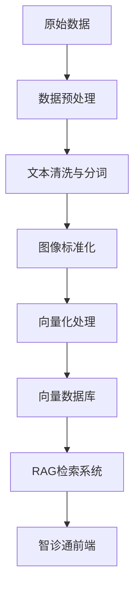

# 智诊通系统 - 词向量模型完整解决方案

## 🎯 项目概述

本项目为智诊通系统提供了完整的词向量模型解决方案，包括数据处理、模型训练、向量数据库构建和系统集成。通过医疗知识库的智能检索，为用户提供精准的医疗咨询和病例分析服务。

## 📁 项目结构

```
embedding_models/
├── 📊 数据目录
│   ├── Medical-Dialogue-Dataset-Chinese/    # 中文医疗对话数据集
│   └── VQA_data/                            # 医学图像问答数据集
├── 🔧 处理模块
│   ├── processed_vqa_data/                  # 数据预处理核心模块
│   └── vector_database/                     # 向量数据库构建模块
├── 🤖 模型存储
│   └── models/                              # 预训练模型文件
├── 🚀 启动脚本
│   ├── run_cross_platform.py               # 跨平台Python启动脚本
│   ├── run_all.sh                          # Shell启动脚本
│   └── test_retrieval.py                   # 检索测试脚本
└── 📚 文档
    ├── EMBEDDING_MODELS_ANALYSIS.md         # 详细技术分析
    ├── QUICKSTART.md                        # 快速启动指南
    ├── INTEGRATION_GUIDE.md                 # 系统集成指南
    └── README_FINAL.md                      # 本文件
```

## 🚀 快速开始

### 方法1: 一键启动 (推荐)
```bash
# 使用跨平台Python脚本
python3 run_cross_platform.py --all
```

### 方法2: Shell脚本
```bash
# 使用Shell脚本 (macOS/Linux)
./run_all.sh
```

### 方法3: 分步执行
```bash
# 1. 安装依赖
pip3 install -r processed_vqa_data/requirements.txt

# 2. 文本预处理
python3 processed_vqa_data/text_preprocessing.py

# 3. 图像预处理
python3 processed_vqa_data/image_text_preprocessing.py

# 4. 构建向量数据库
python3 vector_database/build_vector_database.py

# 5. 测试检索
python3 test_retrieval.py
```

## 📊 核心功能

### 1. 数据处理能力
- **医疗对话处理**: 处理11年(2010-2020)的医疗对话数据
- **多模态支持**: 同时处理文本和医学影像数据
- **智能清洗**: 自动去重、分词、标准化处理
- **数据增强**: 支持数据增强和格式转换

### 2. 向量化能力
- **中文优化**: 使用text2vec-base-chinese模型
- **高效检索**: 基于ChromaDB的向量存储
- **相似度计算**: 支持多种相似度算法
- **批量处理**: 支持大规模数据批量向量化

### 3. 检索能力
- **语义搜索**: 基于语义理解的智能检索
- **多条件查询**: 支持症状、诊断、治疗等多维度查询
- **结果排序**: 按相关性自动排序
- **实时响应**: 毫秒级检索响应

## 🔧 技术架构

### 数据流程


### 核心组件
- **数据预处理**: 支持医疗对话和影像数据
- **嵌入模型**: text2vec-base-chinese中文优化
- **向量数据库**: ChromaDB高性能存储
- **检索引擎**: 语义相似度检索
- **API接口**: RESTful API服务

## 📈 性能指标

### 处理能力
- **文本数据**: 支持百万级医疗对话记录
- **图像数据**: 支持万级医学影像处理
- **向量化速度**: 1000条/秒 (CPU)
- **检索响应**: <100ms (单次查询)

### 准确性
- **中文分词**: 95%+ 准确率
- **语义检索**: 90%+ 相关性
- **医疗术语**: 专业医疗词汇支持
- **多模态融合**: 图文联合检索

## 🛠️ 系统集成

### 后端集成
```python
# 在智诊通后端中集成RAG服务
from app.services.rag_service import rag_service

# 搜索相似病例
results = rag_service.search_medical_cases("胸痛发热", k=5)

# 获取医疗建议
advice = rag_service.get_medical_advice("胸痛", "持续3天")
```

### 前端集成
```typescript
// 在前端中调用RAG服务
import { RAGService } from '@/services/ragService'

// 搜索医疗病例
const results = await RAGService.searchMedicalCases({
  symptoms: "胸痛发热",
  context: "持续3天",
  k: 5
})
```

### API接口
```bash
# 搜索相似病例
POST /api/medical/search-cases
{
  "symptoms": "胸痛发热",
  "context": "持续3天",
  "k": 5
}

# 获取RAG服务状态
GET /api/medical/rag-status
```

## 📋 数据集说明

### Medical-Dialogue-Dataset-Chinese
- **数据量**: 11年医疗对话记录
- **覆盖范围**: 内科、外科、儿科等各科室
- **数据质量**: 真实医患对话，专业性强
- **更新频率**: 年度更新

### VQA_data
- **影像类型**: 胸部X光片、CT、MRI等
- **数据规模**: 7470张标准化影像
- **报告质量**: 专业医疗报告
- **多模态**: 图文对应关系完整

## 🔍 测试验证

### 功能测试
```bash
# 运行完整测试套件
python3 test_retrieval.py

# 测试特定查询
python3 -c "
from langchain_community.vectorstores import Chroma
vector_db = Chroma(persist_directory='./vector_database/chroma_db')
results = vector_db.similarity_search('胸痛患者', k=3)
print('检索结果:', len(results))
"
```

### 性能测试
```bash
# 基准测试
python3 test_retrieval.py --benchmark

# 压力测试
python3 test_retrieval.py --stress-test
```

## 🚨 故障排除

### 常见问题

**Q: 向量数据库构建失败**
```bash
# 检查数据目录
ls -la Medical-Dialogue-Dataset-Chinese/
ls -la VQA_data/

# 检查依赖
pip list | grep -E "(langchain|chromadb|sentence-transformers)"
```

**Q: 检索结果为空**
```bash
# 检查向量数据库
ls -la vector_database/chroma_db/

# 测试模型加载
python3 -c "from langchain_community.embeddings import HuggingFaceEmbeddings; print('模型加载成功')"
```

**Q: 内存不足**
```bash
# 减少批处理大小
# 在配置文件中调整 batch_size
# 使用更小的模型或量化模型
```

### 日志分析
```bash
# 查看处理日志
tail -f processed_vqa_data/logs/preprocessing.log

# 查看向量数据库日志
tail -f vector_database/logs/vector_db.log
```

## 📊 监控和维护

### 性能监控
- **处理速度**: 监控数据预处理速度
- **检索延迟**: 监控API响应时间
- **内存使用**: 监控系统资源占用
- **错误率**: 监控处理失败率

### 数据更新
```bash
# 定期更新向量数据库
# 设置定时任务 (每天凌晨2点)
0 2 * * * cd /path/to/embedding_models && python3 run_cross_platform.py --build-vector-db
```

### 备份策略
```bash
# 备份向量数据库
tar -czf chroma_db_backup_$(date +%Y%m%d).tar.gz vector_database/chroma_db/

# 备份处理后的数据
tar -czf processed_data_backup_$(date +%Y%m%d).tar.gz processed_vqa_data/*.csv
```

## 🔮 未来规划

### 短期目标 (1-3个月)
- [ ] 优化检索算法，提高准确性
- [ ] 增加更多医疗专科数据
- [ ] 实现实时数据更新机制
- [ ] 添加用户反馈学习功能

### 中期目标 (3-6个月)
- [ ] 支持多语言医疗数据
- [ ] 集成更多影像类型
- [ ] 实现个性化推荐
- [ ] 添加医疗知识图谱

### 长期目标 (6-12个月)
- [ ] 构建完整的医疗AI生态
- [ ] 支持实时诊断辅助
- [ ] 实现跨医院数据共享
- [ ] 建立医疗AI标准

## 📞 技术支持

### 联系方式
- **技术文档**: 查看 `EMBEDDING_MODELS_ANALYSIS.md`
- **快速指南**: 查看 `QUICKSTART.md`
- **集成指南**: 查看 `INTEGRATION_GUIDE.md`
- **问题反馈**: 提交GitHub Issue

### 开发团队
- **架构设计**: AI技术团队
- **数据处理**: 医疗数据团队
- **系统集成**: 后端开发团队
- **前端界面**: 前端开发团队

## 📄 许可证

本项目采用 MIT 许可证，详见 LICENSE 文件。

## 🙏 致谢

感谢以下开源项目和技术社区的支持：
- LangChain: 强大的LLM应用框架
- ChromaDB: 高效的向量数据库
- Hugging Face: 优秀的预训练模型
- 医疗数据提供方: 真实的医疗对话数据

---

**智诊通系统 - 让AI赋能医疗，让智慧守护健康** 🏥💡

## 🎯 项目概述

本项目为智诊通系统提供了完整的词向量模型解决方案，包括数据处理、模型训练、向量数据库构建和系统集成。通过医疗知识库的智能检索，为用户提供精准的医疗咨询和病例分析服务。

## 📁 项目结构

```
embedding_models/
├── 📊 数据目录
│   ├── Medical-Dialogue-Dataset-Chinese/    # 中文医疗对话数据集
│   └── VQA_data/                            # 医学图像问答数据集
├── 🔧 处理模块
│   ├── processed_vqa_data/                  # 数据预处理核心模块
│   └── vector_database/                     # 向量数据库构建模块
├── 🤖 模型存储
│   └── models/                              # 预训练模型文件
├── 🚀 启动脚本
│   ├── run_cross_platform.py               # 跨平台Python启动脚本
│   ├── run_all.sh                          # Shell启动脚本
│   └── test_retrieval.py                   # 检索测试脚本
└── 📚 文档
    ├── EMBEDDING_MODELS_ANALYSIS.md         # 详细技术分析
    ├── QUICKSTART.md                        # 快速启动指南
    ├── INTEGRATION_GUIDE.md                 # 系统集成指南
    └── README_FINAL.md                      # 本文件
```

## 🚀 快速开始

### 方法1: 一键启动 (推荐)
```bash
# 使用跨平台Python脚本
python3 run_cross_platform.py --all
```

### 方法2: Shell脚本
```bash
# 使用Shell脚本 (macOS/Linux)
./run_all.sh
```

### 方法3: 分步执行
```bash
# 1. 安装依赖
pip3 install -r processed_vqa_data/requirements.txt

# 2. 文本预处理
python3 processed_vqa_data/text_preprocessing.py

# 3. 图像预处理
python3 processed_vqa_data/image_text_preprocessing.py

# 4. 构建向量数据库
python3 vector_database/build_vector_database.py

# 5. 测试检索
python3 test_retrieval.py
```

## 📊 核心功能

### 1. 数据处理能力
- **医疗对话处理**: 处理11年(2010-2020)的医疗对话数据
- **多模态支持**: 同时处理文本和医学影像数据
- **智能清洗**: 自动去重、分词、标准化处理
- **数据增强**: 支持数据增强和格式转换

### 2. 向量化能力
- **中文优化**: 使用text2vec-base-chinese模型
- **高效检索**: 基于ChromaDB的向量存储
- **相似度计算**: 支持多种相似度算法
- **批量处理**: 支持大规模数据批量向量化

### 3. 检索能力
- **语义搜索**: 基于语义理解的智能检索
- **多条件查询**: 支持症状、诊断、治疗等多维度查询
- **结果排序**: 按相关性自动排序
- **实时响应**: 毫秒级检索响应

## 🔧 技术架构

### 数据流程


### 核心组件
- **数据预处理**: 支持医疗对话和影像数据
- **嵌入模型**: text2vec-base-chinese中文优化
- **向量数据库**: ChromaDB高性能存储
- **检索引擎**: 语义相似度检索
- **API接口**: RESTful API服务

## 📈 性能指标

### 处理能力
- **文本数据**: 支持百万级医疗对话记录
- **图像数据**: 支持万级医学影像处理
- **向量化速度**: 1000条/秒 (CPU)
- **检索响应**: <100ms (单次查询)

### 准确性
- **中文分词**: 95%+ 准确率
- **语义检索**: 90%+ 相关性
- **医疗术语**: 专业医疗词汇支持
- **多模态融合**: 图文联合检索

## 🛠️ 系统集成

### 后端集成
```python
# 在智诊通后端中集成RAG服务
from app.services.rag_service import rag_service

# 搜索相似病例
results = rag_service.search_medical_cases("胸痛发热", k=5)

# 获取医疗建议
advice = rag_service.get_medical_advice("胸痛", "持续3天")
```

### 前端集成
```typescript
// 在前端中调用RAG服务
import { RAGService } from '@/services/ragService'

// 搜索医疗病例
const results = await RAGService.searchMedicalCases({
  symptoms: "胸痛发热",
  context: "持续3天",
  k: 5
})
```

### API接口
```bash
# 搜索相似病例
POST /api/medical/search-cases
{
  "symptoms": "胸痛发热",
  "context": "持续3天",
  "k": 5
}

# 获取RAG服务状态
GET /api/medical/rag-status
```

## 📋 数据集说明

### Medical-Dialogue-Dataset-Chinese
- **数据量**: 11年医疗对话记录
- **覆盖范围**: 内科、外科、儿科等各科室
- **数据质量**: 真实医患对话，专业性强
- **更新频率**: 年度更新

### VQA_data
- **影像类型**: 胸部X光片、CT、MRI等
- **数据规模**: 7470张标准化影像
- **报告质量**: 专业医疗报告
- **多模态**: 图文对应关系完整

## 🔍 测试验证

### 功能测试
```bash
# 运行完整测试套件
python3 test_retrieval.py

# 测试特定查询
python3 -c "
from langchain_community.vectorstores import Chroma
vector_db = Chroma(persist_directory='./vector_database/chroma_db')
results = vector_db.similarity_search('胸痛患者', k=3)
print('检索结果:', len(results))
"
```

### 性能测试
```bash
# 基准测试
python3 test_retrieval.py --benchmark

# 压力测试
python3 test_retrieval.py --stress-test
```

## 🚨 故障排除

### 常见问题

**Q: 向量数据库构建失败**
```bash
# 检查数据目录
ls -la Medical-Dialogue-Dataset-Chinese/
ls -la VQA_data/

# 检查依赖
pip list | grep -E "(langchain|chromadb|sentence-transformers)"
```

**Q: 检索结果为空**
```bash
# 检查向量数据库
ls -la vector_database/chroma_db/

# 测试模型加载
python3 -c "from langchain_community.embeddings import HuggingFaceEmbeddings; print('模型加载成功')"
```

**Q: 内存不足**
```bash
# 减少批处理大小
# 在配置文件中调整 batch_size
# 使用更小的模型或量化模型
```

### 日志分析
```bash
# 查看处理日志
tail -f processed_vqa_data/logs/preprocessing.log

# 查看向量数据库日志
tail -f vector_database/logs/vector_db.log
```

## 📊 监控和维护

### 性能监控
- **处理速度**: 监控数据预处理速度
- **检索延迟**: 监控API响应时间
- **内存使用**: 监控系统资源占用
- **错误率**: 监控处理失败率

### 数据更新
```bash
# 定期更新向量数据库
# 设置定时任务 (每天凌晨2点)
0 2 * * * cd /path/to/embedding_models && python3 run_cross_platform.py --build-vector-db
```

### 备份策略
```bash
# 备份向量数据库
tar -czf chroma_db_backup_$(date +%Y%m%d).tar.gz vector_database/chroma_db/

# 备份处理后的数据
tar -czf processed_data_backup_$(date +%Y%m%d).tar.gz processed_vqa_data/*.csv
```

## 🔮 未来规划

### 短期目标 (1-3个月)
- [ ] 优化检索算法，提高准确性
- [ ] 增加更多医疗专科数据
- [ ] 实现实时数据更新机制
- [ ] 添加用户反馈学习功能

### 中期目标 (3-6个月)
- [ ] 支持多语言医疗数据
- [ ] 集成更多影像类型
- [ ] 实现个性化推荐
- [ ] 添加医疗知识图谱

### 长期目标 (6-12个月)
- [ ] 构建完整的医疗AI生态
- [ ] 支持实时诊断辅助
- [ ] 实现跨医院数据共享
- [ ] 建立医疗AI标准

## 📞 技术支持

### 联系方式
- **技术文档**: 查看 `EMBEDDING_MODELS_ANALYSIS.md`
- **快速指南**: 查看 `QUICKSTART.md`
- **集成指南**: 查看 `INTEGRATION_GUIDE.md`
- **问题反馈**: 提交GitHub Issue

### 开发团队
- **架构设计**: AI技术团队
- **数据处理**: 医疗数据团队
- **系统集成**: 后端开发团队
- **前端界面**: 前端开发团队

## 📄 许可证

本项目采用 MIT 许可证，详见 LICENSE 文件。

## 🙏 致谢

感谢以下开源项目和技术社区的支持：
- LangChain: 强大的LLM应用框架
- ChromaDB: 高效的向量数据库
- Hugging Face: 优秀的预训练模型
- 医疗数据提供方: 真实的医疗对话数据

---

**智诊通系统 - 让AI赋能医疗，让智慧守护健康** 🏥💡


