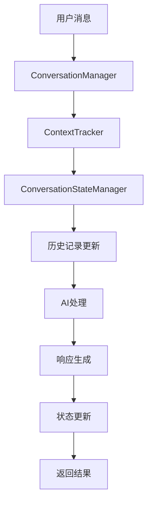
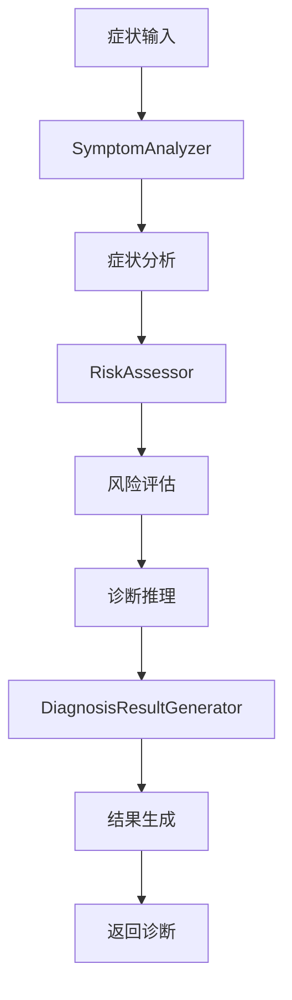
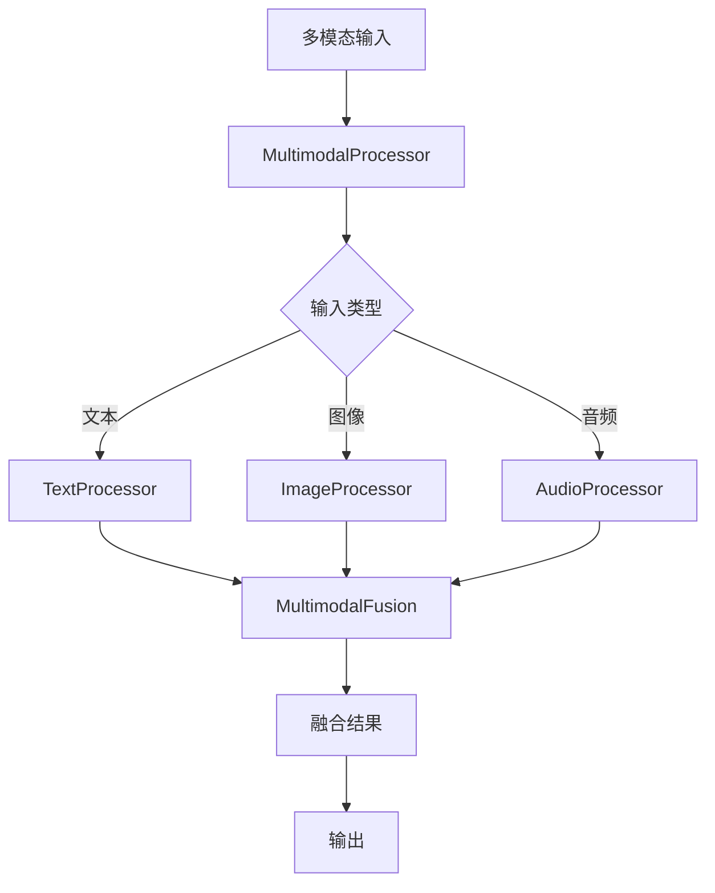
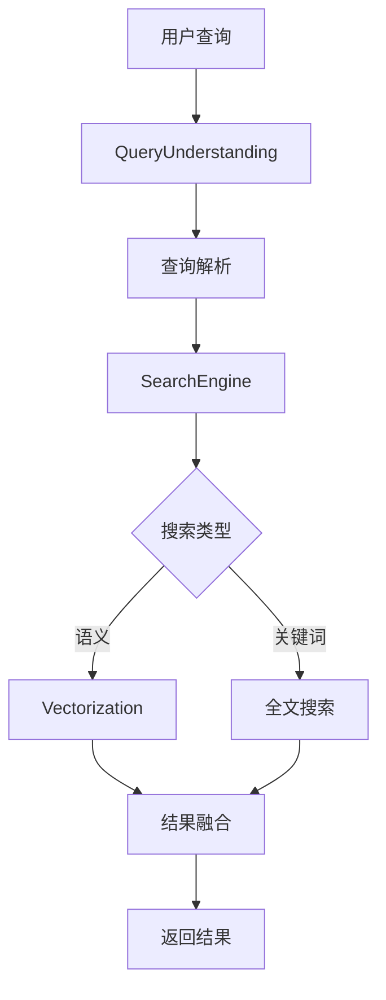
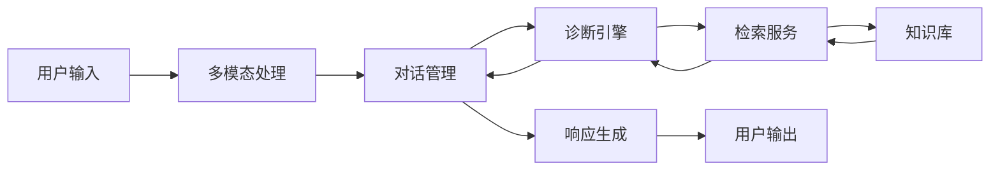

# 智诊通系统业务模块详细说明

## 📋 概述

本文档详细说明智诊通系统后端的业务模块架构，包括对话管理、诊断引擎、多模态处理、检索服务等核心业务逻辑。

---

## 🏗️ 模块架构设计

### 设计原则

- **单一职责**: 每个模块专注于特定业务领域
- **松耦合**: 模块间通过接口交互，降低依赖
- **可扩展**: 支持插件化扩展和功能增强
- **可测试**: 模块独立，便于单元测试

### 模块层次结构

```
app/modules/
├── conversation/          # 对话管理模块
├── diagnosis/            # 诊断引擎模块
├── multimodal/           # 多模态处理模块
└── retrieval/            # 检索服务模块
```

---

## 💬 对话管理模块 (conversation)

### 模块概述

负责管理用户对话的完整生命周期，包括状态管理、上下文跟踪、历史记录等。

### 核心组件

#### 1. ConversationManager (对话管理器)

**文件**: `manager.py`

**功能**: 对话管理的核心协调器

**主要方法**:

```python
class ConversationManager:
    def process_message(self, input_data: ConversationInput) -> ConversationOutput
    def get_conversation_state(self, conversation_id: str) -> Dict[str, Any]
    def update_conversation_state(self, conversation_id: str, state: Dict[str, Any])
    def get_conversation_history(self, conversation_id: str) -> List[Dict[str, Any]]
```

**数据模型**:

```python
class ConversationInput(BaseModel):
    conversation_id: Optional[str] = None
    user_id: str
    message: str
    message_type: str = "text"
    metadata: Optional[Dict[str, Any]] = None

class ConversationOutput(BaseModel):
    conversation_id: str
    response: str
    state: str
    context: Dict[str, Any]
    processing_time: float
```

#### 2. ConversationStateManager (状态管理器)

**文件**: `state_manager.py`

**功能**: 管理对话状态和会话信息

**主要功能**:

- 对话状态持久化
- 会话超时管理
- 状态转换控制
- 并发访问控制

**状态类型**:

- `active`: 活跃对话
- `waiting`: 等待用户输入
- `processing`: 处理中
- `completed`: 已完成
- `archived`: 已归档

#### 3. ContextTracker (上下文跟踪器)

**文件**: `context_tracker.py`

**功能**: 跟踪和维护对话上下文

**主要功能**:

- 上下文信息提取
- 多轮对话记忆
- 上下文压缩和优化
- 上下文相关性分析

**上下文类型**:

- `user_profile`: 用户画像
- `conversation_history`: 对话历史
- `current_topic`: 当前话题
- `user_intent`: 用户意图

#### 4. ConversationHistoryManager (历史管理器)

**文件**: `history_manager.py`

**功能**: 管理对话历史记录

**主要功能**:

- 历史记录存储
- 历史记录检索
- 历史记录分析
- 历史记录清理

### 工作流程



---

## 🏥 诊断引擎模块 (diagnosis)

### 模块概述

负责智能诊断的核心逻辑，包括症状分析、风险评估、诊断推理等。

### 核心组件

#### 1. DiagnosisEngine (诊断引擎)

**文件**: `engine.py`

**功能**: 诊断流程的核心协调器

**主要方法**:

```python
class DiagnosisEngine:
    def diagnose(self, input_data: DiagnosisInput) -> DiagnosisOutput
    def analyze_symptoms(self, symptoms: str) -> Dict[str, Any]
    def assess_risk(self, analysis_result: Dict[str, Any]) -> Dict[str, str]
    def generate_recommendations(self, diagnosis_result: Dict[str, Any]) -> Dict[str, List[str]]
```

**数据模型**:

```python
class DiagnosisInput(BaseModel):
    symptoms: str
    user_context: Optional[Dict[str, Any]] = None
    conversation_id: Optional[str] = None
    multimodal_data: Optional[Dict[str, Any]] = None

class DiagnosisOutput(BaseModel):
    diagnosis_id: str
    results: List[Dict[str, Any]]
    overall_confidence: float
    risk_assessment: Dict[str, str]
    recommendations: Dict[str, List[str]]
    processing_time: float
```

#### 2. SymptomAnalyzer (症状分析器)

**文件**: `symptom_analyzer.py`

**功能**: 分析用户输入的症状信息

**主要功能**:

- 症状文本解析
- 症状标准化
- 症状分类和标注
- 症状严重程度评估

**分析维度**:

- `symptom_type`: 症状类型
- `severity`: 严重程度
- `duration`: 持续时间
- `frequency`: 发生频率
- `location`: 症状位置

#### 3. RiskAssessor (风险评估器)

**文件**: `risk_assessor.py`

**功能**: 评估症状和诊断的风险等级

**风险等级**:

- `low`: 低风险
- `medium`: 中等风险
- `high`: 高风险
- `critical`: 紧急风险

**评估因素**:

- 症状严重程度
- 症状持续时间
- 用户年龄和性别
- 既往病史
- 当前用药情况

#### 4. DiagnosisResultGenerator (诊断结果生成器)

**文件**: `result_generator.py`

**功能**: 生成诊断结果和建议

**生成内容**:

- 可能疾病列表
- 置信度评分
- 医疗建议
- 紧急处理建议
- 后续检查建议

### 诊断流程



---

## 🎯 多模态处理模块 (multimodal)

### 模块概述

负责处理文本、图像、音频等多种模态的输入数据。

### 核心组件

#### 1. MultimodalProcessor (多模态处理器)

**文件**: `processor.py`

**功能**: 多模态处理的核心协调器

**主要方法**:

```python
class MultimodalProcessor:
    def process_input(self, input_data: MultimodalInput) -> MultimodalOutput
    def process_text(self, text: str) -> Dict[str, Any]
    def process_image(self, image_data: bytes) -> Dict[str, Any]
    def process_audio(self, audio_data: bytes) -> Dict[str, Any]
    def fuse_modalities(self, modalities: List[Dict[str, Any]]) -> Dict[str, Any]
```

#### 2. TextProcessor (文本处理器)

**文件**: `text_processor.py`

**功能**: 处理文本输入

**主要功能**:

- 文本预处理
- 实体识别
- 情感分析
- 意图识别
- 关键词提取

#### 3. ImageProcessor (图像处理器)

**文件**: `image_processor.py`

**功能**: 处理图像输入

**主要功能**:

- 图像预处理
- 对象检测
- 图像分类
- 特征提取
- 医疗图像分析

**支持的图像类型**:

- X 光片
- CT 扫描
- MRI 图像
- 皮肤病变图像
- 眼底照片

#### 4. AudioProcessor (音频处理器)

**文件**: `audio_processor.py`

**功能**: 处理音频输入

**主要功能**:

- 音频预处理
- 语音识别
- 音频特征提取
- 情感分析
- 医疗音频分析

**支持的音频类型**:

- 语音描述
- 心跳声
- 呼吸声
- 咳嗽声

#### 5. MultimodalFusion (多模态融合)

**文件**: `fusion.py`

**功能**: 融合多种模态的信息

**融合策略**:

- 早期融合 (Early Fusion)
- 晚期融合 (Late Fusion)
- 混合融合 (Hybrid Fusion)

### 处理流程



---

## 🔍 检索服务模块 (retrieval)

### 模块概述

负责知识检索和相似性搜索，为诊断和对话提供相关知识支持。

### 核心组件

#### 1. RetrievalEngine (检索引擎)

**文件**: `retrieval.py`

**功能**: 检索服务的核心协调器

**主要方法**:

```python
class RetrievalEngine:
    def search(self, query: str, top_k: int = 10) -> List[Dict[str, Any]]
    def semantic_search(self, query: str, top_k: int = 10) -> List[Dict[str, Any]]
    def keyword_search(self, query: str, top_k: int = 10) -> List[Dict[str, Any]]
    def hybrid_search(self, query: str, top_k: int = 10) -> List[Dict[str, Any]]
```

#### 2. QueryUnderstanding (查询理解)

**文件**: `query_understanding.py`

**功能**: 理解和解析用户查询

**主要功能**:

- 查询意图识别
- 实体提取
- 查询扩展
- 查询重写
- 多语言支持

#### 3. SearchEngine (搜索引擎)

**文件**: `search_engine.py`

**功能**: 执行实际的搜索操作

**搜索类型**:

- 全文搜索
- 语义搜索
- 向量搜索
- 混合搜索

#### 4. Vectorization (向量化)

**文件**: `vectorization.py`

**功能**: 文本向量化和相似性计算

**主要功能**:

- 文本嵌入
- 向量存储
- 相似性计算
- 向量索引

### 检索流程



---

## 🔧 服务层 (services)

### 模块概述

提供高级业务服务，整合多个模块的功能。

### 核心服务

#### 1. DiagnosisService (诊断服务)

**文件**: `diagnosis_service.py`

**功能**: 提供诊断相关的业务服务

**主要方法**:

```python
class DiagnosisService:
    def create_diagnosis(self, user_id: str, symptoms: str) -> DiagnosisResult
    def get_diagnosis_history(self, user_id: str) -> List[DiagnosisResult]
    def update_diagnosis(self, diagnosis_id: str, updates: Dict[str, Any])
    def delete_diagnosis(self, diagnosis_id: str)
```

#### 2. RetrievalService (检索服务)

**文件**: `retrieval_service.py`

**功能**: 提供知识检索相关的业务服务

**主要方法**:

```python
class RetrievalService:
    def search_knowledge(self, query: str, filters: Dict[str, Any]) -> List[KnowledgeItem]
    def get_knowledge_detail(self, knowledge_id: str) -> KnowledgeItem
    def add_knowledge(self, knowledge: KnowledgeItem) -> str
    def update_knowledge(self, knowledge_id: str, updates: Dict[str, Any])
```

---

## 🔄 模块间交互

### 交互模式

#### 1. 对话-诊断交互

```python
# 对话管理器调用诊断引擎
conversation_manager.process_message()
    -> diagnosis_engine.diagnose()
    -> symptom_analyzer.analyze()
    -> risk_assessor.assess()
```

#### 2. 诊断-检索交互

```python
# 诊断引擎调用检索服务
diagnosis_engine.diagnose()
    -> retrieval_engine.search()
    -> query_understanding.parse()
    -> search_engine.search()
```

#### 3. 多模态-对话交互

```python
# 多模态处理器为对话提供支持
multimodal_processor.process_input()
    -> conversation_manager.process_message()
    -> context_tracker.update_context()
```

### 数据流



---

## 🧪 测试策略

### 单元测试

- 每个模块独立测试
- Mock 外部依赖
- 测试覆盖率 > 80%

### 集成测试

- 模块间交互测试
- 端到端流程测试
- 性能压力测试

### 测试工具

- `pytest`: 测试框架
- `pytest-asyncio`: 异步测试
- `pytest-mock`: Mock 工具
- `httpx`: HTTP 客户端测试

---

## 📈 性能优化

### 缓存策略

- **Redis 缓存**: 频繁访问的数据
- **内存缓存**: 计算结果缓存
- **CDN 缓存**: 静态资源缓存

### 异步处理

- **异步 I/O**: 数据库和网络请求
- **消息队列**: 耗时任务异步处理
- **并发控制**: 限制并发请求数量

### 资源管理

- **连接池**: 数据库连接池
- **对象池**: 重复使用对象
- **内存管理**: 及时释放资源

---

## 🔧 配置管理

### 模块配置

每个模块都有独立的配置文件：

```python
# conversation/config.py
CONVERSATION_CONFIG = {
    "max_context_length": 4096,
    "context_compression_ratio": 0.8,
    "session_timeout": 3600
}

# diagnosis/config.py
DIAGNOSIS_CONFIG = {
    "confidence_threshold": 0.7,
    "max_conditions": 5,
    "risk_levels": ["low", "medium", "high", "critical"]
}
```

### 环境变量

通过环境变量控制模块行为：

```bash
# 对话模块
CONVERSATION_MAX_CONTEXT=4096
CONVERSATION_TIMEOUT=3600

# 诊断模块
DIAGNOSIS_CONFIDENCE_THRESHOLD=0.7
DIAGNOSIS_MAX_CONDITIONS=5
```

---

## 📝 开发指南

### 添加新模块

1. 在 `app/modules/` 下创建新目录
2. 实现核心类和接口
3. 添加配置和测试
4. 更新文档

### 模块扩展

1. 继承基础类
2. 实现接口方法
3. 添加配置选项
4. 编写测试用例

### 最佳实践

- 保持模块独立性
- 使用依赖注入
- 实现接口抽象
- 添加详细日志
- 编写完整文档

---

_本文档基于当前系统实现生成，业务模块可能根据需求进行调整和扩展。_
