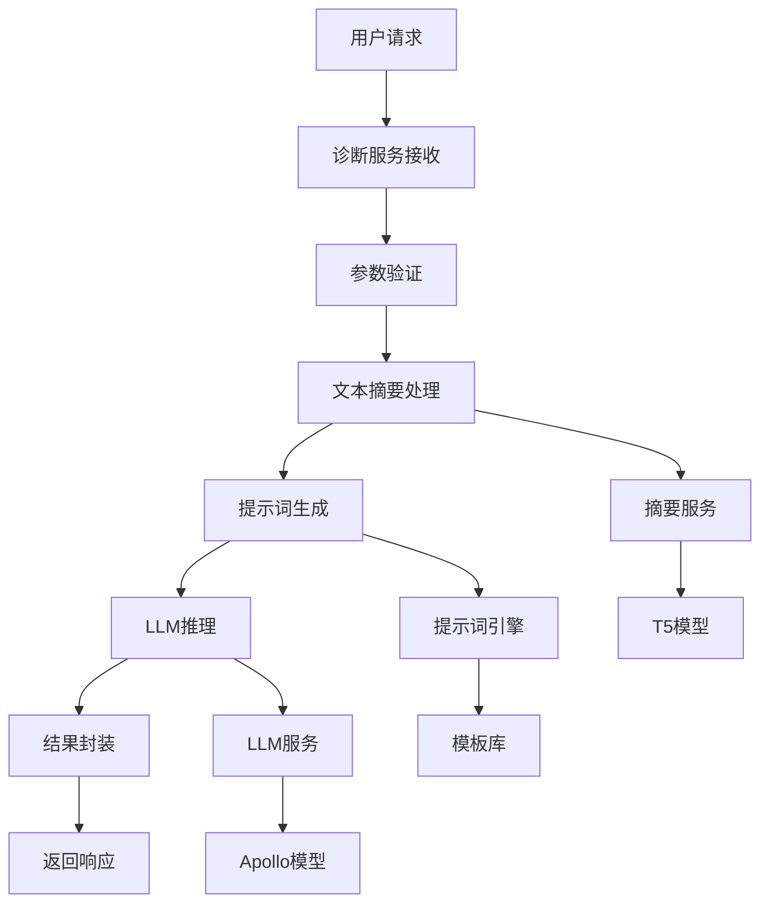
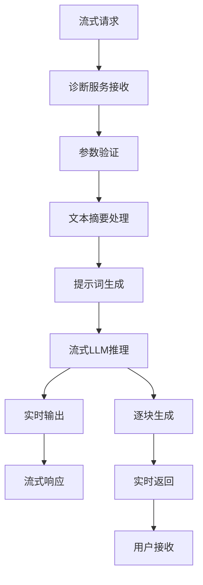

# 智诊通智能诊断服务核心服务层详细说明

## 🎯 核心服务层概述

核心服务层是智诊通智能诊断服务的大脑，负责整合各种 AI 模型和服务，提供统一的智能诊断功能。该层采用模块化设计，包含诊断服务、LLM 服务、文本摘要服务和提示词引擎等核心组件。

## 📁 目录结构

```
core/
├── diagnosis_service.py              # 核心诊断服务
├── models/                           # 数据模型（预留）
└── services/                         # 业务服务
    ├── diagnosis_llm_service.py      # LLM 诊断服务
    ├── diagnosis_prompt_engine.py    # 提示词引擎
    └── medical_text_summarization_service.py  # 文本摘要服务
```

## 🔧 核心组件详解

### 1. 智能诊断服务 (diagnosis_service.py)

#### 功能概述

`IntelligentDiagnosisService` 是整个服务的核心协调器，负责整合文本摘要和大语言模型服务，提供统一的智能诊断接口。

#### 核心特性

- **服务整合**: 统一管理多个子服务
- **流程控制**: 完整的诊断处理流程
- **错误处理**: 完善的异常处理机制
- **流式支持**: 支持实时流式响应
- **健康监控**: 服务状态监控和健康检查

#### 主要方法

##### 1.1 初始化方法

```python
def __init__(self, config: Dict[str, Any] = None):
    """
    初始化智能诊断服务

    Args:
        config: 配置字典，包含各子服务的配置参数
    """
```

**功能说明：**

- 加载配置文件
- 初始化子服务（摘要服务、LLM 服务）
- 设置日志系统
- 验证服务状态

**配置参数：**

- `summarization_service`: 文本摘要服务配置
- `llm_service`: LLM 服务配置
- `service_mode`: 服务运行模式

##### 1.2 诊断请求处理

```python
def process_diagnosis_request(self, query: str, context: str = "",
                             response_type: str = "diagnosis",
                             enable_summary: bool = True) -> Dict[str, Any]:
    """
    处理诊断请求

    Args:
        query: 用户查询
        context: 检索到的上下文
        response_type: 响应类型 (diagnosis, advice, explanation)
        enable_summary: 是否启用摘要

    Returns:
        诊断结果字典
    """
```

**处理流程：**

1. **输入验证**: 验证输入参数
2. **文本摘要**: 对上下文进行摘要处理（可选）
3. **诊断生成**: 使用 LLM 生成诊断建议
4. **结果封装**: 封装返回结果
5. **错误处理**: 处理异常情况

**返回格式：**

```python
{
    'query': str,           # 用户查询
    'context': str,         # 原始上下文
    'response_type': str,    # 响应类型
    'summary': str,         # 摘要内容
    'diagnosis_response': str,  # 诊断响应
    'success': bool,        # 处理状态
    'error': str            # 错误信息
}
```

##### 1.3 流式诊断处理

```python
def process_diagnosis_request_stream(self, query: str, context: str = "",
                                   response_type: str = "diagnosis",
                                   enable_summary: bool = True) -> Generator[str, None, None]:
    """
    流式处理诊断请求

    Args:
        query: 用户查询
        context: 检索到的上下文
        response_type: 响应类型
        enable_summary: 是否启用摘要

    Yields:
        诊断结果文本块
    """
```

**流式特性：**

- **实时响应**: 逐步返回生成结果
- **用户体验**: 提升交互体验
- **资源优化**: 减少等待时间
- **错误恢复**: 流式错误处理

##### 1.4 服务管理方法

```python
def get_service_info(self) -> Dict[str, Any]:
    """获取服务信息"""

def health_check(self) -> Dict[str, Any]:
    """健康检查"""
```

**服务信息包含：**

- 服务名称和版本
- 子服务状态
- 配置信息
- 运行状态

**健康检查包含：**

- 服务整体状态
- 各组件健康状态
- 错误信息
- 性能指标

### 2. LLM 诊断服务 (diagnosis_llm_service.py)

#### 功能概述

`DiagnosisLLMService` 基于 Apollo-0.5B 模型提供医疗诊断生成服务，支持多种生成参数和流式响应。

#### 核心特性

- **模型管理**: 自动加载和缓存模型
- **参数配置**: 灵活的生成参数设置
- **流式生成**: 支持实时流式输出
- **超时控制**: 防止长时间阻塞
- **线程安全**: 多线程安全设计

#### 主要类和方法

##### 2.1 DiagnosisLLMService 类

```python
class DiagnosisLLMService:
    """智能诊断大语言模型服务类"""

    def __init__(self, model_path: str, config: Dict[str, Any]):
        """
        初始化LLM服务

        Args:
            model_path: 模型路径
            config: 配置参数
        """
```

**配置参数：**

- `device`: 设备类型 (cuda/cpu)
- `max_length`: 最大生成长度
- `temperature`: 温度参数
- `top_p`: Top-p 采样
- `top_k`: Top-k 采样
- `repetition_penalty`: 重复惩罚
- `timeout`: 超时时间

##### 2.2 文本生成方法

```python
def generate_text(self, prompt: str, max_new_tokens: int = 512) -> str:
    """
    生成文本

    Args:
        prompt: 输入提示词
        max_new_tokens: 最大新token数

    Returns:
        生成的文本
    """
```

**生成特性：**

- **参数控制**: 灵活的生成参数
- **质量保证**: 输出质量优化
- **错误处理**: 完善的异常处理
- **性能优化**: 内存和速度优化

##### 2.3 流式生成方法

```python
def generate_text_stream(self, prompt: str, max_new_tokens: int = 512) -> Generator[str, None, None]:
    """
    流式生成文本

    Args:
        prompt: 输入提示词
        max_new_tokens: 最大新token数

    Yields:
        生成的文本块
    """
```

**流式特性：**

- **实时输出**: 逐步生成文本
- **用户体验**: 提升交互体验
- **资源管理**: 优化内存使用
- **中断处理**: 支持生成中断

##### 2.4 诊断专用方法

```python
def generate_diagnosis_response(self, query: str, context: str, response_type: str) -> str:
    """
    生成诊断响应

    Args:
        query: 用户查询
        context: 上下文信息
        response_type: 响应类型

    Returns:
        诊断响应文本
    """
```

**诊断特性：**

- **专业提示词**: 医疗专业提示词
- **上下文整合**: 有效整合上下文信息
- **类型适配**: 支持多种响应类型
- **质量保证**: 确保输出质量

### 3. 文本摘要服务 (medical_text_summarization_service.py)

#### 功能概述

`MedicalTextSummarizationService` 基于 T5-small 模型提供医学文本摘要服务，专门针对医学领域优化。

#### 核心特性

- **轻量级设计**: 基于 T5-small 模型
- **医学优化**: 针对医学文本优化
- **快速响应**: 高效的摘要生成
- **质量保证**: 确保摘要质量
- **自动管理**: 自动模型管理

#### 主要方法

##### 3.1 初始化方法

```python
def __init__(self, model_path: str = None):
    """
    初始化医学文本摘要服务

    Args:
        model_path: 模型路径，默认为从统一配置加载
    """
```

**初始化特性：**

- **自动配置**: 自动加载模型配置
- **路径管理**: 智能模型路径管理
- **资源优化**: 内存使用优化
- **错误处理**: 初始化异常处理

##### 3.2 摘要生成方法

```python
def summarize_medical_text(self, text: str, max_length: int = 200,
                          min_length: int = 50, retrieval_content: str = "") -> str:
    """
    生成医学文本摘要

    Args:
        text: 输入文本
        max_length: 最大摘要长度
        min_length: 最小摘要长度
        retrieval_content: 检索内容

    Returns:
        摘要文本
    """
```

**摘要特性：**

- **长度控制**: 灵活的长度设置
- **质量优化**: 摘要质量保证
- **医学适配**: 医学领域优化
- **上下文整合**: 整合检索内容

##### 3.3 模型管理方法

```python
def load_model(self):
    """加载模型"""

def unload_model(self):
    """卸载模型"""

def get_model_info(self) -> Dict[str, Any]:
    """获取模型信息"""
```

**管理特性：**

- **自动加载**: 按需加载模型
- **内存管理**: 智能内存释放
- **状态监控**: 模型状态监控
- **信息获取**: 详细模型信息

### 4. 提示词引擎 (diagnosis_prompt_engine.py)

#### 功能概述

`DiagnosisPromptEngine` 提供专业的医疗提示词模板管理，支持多种诊断场景和动态提示词生成。

#### 核心特性

- **模板管理**: 专业医疗提示词模板
- **场景适配**: 多种诊断场景支持
- **动态生成**: 根据上下文动态生成
- **质量保证**: 确保提示词质量
- **参数化**: 支持参数化配置

#### 主要方法

##### 4.1 提示词生成

```python
def generate_prompt(self, query: str, context: str, response_type: str) -> str:
    """
    生成提示词

    Args:
        query: 用户查询
        context: 上下文信息
        response_type: 响应类型

    Returns:
        生成的提示词
    """
```

**生成特性：**

- **场景识别**: 自动识别诊断场景
- **模板选择**: 智能选择合适模板
- **参数填充**: 动态填充参数
- **质量优化**: 提示词质量保证

##### 4.2 模板管理

```python
def get_template(self, template_name: str) -> str:
    """获取模板"""

def add_template(self, name: str, template: str):
    """添加模板"""

def list_templates(self) -> List[str]:
    """列出所有模板"""
```

**管理特性：**

- **模板存储**: 安全存储模板
- **版本控制**: 模板版本管理
- **动态更新**: 支持动态更新
- **质量检查**: 模板质量验证

## 🔄 服务交互流程

### 诊断请求处理流程



### 流式处理流程



## ⚙️ 配置管理

### 服务配置

```python
# 诊断服务配置
diagnosis_config = {
    'summarization_service': {
        'model_path': None,
        'max_length': 300,
        'min_length': 50
    },
    'llm_service': {
        'device': 'cuda',
        'model_path': 'FreedomIntelligence/Apollo-0.5B',
        'max_length': 2048,
        'temperature': 0.7,
        'top_p': 0.9,
        'top_k': 50,
        'repetition_penalty': 1.1,
        'timeout': 600
    },
    'service_mode': 'optimized'
}
```

### 模型配置

```python
# LLM模型配置
llm_config = {
    'model_path': 'FreedomIntelligence/Apollo-0.5B',
    'device': 'cuda',
    'max_length': 2048,
    'temperature': 0.7,
    'top_p': 0.9,
    'top_k': 50,
    'repetition_penalty': 1.1,
    'timeout': 600
}

# 摘要模型配置
summarization_config = {
    'model_path': None,  # 使用默认T5-small
    'max_length': 300,
    'min_length': 50
}
```

## 🔍 错误处理

### 异常类型

1. **模型加载异常**: 模型文件不存在或损坏
2. **推理异常**: 模型推理过程中出错
3. **配置异常**: 配置参数错误
4. **资源异常**: 内存或 GPU 资源不足
5. **超时异常**: 处理时间超时

### 错误处理策略

```python
def handle_exception(self, exception: Exception, context: str) -> Dict[str, Any]:
    """
    处理异常

    Args:
        exception: 异常对象
        context: 异常上下文

    Returns:
        错误响应
    """
    if isinstance(exception, TimeoutException):
        return self._handle_timeout_error(exception, context)
    elif isinstance(exception, ModelLoadException):
        return self._handle_model_error(exception, context)
    elif isinstance(exception, ResourceException):
        return self._handle_resource_error(exception, context)
    else:
        return self._handle_generic_error(exception, context)
```

## 📊 性能优化

### 内存优化

- **模型缓存**: 避免重复加载模型
- **内存释放**: 及时释放不需要的资源
- **批处理**: 优化批处理大小
- **GPU 管理**: 智能 GPU 内存管理

### 速度优化

- **模型预热**: 服务启动时预热模型
- **并行处理**: 支持并行请求处理
- **缓存机制**: 智能缓存常用结果
- **流式处理**: 减少等待时间

### 质量优化

- **参数调优**: 优化生成参数
- **提示词优化**: 改进提示词模板
- **后处理**: 结果后处理优化
- **质量监控**: 实时质量监控

## 🔧 扩展性设计

### 新模型集成

```python
class ModelAdapter:
    """模型适配器基类"""

    def load_model(self, config: Dict[str, Any]):
        """加载模型"""
        pass

    def generate_text(self, prompt: str) -> str:
        """生成文本"""
        pass

    def generate_stream(self, prompt: str) -> Generator[str, None, None]:
        """流式生成"""
        pass
```

### 新功能扩展

```python
class DiagnosisFeature:
    """诊断功能基类"""

    def process(self, query: str, context: str) -> Dict[str, Any]:
        """处理诊断请求"""
        pass

    def validate(self, input_data: Dict[str, Any]) -> bool:
        """验证输入"""
        pass
```

## 🎯 使用示例

### 基本使用

```python
from core.diagnosis_service import create_intelligent_diagnosis_service

# 创建服务实例
service = create_intelligent_diagnosis_service()

# 处理诊断请求
query = "我最近经常感到胸痛，这是什么原因？"
context = "胸痛可能由多种原因引起，包括心血管疾病、肺部疾病等。"

result = service.process_diagnosis_request(
    query=query,
    context=context,
    response_type="diagnosis",
    enable_summary=True
)

print(f"诊断结果: {result['diagnosis_response']}")
```

### 流式使用

```python
# 流式处理诊断请求
for chunk in service.process_diagnosis_request_stream(
    query=query,
    context=context,
    response_type="diagnosis"
):
    print(chunk, end='', flush=True)
```

### 服务管理

```python
# 获取服务信息
service_info = service.get_service_info()
print(f"服务状态: {service_info}")

# 健康检查
health_status = service.health_check()
print(f"健康状态: {health_status}")
```

---

**文档版本**: v1.0.0  
**创建时间**: 2024 年 12 月  
**最后更新**: 2024 年 12 月  
**维护状态**: ✅ 持续更新
