# 构建索引完整流程详细梳理

## 1. 环境准备 → 安装依赖，导入库

### 主要依赖包详细说明

**核心框架依赖：**
- `llama-index>=0.10.0`：RAG系统的核心框架，提供了完整的索引构建功能。它是整个索引系统的基础，负责协调各种索引组件和存储系统的工作流程。

- `llama-index-core>=0.12.0`：LlamaIndex的核心组件，提供了Document、Node、VectorStoreIndex、SummaryIndex等基础类和接口，是索引构建功能的核心实现。

- `llama-index-vector-stores>=0.1.0`：向量存储集成包，提供了与各种向量数据库的无缝集成，支持本地和云端向量存储。

**向量存储依赖：**
- `faiss-cpu>=1.7.0`：Facebook AI Similarity Search库，提供高效的向量相似性搜索功能，支持大规模向量的索引和检索。

- `chromadb>=0.4.0`：Chroma向量数据库，提供持久化的向量存储和检索功能，适合生产环境的向量数据管理。

- `pinecone-client>=2.2.0`：Pinecone云向量数据库客户端，提供云端向量存储服务，适合大规模分布式应用。

- `weaviate-client>=3.25.0`：Weaviate向量数据库客户端，提供图数据库和向量数据库的混合功能。

**数据处理依赖：**
- `numpy>=1.21.0`：数值计算库，提供高效的数组操作和数学函数，在向量计算、相似度计算等场景中发挥重要作用。

- `pandas>=1.5.0`：强大的数据处理库，用于处理结构化数据、CSV文件、数据清洗和转换，在索引构建中主要用于数据预处理和结果分析。

- `scikit-learn>=1.0.0`：机器学习库，提供向量相似度计算、聚类分析等功能，在索引质量评估中发挥重要作用。

**系统工具依赖：**
- `os`：操作系统接口库，用于文件路径管理、环境变量设置和系统操作，是文件系统操作的基础工具。

- `json`：JSON数据处理库，用于处理配置文件和数据交换格式，支持结构化数据的序列化和反序列化。

- `time`：时间处理库，用于性能监控和进度跟踪，帮助优化处理效率和资源使用。

- `logging`：日志记录库，用于记录索引构建过程中的详细信息，便于调试和监控。

### 真实业务场景应用
在企业知识库系统中，环境准备阶段需要根据具体的业务需求选择合适的依赖包。例如，如果企业需要处理大规模数据，会选择分布式向量存储；如果需要实时检索，会选择内存向量存储；如果需要持久化存储，会选择数据库向量存储。

## 2. 基础配置 → 设置连接，配置存储

### 连接配置详细说明

**向量存储配置：**
- **内存向量存储**：使用`SimpleVectorStore`在内存中存储向量，适合小规模数据和快速原型开发。

- **本地向量数据库**：使用`ChromaVectorStore`在本地存储向量，适合中等规模数据和离线应用场景。

- **云端向量数据库**：使用`PineconeVectorStore`在云端存储向量，适合大规模数据和分布式应用场景。

- **混合向量数据库**：使用`WeaviateVectorStore`提供图数据库和向量数据库的混合功能，适合复杂关系查询。

**连接参数配置：**
- **API密钥管理**：通过环境变量或配置文件管理API密钥，确保安全性和可维护性，避免密钥泄露和硬编码问题。

- **连接池配置**：设置数据库连接池大小和超时时间，优化连接效率和稳定性。

- **重试策略配置**：设置连接失败时的重试策略，提高系统的容错能力。

### 存储配置详细说明

**索引类型配置：**
- **向量索引**：配置向量相似性搜索的索引类型，如HNSW、IVF、LSH等。

- **关键词索引**：配置关键词搜索的索引类型，如倒排索引、前缀树等。

- **元数据索引**：配置元数据过滤的索引类型，如B树、哈希表等。

**性能配置：**
- **索引参数**：配置索引的构建参数，如维度、距离度量、构建算法等。

- **缓存配置**：配置索引的缓存策略，如LRU缓存、TTL缓存等。

- **压缩配置**：配置索引的压缩策略，如PQ、OPQ等。

### 真实业务场景应用
在企业环境中，基础配置需要根据企业的具体需求进行定制。例如，金融企业可能需要配置高安全性的向量存储；医疗企业可能需要配置高可用性的存储系统；跨国企业可能需要配置分布式存储架构。

## 3. 数据准备 → 向量收集，格式验证

### 向量数据收集详细说明

**向量数据来源：**
- **向量化结果**：从向量化阶段获取的向量数据，包括向量值和元数据信息。

- **外部向量数据**：从外部系统导入的向量数据，如预训练模型、第三方API等。

- **混合向量数据**：结合多种来源的向量数据，如本地向量化+云端向量化等。

**数据格式验证：**
- **向量格式验证**：验证向量数据的格式是否正确，如维度、数据类型、数值范围等。

- **元数据格式验证**：验证元数据信息的格式是否正确，如字段类型、必填字段、数据完整性等。

- **关联关系验证**：验证向量数据与原始文档的关联关系是否正确。

### 真实业务场景应用
在企业知识库系统中，数据准备阶段需要处理各种来源的向量数据。例如，技术部门可能主要处理代码文档的向量化结果；市场部门可能主要处理市场报告的向量化结果；法务部门可能主要处理法律文档的向量化结果。每种数据类型都有其特定的格式要求和验证标准。

## 4. 索引策略选择 → 策略选择，参数配置

### 索引策略详细说明

**向量存储索引（VectorStoreIndex）：**
- **适用场景**：语义相似性搜索、大规模文档检索、需要快速查询响应的场景
- **工作原理**：将每个文档块转换为向量嵌入，存储在向量数据库中，查询时计算查询向量与文档向量的相似度
- **优势**：语义理解能力强、扩展性好、查询灵活、支持自然语言查询

**总结索引（SummaryIndex）：**
- **适用场景**：文档总结任务、小规模数据集、内容概览、需要综合所有文档内容的场景
- **工作原理**：将文档按顺序存储为链表结构，查询时默认加载所有节点到响应合成模块
- **优势**：能够综合所有文档内容、提供全面的总结、支持多种查询方式

**树形索引（TreeIndex）：**
- **适用场景**：层次化文档结构、需要不同粒度检索的场景、复杂文档组织、支持渐进式查询
- **工作原理**：创建层次化的索引结构，支持从粗粒度到细粒度的渐进式查询
- **优势**：支持层次化检索、可以处理复杂文档结构、支持渐进式查询

**关键词索引（KeywordTableIndex）：**
- **适用场景**：精确匹配查询、结构化数据检索、需要复杂查询条件的场景、结合向量检索的混合检索
- **工作原理**：基于关键词的索引，支持精确匹配和结构化查询
- **优势**：精确匹配能力强、支持复杂查询条件、可以结合向量检索

### 真实业务场景应用
在企业环境中，索引策略选择需要根据具体的应用场景进行优化。例如，对于问答系统，可能需要向量存储索引以提供语义搜索；对于文档摘要，可能需要总结索引以提供全面总结；对于结构化数据，可能需要关键词索引以提供精确匹配。

## 5. 索引构建执行 → 智能构建，质量保证

### 索引构建执行详细说明

**索引构建过程控制：**
- **批量构建**：对大量向量数据进行批量索引构建，提高构建效率。

- **进度监控**：实时监控索引构建进度，提供构建状态和统计信息。

- **错误处理**：捕获和处理索引构建过程中的异常，确保构建的稳定性。

**质量保证机制：**
- **完整性检查**：检查索引构建结果的完整性，确保没有遗漏重要数据。

- **准确性验证**：验证索引的检索结果是否准确，是否能够找到相关的内容。

- **性能验证**：验证索引的检索性能，是否满足响应时间要求。

### 真实业务场景应用
在企业环境中，索引构建执行需要根据业务需求进行定制。例如，对于大规模数据，需要进行分布式索引构建；对于实时性要求高的场景，需要进行增量索引构建；对于高可用性要求，需要进行索引备份和恢复。

## 6. 索引质量评估 → 质量检查，性能验证

### 质量检查详细说明

**索引质量检查：**
- **索引完整性**：检查索引是否包含所有必要的文档和向量。

- **检索准确性**：验证索引的检索结果是否准确，是否能够找到相关的内容。

- **性能检查**：检查索引的检索性能，是否满足响应时间要求。

**性能验证：**
- **检索速度验证**：验证索引的检索速度是否满足业务需求。

- **内存使用验证**：验证索引的内存使用是否在合理范围内。

- **并发性能验证**：验证索引在高并发场景下的性能表现。

**错误处理策略：**
- **异常捕获**：捕获索引构建过程中的异常，如数据损坏、格式不支持等，避免程序崩溃。

- **重试机制**：对于临时性问题，实现重试机制，提高构建的成功率。

- **降级处理**：当高级索引功能失败时，降级到基础索引功能，确保基本的索引能够完成。

**质量报告：**
- **构建统计**：生成构建统计报告，包括成功构建的索引数量、失败的索引数量、构建时间等。

- **错误日志**：记录详细的错误信息，包括错误类型、错误位置、错误原因等，便于问题排查和修复。

- **质量评分**：为每个构建的索引给出质量评分，包括完整性评分、准确性评分、性能评分等，便于质量管理。

### 真实业务场景应用
在企业环境中，索引质量评估是确保数据质量的关键环节。企业需要建立完善的质量检查机制，确保构建的索引能够满足业务需求。同时，企业还需要建立错误处理流程，及时处理和处理过程中出现的问题。

## 7. 索引优化 → 性能优化，结构优化

### 索引优化详细说明

**性能优化：**
- **索引结构优化**：优化索引的数据结构，提高检索效率。

- **查询优化**：优化查询算法，减少查询时间。

- **缓存优化**：优化缓存策略，提高缓存命中率。

**结构优化：**
- **索引分片**：将大索引分割成多个小索引，提高并行处理能力。

- **索引压缩**：压缩索引数据，减少存储空间。

- **索引合并**：合并相关索引，减少索引数量。

### 真实业务场景应用
在企业环境中，索引优化对于提高系统性能至关重要。企业需要根据数据量和访问模式选择合适的优化策略，确保系统能够高效地处理大量数据。

## 8. 索引管理 → 索引维护，版本控制

### 索引管理详细说明

**索引维护：**
- **索引更新**：定期更新索引，保持索引与数据的一致性。

- **索引清理**：清理过期或无效的索引，释放存储空间。

- **索引备份**：定期备份索引，确保数据安全。

**版本控制：**
- **索引版本管理**：管理不同版本的索引，支持版本回滚。

- **索引迁移**：在不同环境间迁移索引，支持部署和测试。

- **索引同步**：同步多个索引，保持数据一致性。

### 真实业务场景应用
在企业环境中，索引管理需要根据业务需求进行定制。例如，对于生产环境，需要建立完善的备份和恢复机制；对于开发环境，需要支持快速迭代和测试；对于多环境部署，需要建立索引同步机制。

## 9. 索引监控 → 性能监控，健康检查

### 索引监控详细说明

**性能监控：**
- **检索性能监控**：监控索引的检索性能，包括响应时间、吞吐量等。

- **资源使用监控**：监控索引的资源使用情况，包括内存、CPU、存储等。

- **错误率监控**：监控索引的错误率，及时发现和处理问题。

**健康检查：**
- **索引完整性检查**：定期检查索引的完整性，确保索引没有损坏。

- **数据一致性检查**：检查索引数据与原始数据的一致性。

- **服务可用性检查**：检查索引服务的可用性，确保服务正常运行。

### 真实业务场景应用
在企业环境中，索引监控对于确保系统稳定性至关重要。企业需要建立完善的监控体系，及时发现和处理问题，确保系统的正常运行。

## 10. 索引类型详细说明

### 1. 向量存储索引（VectorStoreIndex）

**工作原理：**
- 将每个文档块转换为向量嵌入
- 存储在向量数据库中
- 查询时计算查询向量与文档向量的相似度
- 返回最相似的Top-K个文档块

**适用场景：**
- 语义相似性搜索
- 大规模文档检索
- 需要快速查询响应的场景
- 最常用的RAG索引类型

**优势：**
- 语义理解能力强
- 扩展性好
- 查询灵活
- 支持自然语言查询

**配置参数：**
- `similarity_top_k`：返回最相似的文档数量
- `response_mode`：响应模式，如"default"、"tree_summarize"等
- `filters`：元数据过滤器
- `embed_batch_size`：批处理大小

### 2. 总结索引（SummaryIndex）

**工作原理：**
- 将文档按顺序存储为链表结构
- 查询时默认加载所有节点到响应合成模块
- 可以配置基于嵌入的相似性检索
- 支持关键词过滤查询

**适用场景：**
- 文档总结任务
- 小规模数据集
- 内容概览
- 需要综合所有文档内容的场景

**优势：**
- 能够综合所有文档内容
- 提供全面的总结
- 支持多种查询方式
- 适合小规模数据

**配置参数：**
- `response_mode`：响应模式，如"default"、"tree_summarize"等
- `similarity_top_k`：相似性检索的文档数量
- `filters`：元数据过滤器

### 3. 树形索引（TreeIndex）

**工作原理：**
- 创建层次化的索引结构
- 支持从粗粒度到细粒度的渐进式查询
- 可以构建父子关系的文档结构
- 支持分层检索

**适用场景：**
- 层次化文档结构
- 需要不同粒度检索的场景
- 复杂文档组织
- 支持渐进式查询

**优势：**
- 支持层次化检索
- 可以处理复杂文档结构
- 支持渐进式查询
- 适合结构化文档

**配置参数：**
- `build_tree`：是否构建树形结构
- `num_children`：每个节点的子节点数量
- `response_mode`：响应模式

### 4. 关键词索引（KeywordTableIndex）

**工作原理：**
- 基于关键词的索引
- 支持精确匹配和结构化查询
- 可以结合向量检索
- 支持复杂的查询条件

**适用场景：**
- 精确匹配查询
- 结构化数据检索
- 需要复杂查询条件的场景
- 结合向量检索的混合检索

**优势：**
- 精确匹配能力强
- 支持复杂查询条件
- 可以结合向量检索
- 适合结构化数据

**配置参数：**
- `max_keywords_per_chunk`：每个块的最大关键词数量
- `similarity_top_k`：相似性检索的文档数量
- `filters`：元数据过滤器

## 完整流程图

```mermaid
flowchart TD
    A[开始] --> B[环境准备]
    B --> B1[安装核心依赖]
    B1 --> B2[配置向量存储]
    B2 --> B3[导入处理库]
    
    B3 --> C[基础配置]
    C --> C1[设置存储连接]
    C1 --> C2[配置索引参数]
    C2 --> C3[设置性能配置]
    C3 --> C4[配置缓存策略]
    
    C4 --> D[数据准备]
    D --> D1[向量数据收集]
    D1 --> D2[格式验证]
    D2 --> D3[数据预处理]
    D3 --> D4[质量检查]
    
    D4 --> E[索引策略选择]
    E --> E1{应用场景}
    E1 -->|语义搜索| E2[向量存储索引]
    E1 -->|文档总结| E3[总结索引]
    E1 -->|层次检索| E4[树形索引]
    E1 -->|精确匹配| E5[关键词索引]
    E2 --> E6[参数配置]
    E3 --> E6
    E4 --> E6
    E5 --> E6
    
    E6 --> F[索引构建执行]
    F --> F1[索引构建处理]
    F1 --> F2[批量构建]
    F2 --> F3[进度监控]
    F3 --> F4[错误处理]
    
    F4 --> G[索引质量评估]
    G --> G1[完整性检查]
    G1 --> G2[准确性检查]
    G2 --> G3[性能验证]
    G3 --> G4{质量是否合格?}
    G4 -->|否| G5[错误处理]
    G5 --> G6[重新构建]
    G6 --> G1
    G4 -->|是| G7[质量报告生成]
    
    G7 --> H[索引优化]
    H --> H1[性能优化]
    H1 --> H2[结构优化]
    H2 --> H3[缓存优化]
    H3 --> H4[查询优化]
    
    H4 --> I[索引管理]
    I --> I1[索引维护]
    I1 --> I2[版本控制]
    I2 --> I3[索引同步]
    I3 --> I4[索引备份]
    
    I4 --> J[索引监控]
    J --> J1[性能监控]
    J1 --> J2[健康检查]
    J2 --> J3[错误监控]
    J3 --> J4[资源监控]
    
    J4 --> K[完成]
    
    %% 样式定义
    classDef startEnd fill:#e1f5fe,stroke:#01579b,stroke-width:2px
    classDef process fill:#f3e5f5,stroke:#4a148c,stroke-width:2px
    classDef decision fill:#fff3e0,stroke:#e65100,stroke-width:2px
    classDef config fill:#e8f5e8,stroke:#1b5e20,stroke-width:2px
    classDef data fill:#fce4ec,stroke:#880e4f,stroke-width:2px
    classDef strategy fill:#f1f8e9,stroke:#33691e,stroke-width:2px
    classDef build fill:#fff8e1,stroke:#f57f17,stroke-width:2px
    classDef quality fill:#fff8e1,stroke:#f57f17,stroke-width:2px
    classDef optimize fill:#e3f2fd,stroke:#0d47a1,stroke-width:2px
    classDef manage fill:#fafafa,stroke:#424242,stroke-width:2px
    classDef monitor fill:#e8f5e8,stroke:#1b5e20,stroke-width:2px
    
    %% 应用样式
    class A,K startEnd
    class B,B1,B2,B3,C,C1,C2,C3,C4,D,D1,D2,D3,D4 process
    class E1,G4 decision
    class C1,C2,C3,C4 config
    class D1,D2,D3,D4 data
    class E2,E3,E4,E5,E6 strategy
    class F1,F2,F3,F4 build
    class G1,G2,G3,G5,G6,G7 quality
    class H1,H2,H3,H4 optimize
    class I1,I2,I3,I4 manage
    class J1,J2,J3,J4 monitor
```

## 关键决策点

1. **索引类型选择**：根据应用场景选择合适的索引类型
2. **存储策略选择**：根据数据量和访问模式选择合适的存储方案
3. **质量评估决策**：根据质量检查结果决定是否需要重新构建
4. **性能优化策略**：根据数据量和硬件资源选择合适的优化策略
5. **监控策略选择**：根据业务需求选择合适的监控方案

## 索引构建最佳实践

### 1. 索引类型选择最佳实践

**语义搜索场景：**
- 优先选择向量存储索引（VectorStoreIndex）
- 配置合适的相似度阈值和返回数量
- 使用元数据过滤器提高检索精度

**文档总结场景：**
- 优先选择总结索引（SummaryIndex）
- 配置合适的响应模式
- 使用相似性检索提高总结质量

**层次化检索场景：**
- 优先选择树形索引（TreeIndex）
- 配置合适的树形结构参数
- 使用渐进式查询提高用户体验

**精确匹配场景：**
- 优先选择关键词索引（KeywordTableIndex）
- 配置合适的关键词提取参数
- 结合向量检索提供混合搜索

### 2. 性能优化最佳实践

**索引构建优化：**
- 使用批量构建提高构建效率
- 配置合适的批处理大小
- 使用并行处理加速构建过程

**检索性能优化：**
- 优化索引结构提高检索速度
- 使用缓存机制减少重复计算
- 配置合适的查询参数

**存储优化：**
- 使用索引压缩减少存储空间
- 配置合适的分片策略
- 使用增量更新减少重建成本

### 3. 质量控制最佳实践

**完整性检查：**
- 检查索引是否包含所有必要数据
- 验证索引结构与预期一致
- 确认索引元数据完整

**准确性检查：**
- 使用测试查询验证检索结果
- 对比不同索引类型的检索效果
- 进行人工评估验证质量

**性能检查：**
- 监控索引构建时间
- 测试检索响应时间
- 验证并发处理能力

### 4. 监控管理最佳实践

**性能监控：**
- 监控索引构建和检索性能
- 跟踪资源使用情况
- 设置性能告警阈值

**健康检查：**
- 定期检查索引完整性
- 验证数据一致性
- 测试服务可用性

**错误处理：**
- 建立完善的错误日志记录
- 实现自动错误恢复机制
- 设置错误告警通知

这个流程图完整地展示了索引构建系统从环境准备到最终监控的整个处理流程，每个阶段都有明确的输入、输出和决策点，为实际项目实施提供了清晰的指导。索引构建是RAG系统中的关键环节，它直接影响检索的效率和准确性。通过这个详细的流程梳理，企业可以更好地理解和实施索引构建系统，提高整个RAG系统的性能。
