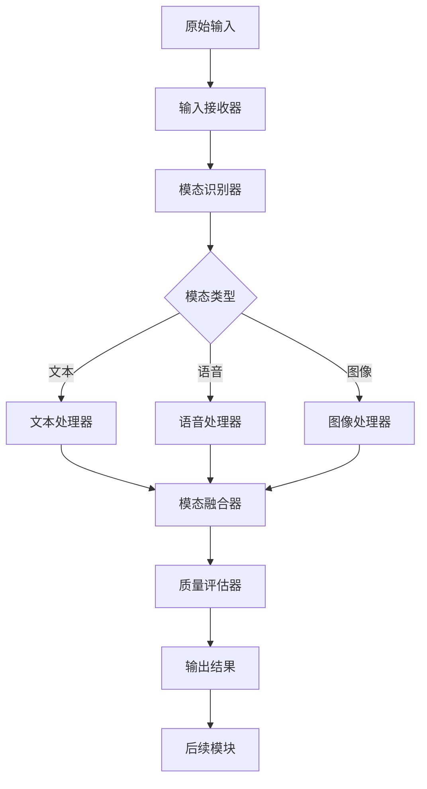
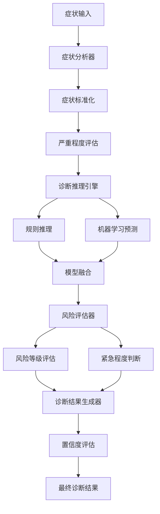
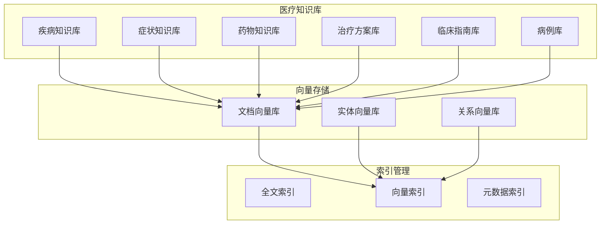
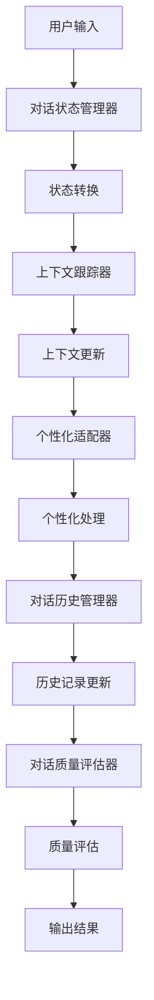
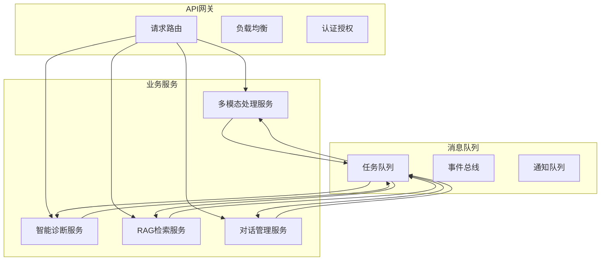
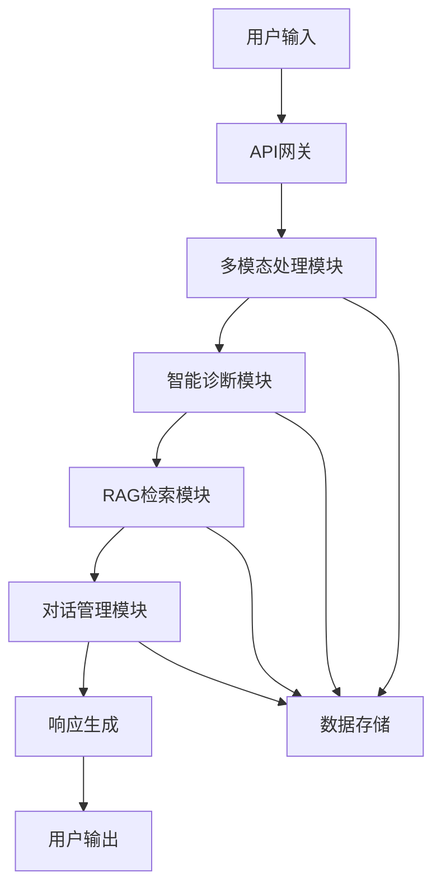

# 智诊通-多模态智能医生问诊系统模块详细设计

## 1. 多模态处理模块详细设计

### 1.1 模块概述

多模态处理模块是智诊通系统的核心输入处理模块，负责处理用户通过文本、语音、图像等多种方式输入的医疗相关信息，并将这些信息进行融合和标准化处理，为后续的智能诊断提供高质量的输入数据。

### 1.2 模块架构详细设计

#### 1.2.1 输入接收器详细设计

**功能描述**：
- 接收来自Web前端、移动端APP、语音助手等多种渠道的输入数据
- 对输入数据进行格式验证和预处理
- 根据数据类型进行分类和路由

**技术实现**：
```python
class InputReceiver:
    def __init__(self):
        self.validators = {
            'text': TextValidator(),
            'audio': AudioValidator(),
            'image': ImageValidator()
        }
        self.routers = {
            'text': TextProcessor(),
            'audio': AudioProcessor(),
            'image': ImageProcessor()
        }
    
    def receive_input(self, input_data):
        # 数据格式验证
        validated_data = self.validate_input(input_data)
        # 数据分类和路由
        return self.route_input(validated_data)
```

**关键特性**：
- 支持多种数据格式（JSON、XML、二进制等）
- 实时数据验证和错误处理
- 可扩展的插件化架构

#### 1.2.2 模态识别器详细设计

**功能描述**：
- 自动识别输入数据的模态类型
- 处理多模态混合输入
- 确定模态优先级和处理顺序

**技术实现**：
```python
class ModalityRecognizer:
    def __init__(self):
        self.modality_detectors = {
            'text': TextDetector(),
            'audio': AudioDetector(),
            'image': ImageDetector()
        }
    
    def recognize_modality(self, input_data):
        modalities = []
        for detector_name, detector in self.modality_detectors.items():
            if detector.detect(input_data):
                modalities.append(detector_name)
        return self.prioritize_modalities(modalities)
```

**关键特性**：
- 基于机器学习的模态识别
- 支持混合模态输入处理
- 动态优先级调整

#### 1.2.3 文本处理器详细设计

**功能描述**：
- 文本清洗和标准化处理
- 医疗术语识别和标准化
- 实体识别和关系抽取
- 文本情感分析

**技术实现**：
```python
class TextProcessor:
    def __init__(self):
        self.cleaner = TextCleaner()
        self.normalizer = MedicalTermNormalizer()
        self.ner = MedicalNER()
        self.sentiment = SentimentAnalyzer()
    
    def process_text(self, text):
        # 文本清洗
        cleaned_text = self.cleaner.clean(text)
        # 医疗术语标准化
        normalized_text = self.normalizer.normalize(cleaned_text)
        # 实体识别
        entities = self.ner.extract_entities(normalized_text)
        # 情感分析
        sentiment = self.sentiment.analyze(normalized_text)
        
        return {
            'text': normalized_text,
            'entities': entities,
            'sentiment': sentiment
        }
```

**关键特性**：
- 医疗领域特定的文本处理
- 多语言支持
- 实时处理能力

#### 1.2.4 语音处理器详细设计

**功能描述**：
- 语音信号预处理
- 语音转文本转换
- 说话人识别
- 语音情感分析
- 方言和口音处理

**技术实现**：
```python
class AudioProcessor:
    def __init__(self):
        self.preprocessor = AudioPreprocessor()
        self.asr = SpeechRecognizer()
        self.speaker_id = SpeakerIdentifier()
        self.emotion = EmotionAnalyzer()
        self.accent = AccentProcessor()
    
    def process_audio(self, audio_data):
        # 音频预处理
        processed_audio = self.preprocessor.process(audio_data)
        # 语音识别
        text = self.asr.recognize(processed_audio)
        # 说话人识别
        speaker = self.speaker_id.identify(processed_audio)
        # 情感分析
        emotion = self.emotion.analyze(processed_audio)
        # 口音处理
        normalized_text = self.accent.normalize(text)
        
        return {
            'text': normalized_text,
            'speaker': speaker,
            'emotion': emotion,
            'confidence': self.asr.confidence
        }
```

**关键特性**：
- 高精度语音识别
- 实时处理能力
- 多方言支持

#### 1.2.5 图像处理器详细设计

**功能描述**：
- 图像预处理和增强
- 医疗图像特征提取
- 症状图像识别
- 图像质量评估
- 隐私信息检测和脱敏

**技术实现**：
```python
class ImageProcessor:
    def __init__(self):
        self.preprocessor = ImagePreprocessor()
        self.feature_extractor = MedicalFeatureExtractor()
        self.symptom_detector = SymptomDetector()
        self.quality_assessor = QualityAssessor()
        self.privacy_detector = PrivacyDetector()
    
    def process_image(self, image_data):
        # 图像预处理
        processed_image = self.preprocessor.process(image_data)
        # 特征提取
        features = self.feature_extractor.extract(processed_image)
        # 症状检测
        symptoms = self.symptom_detector.detect(processed_image)
        # 质量评估
        quality_score = self.quality_assessor.assess(processed_image)
        # 隐私检测
        privacy_info = self.privacy_detector.detect(processed_image)
        
        return {
            'features': features,
            'symptoms': symptoms,
            'quality_score': quality_score,
            'privacy_info': privacy_info
        }
```

**关键特性**：
- 医疗图像专用处理
- 隐私保护机制
- 质量自动评估

#### 1.2.6 模态融合器详细设计

**功能描述**：
- 多模态信息的对齐
- 模态间信息融合
- 冲突信息处理
- 融合结果优化

**技术实现**：
```python
class ModalityFusion:
    def __init__(self):
        self.aligner = ModalityAligner()
        self.fusion_engine = FusionEngine()
        self.conflict_resolver = ConflictResolver()
        self.optimizer = FusionOptimizer()
    
    def fuse_modalities(self, modality_data):
        # 模态对齐
        aligned_data = self.aligner.align(modality_data)
        # 信息融合
        fused_data = self.fusion_engine.fuse(aligned_data)
        # 冲突处理
        resolved_data = self.conflict_resolver.resolve(fused_data)
        # 结果优化
        optimized_data = self.optimizer.optimize(resolved_data)
        
        return optimized_data
```

**关键特性**：
- 智能信息融合
- 冲突自动解决
- 融合质量优化

### 1.3 数据流设计

#### 1.3.1 数据流程图



#### 1.3.2 数据格式规范

**输入数据格式**：
```json
{
    "input_id": "unique_identifier",
    "user_id": "user_identifier",
    "timestamp": "2024-01-01T12:00:00Z",
    "modality": "text|audio|image|multimodal",
    "data": {
        "content": "actual_data_content",
        "format": "data_format",
        "metadata": {}
    }
}
```

**输出数据格式**：
```json
{
    "output_id": "unique_identifier",
    "input_id": "original_input_id",
    "processed_data": {
        "text": "processed_text",
        "entities": [],
        "sentiment": "positive|negative|neutral",
        "confidence": 0.95
    },
    "quality_score": 0.92,
    "processing_time": 0.15
}
```

### 1.4 性能优化设计

#### 1.4.1 并发处理
- 多线程处理不同模态
- 异步处理机制
- 负载均衡策略

#### 1.4.2 缓存机制
- 处理结果缓存
- 模型参数缓存
- 热点数据缓存

#### 1.4.3 资源管理
- 内存池管理
- 连接池管理
- 资源回收机制

## 2. 智能诊断模块详细设计

### 2.1 模块概述

智能诊断模块是智诊通系统的核心业务模块，负责基于用户输入的症状信息和医疗知识库，进行智能诊断推理，生成诊断结果和治疗建议。

### 2.2 模块架构详细设计

#### 2.2.1 症状分析器详细设计

**功能描述**：
- 症状描述解析和标准化
- 症状严重程度评估
- 症状组合分析
- 症状时间线分析

**技术实现**：
```python
class SymptomAnalyzer:
    def __init__(self):
        self.parser = SymptomParser()
        self.normalizer = SymptomNormalizer()
        self.severity_assessor = SeverityAssessor()
        self.combination_analyzer = CombinationAnalyzer()
        self.timeline_analyzer = TimelineAnalyzer()
    
    def analyze_symptoms(self, symptom_data):
        # 症状解析
        parsed_symptoms = self.parser.parse(symptom_data)
        # 症状标准化
        normalized_symptoms = self.normalizer.normalize(parsed_symptoms)
        # 严重程度评估
        severity_scores = self.severity_assessor.assess(normalized_symptoms)
        # 组合分析
        combinations = self.combination_analyzer.analyze(normalized_symptoms)
        # 时间线分析
        timeline = self.timeline_analyzer.analyze(symptom_data)
        
        return {
            'symptoms': normalized_symptoms,
            'severity': severity_scores,
            'combinations': combinations,
            'timeline': timeline
        }
```

**关键特性**：
- 医疗症状标准化
- 多维度症状分析
- 时间序列分析

#### 2.2.2 诊断推理引擎详细设计

**功能描述**：
- 基于规则的诊断推理
- 基于机器学习的诊断预测
- 多模型融合诊断
- 诊断路径优化

**技术实现**：
```python
class DiagnosisEngine:
    def __init__(self):
        self.rule_engine = RuleBasedEngine()
        self.ml_engine = MachineLearningEngine()
        self.fusion_engine = ModelFusionEngine()
        self.path_optimizer = PathOptimizer()
    
    def diagnose(self, symptom_analysis):
        # 规则推理
        rule_results = self.rule_engine.infer(symptom_analysis)
        # 机器学习预测
        ml_results = self.ml_engine.predict(symptom_analysis)
        # 模型融合
        fused_results = self.fusion_engine.fuse(rule_results, ml_results)
        # 路径优化
        optimized_diagnosis = self.path_optimizer.optimize(fused_results)
        
        return optimized_diagnosis
```

**关键特性**：
- 多模型融合诊断
- 诊断路径优化
- 实时推理能力

#### 2.2.3 风险评估器详细设计

**功能描述**：
- 疾病风险等级评估
- 紧急程度判断
- 并发症风险评估
- 预后评估

**技术实现**：
```python
class RiskAssessor:
    def __init__(self):
        self.disease_risk = DiseaseRiskAssessor()
        self.urgency = UrgencyAssessor()
        self.complication = ComplicationAssessor()
        self.prognosis = PrognosisAssessor()
    
    def assess_risk(self, diagnosis_result):
        # 疾病风险评估
        disease_risk = self.disease_risk.assess(diagnosis_result)
        # 紧急程度评估
        urgency_level = self.urgency.assess(diagnosis_result)
        # 并发症风险评估
        complication_risk = self.complication.assess(diagnosis_result)
        # 预后评估
        prognosis = self.prognosis.assess(diagnosis_result)
        
        return {
            'disease_risk': disease_risk,
            'urgency_level': urgency_level,
            'complication_risk': complication_risk,
            'prognosis': prognosis
        }
```

**关键特性**：
- 多维度风险评估
- 实时风险预警
- 个性化风险评估

### 2.3 诊断流程设计

#### 2.3.1 诊断流程图



#### 2.3.2 诊断结果格式

```json
{
    "diagnosis_id": "unique_identifier",
    "user_id": "user_identifier",
    "diagnosis_results": [
        {
            "disease": "disease_name",
            "confidence": 0.85,
            "severity": "moderate",
            "risk_level": "medium",
            "urgency": "normal",
            "recommendations": []
        }
    ],
    "overall_confidence": 0.82,
    "risk_assessment": {
        "disease_risk": "medium",
        "complication_risk": "low",
        "urgency_level": "normal"
    },
    "recommendations": {
        "immediate_actions": [],
        "follow_up": [],
        "preventive_measures": []
    }
}
```

## 3. RAG知识检索模块详细设计

### 3.1 模块概述

RAG知识检索模块是智诊通系统的知识增强核心，负责从医疗知识库中检索相关信息，为大语言模型提供准确可靠的医疗知识支持。

### 3.2 模块架构详细设计

#### 3.2.1 查询理解器详细设计

**功能描述**：
- 用户查询意图理解
- 查询关键词提取
- 查询扩展和优化
- 多语言查询处理

**技术实现**：
```python
class QueryUnderstanding:
    def __init__(self):
        self.intent_classifier = IntentClassifier()
        self.keyword_extractor = KeywordExtractor()
        self.query_expander = QueryExpander()
        self.language_processor = LanguageProcessor()
    
    def understand_query(self, user_query):
        # 意图分类
        intent = self.intent_classifier.classify(user_query)
        # 关键词提取
        keywords = self.keyword_extractor.extract(user_query)
        # 查询扩展
        expanded_query = self.query_expander.expand(user_query, keywords)
        # 语言处理
        processed_query = self.language_processor.process(expanded_query)
        
        return {
            'original_query': user_query,
            'intent': intent,
            'keywords': keywords,
            'expanded_query': expanded_query,
            'processed_query': processed_query
        }
```

**关键特性**：
- 医疗领域意图识别
- 智能查询扩展
- 多语言支持

#### 3.2.2 向量化处理器详细设计

**功能描述**：
- 文档向量化处理
- 查询向量化处理
- 向量质量优化
- 向量索引构建

**技术实现**：
```python
class VectorizationProcessor:
    def __init__(self):
        self.document_encoder = DocumentEncoder()
        self.query_encoder = QueryEncoder()
        self.vector_optimizer = VectorOptimizer()
        self.index_builder = IndexBuilder()
    
    def process_documents(self, documents):
        # 文档向量化
        document_vectors = self.document_encoder.encode(documents)
        # 向量优化
        optimized_vectors = self.vector_optimizer.optimize(document_vectors)
        # 索引构建
        index = self.index_builder.build(optimized_vectors)
        
        return index
    
    def process_query(self, query):
        # 查询向量化
        query_vector = self.query_encoder.encode(query)
        # 向量优化
        optimized_vector = self.vector_optimizer.optimize(query_vector)
        
        return optimized_vector
```

**关键特性**：
- 高质量向量化
- 实时向量处理
- 索引自动更新

#### 3.2.3 检索引擎详细设计

**功能描述**：
- 向量相似度检索
- 混合检索策略
- 实时检索优化
- 检索结果缓存

**技术实现**：
```python
class RetrievalEngine:
    def __init__(self):
        self.vector_retriever = VectorRetriever()
        self.hybrid_retriever = HybridRetriever()
        self.cache_manager = CacheManager()
        self.optimizer = RetrievalOptimizer()
    
    def retrieve(self, query_vector, query_text):
        # 检查缓存
        cached_results = self.cache_manager.get(query_text)
        if cached_results:
            return cached_results
        
        # 向量检索
        vector_results = self.vector_retriever.retrieve(query_vector)
        # 混合检索
        hybrid_results = self.hybrid_retriever.retrieve(query_text, vector_results)
        # 结果优化
        optimized_results = self.optimizer.optimize(hybrid_results)
        
        # 缓存结果
        self.cache_manager.set(query_text, optimized_results)
        
        return optimized_results
```

**关键特性**：
- 高效向量检索
- 混合检索策略
- 智能缓存机制

### 3.3 知识库设计

#### 3.3.1 知识库结构



#### 3.3.2 知识库更新机制

**增量更新**：
- 新知识自动检测
- 增量向量化处理
- 索引实时更新

**质量保证**：
- 知识来源验证
- 内容质量评估
- 一致性检查

## 4. 对话管理模块详细设计

### 4.1 模块概述

对话管理模块负责管理用户与系统的对话过程，包括对话状态跟踪、上下文管理、个性化适配等功能。

### 4.2 模块架构详细设计

#### 4.2.1 对话状态管理器详细设计

**功能描述**：
- 对话状态跟踪
- 状态转换管理
- 异常状态处理
- 状态持久化

**技术实现**：
```python
class ConversationStateManager:
    def __init__(self):
        self.state_tracker = StateTracker()
        self.transition_manager = TransitionManager()
        self.exception_handler = ExceptionHandler()
        self.persistence = StatePersistence()
    
    def manage_state(self, conversation_id, user_input):
        # 获取当前状态
        current_state = self.state_tracker.get_state(conversation_id)
        # 状态转换
        new_state = self.transition_manager.transition(current_state, user_input)
        # 异常处理
        if new_state.is_exception():
            new_state = self.exception_handler.handle(new_state)
        # 状态持久化
        self.persistence.save_state(conversation_id, new_state)
        
        return new_state
```

**关键特性**：
- 状态机管理
- 异常自动处理
- 状态持久化

#### 4.2.2 上下文跟踪器详细设计

**功能描述**：
- 对话上下文维护
- 关键信息提取
- 上下文压缩
- 上下文更新

**技术实现**：
```python
class ContextTracker:
    def __init__(self):
        self.context_store = ContextStore()
        self.information_extractor = InformationExtractor()
        self.compressor = ContextCompressor()
        self.updater = ContextUpdater()
    
    def track_context(self, conversation_id, message):
        # 获取当前上下文
        current_context = self.context_store.get_context(conversation_id)
        # 信息提取
        extracted_info = self.information_extractor.extract(message)
        # 上下文更新
        updated_context = self.updater.update(current_context, extracted_info)
        # 上下文压缩
        compressed_context = self.compressor.compress(updated_context)
        # 保存上下文
        self.context_store.save_context(conversation_id, compressed_context)
        
        return compressed_context
```

**关键特性**：
- 智能上下文管理
- 信息自动提取
- 上下文优化

### 4.3 对话流程设计

#### 4.3.1 对话流程图



#### 4.3.2 对话状态定义

```json
{
    "conversation_id": "unique_identifier",
    "user_id": "user_identifier",
    "current_state": "diagnosis_in_progress",
    "context": {
        "symptoms": [],
        "diagnosis": null,
        "recommendations": [],
        "user_preferences": {}
    },
    "history": [
        {
            "timestamp": "2024-01-01T12:00:00Z",
            "user_message": "user_input",
            "system_response": "system_response",
            "state": "previous_state"
        }
    ],
    "quality_metrics": {
        "user_satisfaction": 0.85,
        "conversation_flow": 0.92,
        "information_completeness": 0.78
    }
}
```

## 5. 系统集成设计

### 5.1 模块间通信设计

#### 5.1.1 通信架构



#### 5.1.2 接口设计

**RESTful API接口**：
```python
# 多模态处理接口
POST /api/v1/multimodal/process
{
    "input_data": {},
    "modality": "text|audio|image|multimodal"
}

# 智能诊断接口
POST /api/v1/diagnosis/analyze
{
    "symptoms": [],
    "user_context": {}
}

# RAG检索接口
POST /api/v1/rag/retrieve
{
    "query": "query_text",
    "context": {}
}

# 对话管理接口
POST /api/v1/conversation/process
{
    "message": "user_message",
    "conversation_id": "conversation_id"
}
```

### 5.2 数据流设计

#### 5.2.1 系统数据流



#### 5.2.2 数据同步机制

**实时同步**：
- WebSocket实时通信
- 消息队列异步处理
- 数据库事务管理

**批量同步**：
- 定时数据同步
- 增量数据更新
- 数据一致性检查

## 6. 性能优化设计

### 6.1 模块级优化

#### 6.1.1 多模态处理优化
- 并行处理不同模态
- 模型推理优化
- 内存使用优化

#### 6.1.2 智能诊断优化
- 诊断算法优化
- 模型缓存机制
- 推理加速

#### 6.1.3 RAG检索优化
- 向量检索优化
- 索引结构优化
- 缓存策略优化

#### 6.1.4 对话管理优化
- 状态管理优化
- 上下文压缩优化
- 历史数据优化

### 6.2 系统级优化

#### 6.2.1 架构优化
- 微服务拆分
- 负载均衡
- 服务网格

#### 6.2.2 存储优化
- 数据库优化
- 缓存策略
- 存储分层

#### 6.2.3 网络优化
- CDN加速
- 网络压缩
- 连接复用

## 7. 监控和运维

### 7.1 监控设计

#### 7.1.1 性能监控
- 响应时间监控
- 吞吐量监控
- 资源使用监控

#### 7.1.2 业务监控
- 诊断准确率监控
- 用户满意度监控
- 系统可用性监控

#### 7.1.3 错误监控
- 异常检测
- 错误日志
- 告警机制

### 7.2 运维设计

#### 7.2.1 部署策略
- 蓝绿部署
- 滚动更新
- 灰度发布

#### 7.2.2 备份恢复
- 数据备份
- 系统备份
- 灾难恢复

#### 7.2.3 扩展策略
- 水平扩展
- 垂直扩展
- 自动扩缩容

## 8. 总结

智诊通系统的模块详细设计涵盖了系统的核心功能模块，每个模块都有明确的功能定义、技术实现方案和性能优化策略。通过模块化设计，系统具有良好的可扩展性、可维护性和可测试性。

关键设计原则：
1. **模块化设计**：每个模块职责单一，接口清晰
2. **高内聚低耦合**：模块内部紧密相关，模块间松耦合
3. **可扩展性**：支持功能扩展和性能扩展
4. **可维护性**：代码结构清晰，易于维护
5. **可测试性**：模块独立，便于单元测试和集成测试

通过这样的详细设计，可以为后续的开发、测试和部署提供清晰的指导，确保系统的高质量交付。
