# 智诊通-多模态智能医生问诊系统架构设计

## 1. 系统概述

智诊通是一个基于多模态AI技术的智能医生问诊系统，集成了文本、语音、图像等多种模态的输入处理能力，通过RAG（检索增强生成）技术提供精准的医疗诊断建议和健康咨询服务。

### 1.1 系统特点
- **多模态输入**：支持文本、语音、图像等多种输入方式
- **智能诊断**：基于大语言模型和医疗知识库的智能诊断
- **RAG增强**：检索增强生成技术提供准确可靠的医疗建议
- **实时交互**：支持实时对话和交互式问诊
- **安全可靠**：医疗数据加密存储，确保隐私安全

### 1.2 应用场景
- 在线医疗咨询
- 症状初步诊断
- 健康知识问答
- 用药指导
- 就医建议

## 2. 整体系统架构

### 2.1 系统架构图

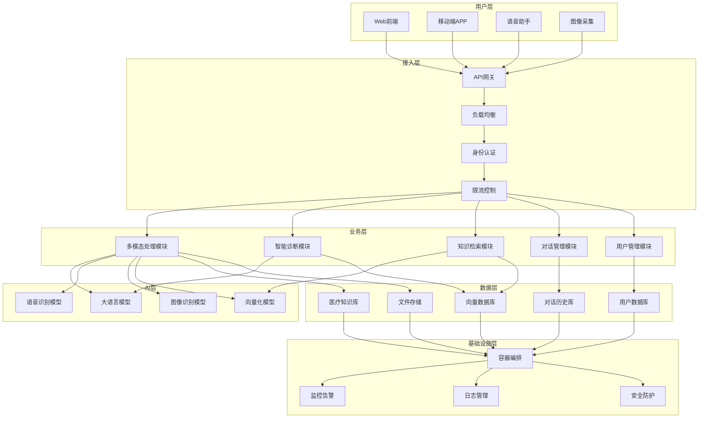

### 2.2 架构设计说明

**用户层**：
- **Web前端**：基于React/Vue的响应式Web界面
- **移动端APP**：支持iOS和Android的原生应用
- **语音助手**：集成语音交互功能
- **图像采集**：支持医疗图像上传和分析

**接入层**：
- **API网关**：统一接口管理，支持多种协议
- **负载均衡**：确保系统高可用性和性能
- **身份认证**：用户身份验证和权限管理
- **限流控制**：防止系统过载，保护后端服务

**业务层**：
- **多模态处理模块**：处理文本、语音、图像等多种输入
- **智能诊断模块**：基于AI模型的智能诊断逻辑
- **知识检索模块**：RAG检索增强生成核心模块
- **对话管理模块**：管理用户对话上下文和状态
- **用户管理模块**：用户信息管理和个性化服务

**AI层**：
- **大语言模型**：GPT、Claude等大语言模型
- **语音识别模型**：Whisper等语音转文本模型
- **图像识别模型**：医疗图像识别和分析模型
- **向量化模型**：文本和图像向量化模型

**数据层**：
- **医疗知识库**：结构化的医疗知识和诊断标准
- **向量数据库**：存储文档和查询的向量表示
- **用户数据库**：用户信息和偏好数据
- **对话历史库**：用户对话记录和上下文
- **文件存储**：医疗图像和文档存储

**基础设施层**：
- **容器编排**：Kubernetes容器编排管理
- **监控告警**：系统性能监控和异常告警
- **日志管理**：集中化日志收集和分析
- **安全防护**：数据加密、访问控制等安全措施

## 3. 核心业务流程

### 3.1 整体业务流程图

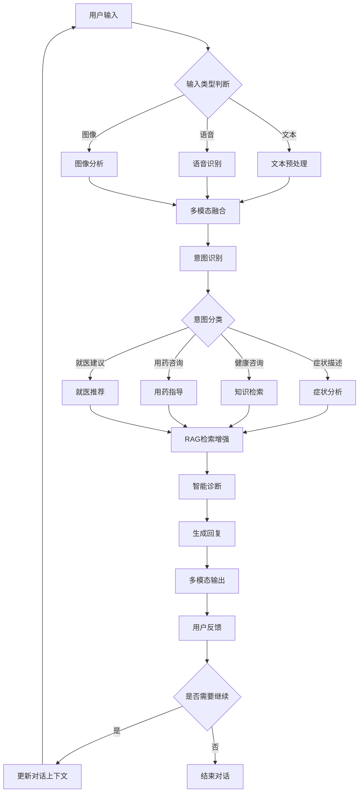

### 3.2 业务流程详细说明

**1. 用户输入阶段**
- 支持文本、语音、图像等多种输入方式
- 实时输入处理和格式验证
- 输入内容的安全检查和过滤

**2. 多模态处理阶段**
- **文本预处理**：文本清洗、分词、实体识别
- **语音识别**：语音转文本、说话人识别、情感分析
- **图像分析**：医疗图像识别、症状特征提取、图像质量评估

**3. 意图识别阶段**
- 基于NLP技术的用户意图识别
- 医疗领域特定的意图分类
- 多轮对话的上下文理解

**4. 业务处理阶段**
- **症状分析**：症状描述解析、严重程度评估
- **知识检索**：医疗知识库检索、相关案例匹配
- **用药指导**：药物信息查询、用药建议生成
- **就医建议**：科室推荐、医院推荐、就医时机建议

**5. RAG检索增强阶段**
- 向量化查询和文档检索
- 相关医疗知识检索
- 检索结果的排序和筛选

**6. 智能诊断阶段**
- 基于大语言模型的诊断推理
- 多源信息的融合分析
- 诊断结果的置信度评估

**7. 回复生成阶段**
- 自然语言回复生成
- 多模态回复内容组织
- 回复内容的医疗准确性验证

**8. 用户交互阶段**
- 多模态输出展示
- 用户反馈收集
- 对话上下文管理

## 4. 核心模块详细设计

### 4.1 多模态处理模块

#### 4.1.1 模块架构图

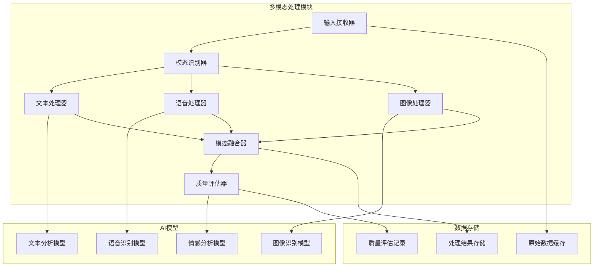

#### 4.1.2 详细功能说明

**输入接收器**：
- 接收来自不同渠道的输入数据
- 数据格式验证和预处理
- 输入数据的分类和路由

**模态识别器**：
- 自动识别输入数据的模态类型
- 多模态混合输入的分离
- 模态优先级排序

**文本处理器**：
- 文本清洗和标准化
- 医疗术语识别和标准化
- 实体识别和关系抽取
- 文本情感分析

**语音处理器**：
- 语音信号预处理
- 语音转文本转换
- 说话人识别
- 语音情感分析
- 方言和口音处理

**图像处理器**：
- 图像预处理和增强
- 医疗图像特征提取
- 症状图像识别
- 图像质量评估
- 隐私信息检测和脱敏

**模态融合器**：
- 多模态信息的对齐
- 模态间信息融合
- 冲突信息处理
- 融合结果优化

**质量评估器**：
- 处理结果质量评估
- 置信度计算
- 异常检测和处理
- 质量反馈机制

### 4.2 智能诊断模块

#### 4.2.1 模块架构图

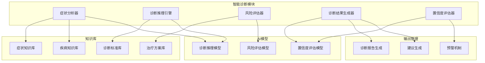

#### 4.2.2 详细功能说明

**症状分析器**：
- 症状描述解析和标准化
- 症状严重程度评估
- 症状组合分析
- 症状时间线分析

**诊断推理引擎**：
- 基于规则的诊断推理
- 基于机器学习的诊断预测
- 多模型融合诊断
- 诊断路径优化

**风险评估器**：
- 疾病风险等级评估
- 紧急程度判断
- 并发症风险评估
- 预后评估

**诊断结果生成器**：
- 诊断结果格式化
- 诊断依据说明
- 诊断置信度标注
- 诊断结果验证

**置信度评估器**：
- 诊断结果置信度计算
- 不确定性量化
- 诊断可靠性评估
- 建议可信度评估

### 4.3 RAG知识检索模块

#### 4.3.1 模块架构图

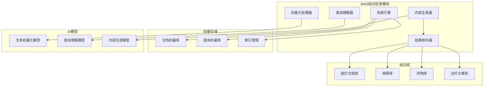

#### 4.3.2 详细功能说明

**查询理解器**：
- 用户查询意图理解
- 查询关键词提取
- 查询扩展和优化
- 多语言查询处理

**向量化处理器**：
- 文档向量化处理
- 查询向量化处理
- 向量质量优化
- 向量索引构建

**检索引擎**：
- 向量相似度检索
- 混合检索策略
- 实时检索优化
- 检索结果缓存

**结果排序器**：
- 相关性排序
- 权威性排序
- 时效性排序
- 个性化排序

**内容生成器**：
- 检索结果整合
- 内容摘要生成
- 个性化内容定制
- 多模态内容生成

### 4.4 对话管理模块

#### 4.4.1 模块架构图

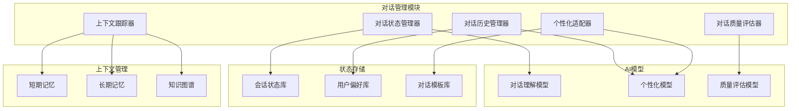

#### 4.4.2 详细功能说明

**对话状态管理器**：
- 对话状态跟踪
- 状态转换管理
- 异常状态处理
- 状态持久化

**上下文跟踪器**：
- 对话上下文维护
- 关键信息提取
- 上下文压缩
- 上下文更新

**对话历史管理器**：
- 对话记录存储
- 历史查询分析
- 用户行为模式识别
- 历史数据清理

**个性化适配器**：
- 用户偏好学习
- 个性化回复生成
- 交互风格适配
- 知识水平适配

**对话质量评估器**：
- 对话流畅度评估
- 用户满意度评估
- 对话效率评估
- 质量改进建议

## 5. 数据架构设计

### 5.1 数据架构图

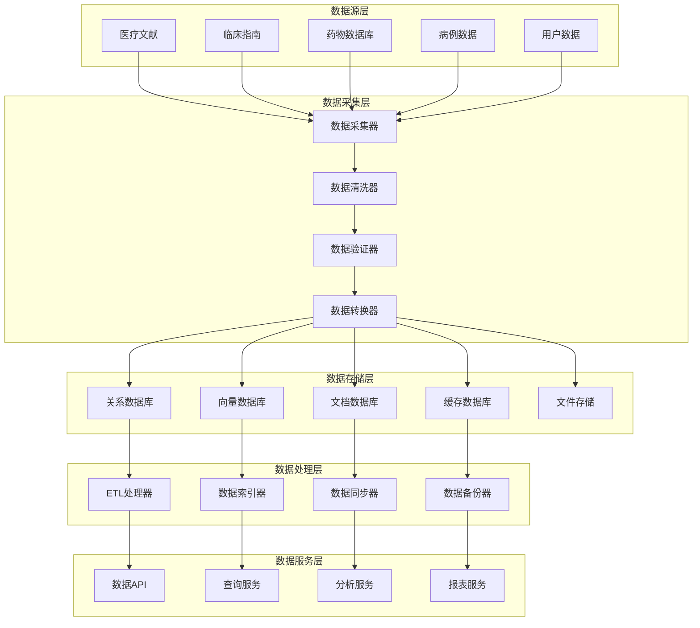

### 5.2 数据模型设计

#### 5.2.1 用户数据模型

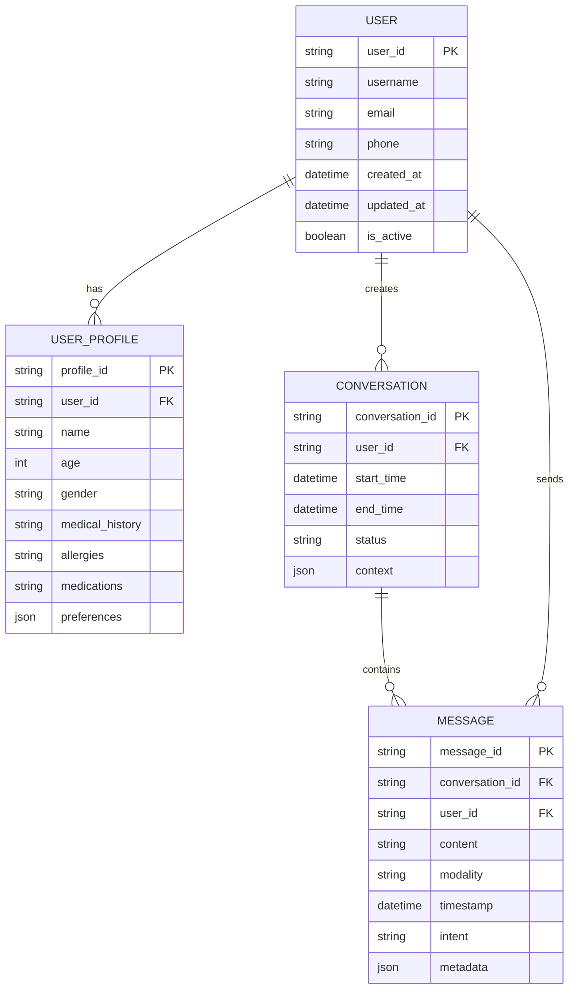

#### 5.2.2 医疗知识数据模型

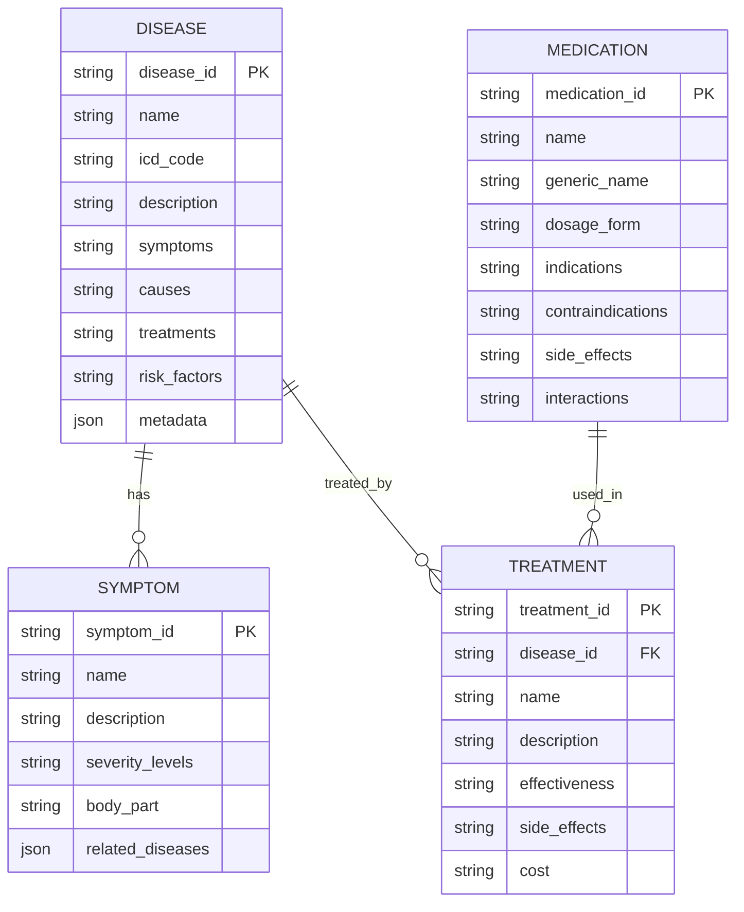

## 6. 技术架构设计

### 6.1 技术栈选择

#### 6.1.1 前端技术栈
- **框架**：React 18 + TypeScript
- **状态管理**：Redux Toolkit
- **UI组件库**：Ant Design / Material-UI
- **构建工具**：Vite
- **测试框架**：Jest + React Testing Library

#### 6.1.2 后端技术栈
- **语言**：Python 3.11+
- **Web框架**：FastAPI
- **异步处理**：Celery + Redis
- **数据库**：PostgreSQL + Redis
- **向量数据库**：Pinecone / Weaviate
- **消息队列**：RabbitMQ

#### 6.1.3 AI模型技术栈
- **大语言模型**：GPT-4 / Claude / 文心一言
- **语音识别**：Whisper / 讯飞语音识别
- **图像识别**：ResNet / ViT / 医疗专用模型
- **向量化模型**：OpenAI Embeddings / BGE / 智源Embedding
- **RAG框架**：LangChain / LlamaIndex

#### 6.1.4 基础设施技术栈
- **容器化**：Docker + Kubernetes
- **服务网格**：Istio
- **监控**：Prometheus + Grafana
- **日志**：ELK Stack
- **CI/CD**：GitHub Actions / GitLab CI

### 6.2 部署架构图

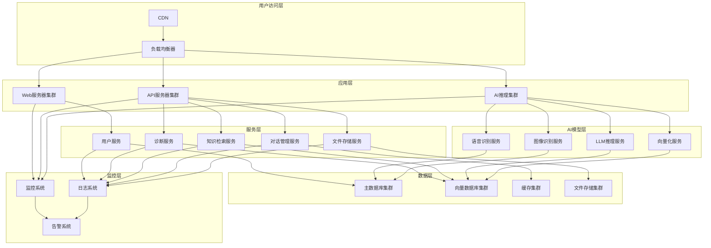

## 7. 安全架构设计

### 7.1 安全架构图

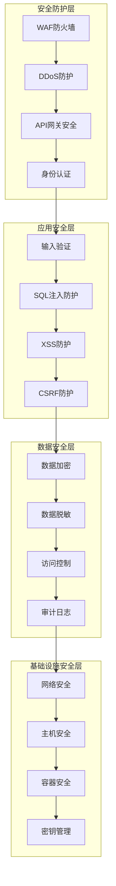

### 7.2 安全措施详细说明

**网络安全**：
- WAF防火墙防护
- DDoS攻击防护
- 网络隔离和分段
- VPN访问控制

**应用安全**：
- 输入数据验证和过滤
- SQL注入防护
- XSS攻击防护
- CSRF攻击防护
- 会话管理安全

**数据安全**：
- 数据传输加密（TLS/SSL）
- 数据存储加密
- 敏感数据脱敏
- 数据访问权限控制
- 数据备份和恢复

**身份认证**：
- 多因素认证
- OAuth2.0/OIDC
- JWT令牌管理
- 单点登录（SSO）
- 权限管理（RBAC）

## 8. 性能优化设计

### 8.1 性能优化策略

#### 8.1.1 缓存策略
- **多级缓存**：浏览器缓存、CDN缓存、应用缓存、数据库缓存
- **缓存策略**：LRU、LFU、TTL等缓存淘汰策略
- **缓存预热**：系统启动时预加载热点数据
- **缓存更新**：异步更新和失效策略

#### 8.1.2 数据库优化
- **索引优化**：合理设计数据库索引
- **查询优化**：SQL查询语句优化
- **分库分表**：水平分片和垂直分片
- **读写分离**：主从复制和读写分离

#### 8.1.3 AI模型优化
- **模型量化**：模型压缩和量化
- **模型缓存**：推理结果缓存
- **批量处理**：批量推理优化
- **异步处理**：异步推理和结果回调

#### 8.1.4 系统架构优化
- **微服务架构**：服务拆分和独立部署
- **负载均衡**：多实例负载均衡
- **异步处理**：消息队列和异步任务
- **资源池化**：连接池和线程池

### 8.2 性能监控指标

**系统性能指标**：
- 响应时间（RT）
- 吞吐量（TPS）
- 并发用户数
- 错误率

**资源使用指标**：
- CPU使用率
- 内存使用率
- 磁盘I/O
- 网络带宽

**业务性能指标**：
- 诊断准确率
- 用户满意度
- 对话完成率
- 知识检索准确率

## 9. 部署和运维

### 9.1 部署流程

#### 9.1.1 CI/CD流水线

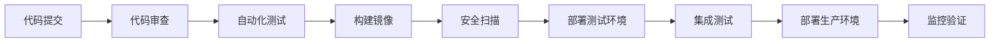

#### 9.1.2 环境管理
- **开发环境**：本地开发环境
- **测试环境**：功能测试和集成测试
- **预生产环境**：生产环境模拟
- **生产环境**：正式运行环境

### 9.2 运维监控

#### 9.2.1 监控体系
- **基础设施监控**：服务器、网络、存储监控
- **应用监控**：应用性能、错误率、响应时间监控
- **业务监控**：用户行为、业务指标监控
- **安全监控**：安全事件、异常访问监控

#### 9.2.2 告警机制
- **多级告警**：警告、严重、紧急等级别
- **多渠道通知**：邮件、短信、钉钉、微信通知
- **自动恢复**：自动故障恢复和降级处理
- **人工介入**：需要人工处理的告警升级

## 10. 项目实施计划

### 10.1 开发阶段规划

#### 第一阶段：基础架构搭建（4周）
- 环境搭建和基础框架开发
- 数据库设计和初始化
- 基础API接口开发
- 用户认证和权限管理

#### 第二阶段：核心功能开发（8周）
- 多模态处理模块开发
- 智能诊断模块开发
- RAG知识检索模块开发
- 对话管理模块开发

#### 第三阶段：AI模型集成（6周）
- 大语言模型集成
- 语音识别模型集成
- 图像识别模型集成
- 向量化模型集成

#### 第四阶段：系统集成测试（4周）
- 模块集成测试
- 系统功能测试
- 性能测试和优化
- 安全测试

#### 第五阶段：部署上线（2周）
- 生产环境部署
- 监控系统部署
- 用户培训
- 正式上线

### 10.2 风险评估和应对

**技术风险**：
- AI模型性能不达标
- 系统性能瓶颈
- 数据质量问题

**应对措施**：
- 多模型备选方案
- 性能优化和扩展
- 数据质量检查和清洗

**业务风险**：
- 用户接受度不高
- 医疗准确性风险
- 合规性要求

**应对措施**：
- 用户体验优化
- 医疗专家审核
- 合规性评估和调整

## 11. 总结

智诊通-多模态智能医生问诊系统是一个复杂的AI医疗应用系统，需要整合多种技术栈和AI模型。通过合理的架构设计、模块化开发和系统集成，可以构建一个功能完善、性能优良、安全可靠的智能问诊系统。

系统的核心价值在于：
1. **多模态交互**：支持文本、语音、图像等多种输入方式
2. **智能诊断**：基于AI技术的智能诊断和健康建议
3. **知识增强**：通过RAG技术提供准确可靠的医疗知识
4. **个性化服务**：根据用户特征提供个性化医疗服务
5. **安全可靠**：确保医疗数据安全和隐私保护

通过分阶段实施和持续优化，可以逐步完善系统功能，提升用户体验，为医疗健康领域提供有价值的AI服务。
