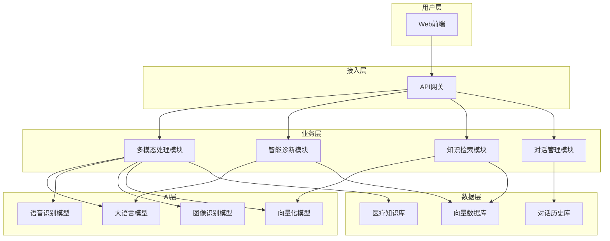
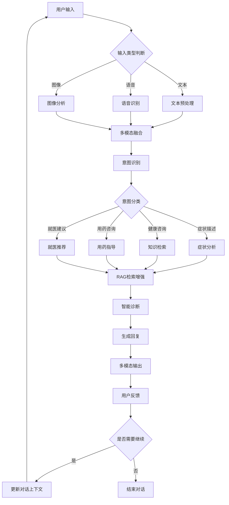
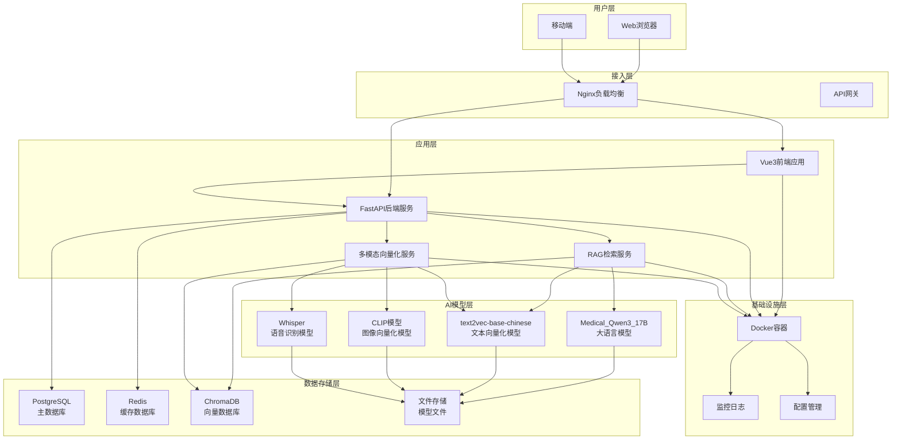
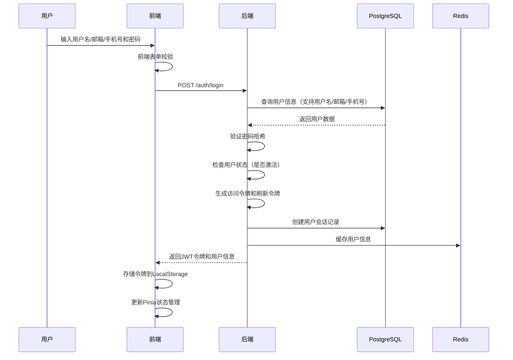
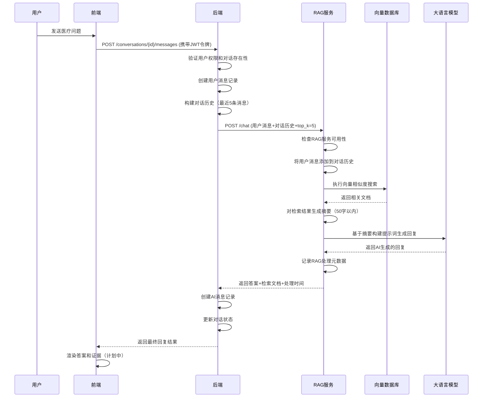
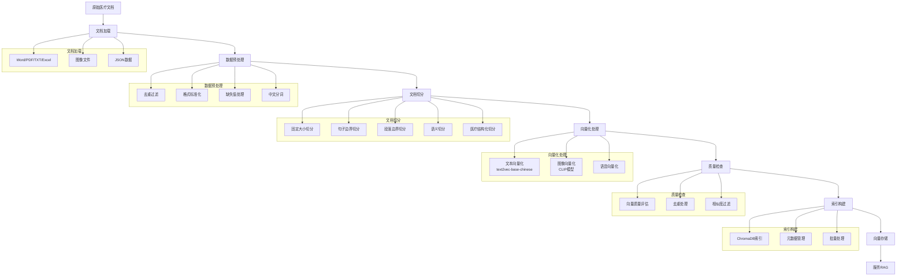

# 智诊通-多模态智能医生问诊系统 项目汇报

## 目录

1. 项目组成员介绍
2. 项目背景与概述
3. 系统整体架构
4. 技术架构与设计
5. 主要模块说明
6. 系统运行情况
7. 项目成果展示
8. 项目总结与思考

---

## 1. 项目组成员介绍

- 组长：田库

- 成员：张志良、焦志远、臧昊、范金龙、杨玥、刘书芹、刘毅军、于洪胜、郭亮、柯华应、隋衡、朴明哲

- 角色与分工：

  

---

## 2. 项目背景与概述

### 2.1 背景

医疗健康服务持续数字化，用户希望通过在线渠道获得可靠的初步诊疗建议与健康咨询。然而，传统纯生成式对话系统在医疗场景中容易产生“幻觉”，且缺乏来源可追溯性，难以满足合规与安全要求。近年来，检索增强生成（RAG）技术成熟，将领域知识检索与大语言模型生成相结合，能够显著提高答案的准确性与可解释性。此外，真实世界问诊往往呈现多模态形态（文本描述、语音问询、图像上传等），这要求系统具备对文本、语音与医学图像的统一处理与融合能力。因此，建设一套以多模态输入为入口、以 RAG 为核心、具备工程化落地能力（部署、运维、观测、度量）的智能问诊系统，既顺应技术趋势，也能切实提升医疗咨询的效率与质量。

### 2.2 项目目标

项目旨在构建“多模态 + RAG”的智能问诊系统：支持文本、语音与图像等多种输入方式，面向患者与医生输出结构化、可追溯的医疗建议与就医指引。我们强调工程化可用性：提供可部署、可运维、可观测、可度量的端到端能力，覆盖开发、测试与生产环境，兼容本地与容器化部署。此外，系统在架构上坚持可扩展与可替换原则：LLM、Embedding 模型、向量数据库、召回与重排序策略以及数据源均以配置化方式进行装配，便于在不同资源与预算约束下进行灵活调优。我们也关注安全与合规，在认证鉴权、数据保护、访问控制与审计追踪方面逐步完善，为医疗级场景打下基础。

### 2.3 项目概述

系统能力包含：多模态输入（文本、语音 ASR、医学图像）、基于 RAG 的智能问诊与建议生成（结合可追溯证据，支持后续证据可视化）、多轮对话管理（上下文维护、消息持久化、会话隔离）、用户与权限（注册/登录、JWT 鉴权、角色权限）、以及运维与部署（Docker Compose、统一日志、健康检查与初步可观测性）。与通用对话系统不同，本系统更强调“事实性与来源透明”，通过检索真实的医学知识库与规范化资料作为生成的依据，从而提升答案可信度与可用性。随着后续迭代，系统将引入更细粒度的指标体系、证据侧栏可视化与质量评估闭环，进一步增强医学场景的可靠与安全。

---

## 3. 系统整体架构

### 3.1 架构图



### 3.2 业务流程图



### 3.3 架构流程说明

#### 3.3.1 系统架构流程说明

**分层架构设计**：

- **用户层**：Web 前端作为用户交互入口，提供多模态输入界面
- **接入层**：API 网关统一处理请求路由、认证授权和负载均衡
- **业务层**：四大核心模块协同工作
  - 多模态处理模块：处理文本、语音、图像等多种输入类型
  - 智能诊断模块：基于 AI 模型进行医疗诊断分析
  - 知识检索模块：从医疗知识库中检索相关信息
  - 对话管理模块：维护对话上下文和历史记录
- **AI 层**：集成多种 AI 模型，包括大语言模型、语音识别、图像识别和向量化模型
- **数据层**：医疗知识库、向量数据库、对话历史库提供数据支撑

**模块间协作**：

- 用户输入通过 API 网关分发到相应业务模块
- 多模态处理模块调用 AI 层各模型进行数据处理
- 智能诊断和知识检索模块协同工作，提供诊断建议
- 对话管理模块维护用户交互状态和历史记录

#### 3.3.2 业务流程说明

**多模态输入处理**：

1. **输入类型判断**：系统自动识别用户输入类型（文本/语音/图像）
2. **预处理阶段**：
   - 文本：进行分词、实体识别、医疗术语标准化
   - 语音：通过 ASR 模型转换为文本
   - 图像：通过 CV 模型进行医学图像分析
3. **多模态融合**：将不同模态的信息整合为统一表示

**智能诊断流程**：

1. **意图识别**：理解用户真实意图和需求
2. **意图分类**：将用户需求分类为症状描述、健康咨询、用药咨询、就医建议等
3. **专业处理**：根据分类调用相应的专业模块
   - 症状分析：分析症状特征和可能原因
   - 知识检索：从医疗知识库检索相关信息
   - 用药指导：提供药物使用建议和注意事项
   - 就医推荐：推荐合适的科室和医生

**RAG 增强生成**：

1. **知识检索**：基于用户问题从向量数据库检索相关医疗知识
2. **上下文构建**：结合检索结果和对话历史构建完整上下文
3. **智能诊断**：大语言模型基于检索知识进行诊断分析
4. **回复生成**：生成专业、准确的医疗建议和回复

**交互循环机制**：

1. **多模态输出**：以文本、语音、图像等多种形式输出结果
2. **用户反馈**：收集用户对回复的反馈和评价
3. **对话管理**：根据用户反馈决定是否继续对话
4. **上下文更新**：更新对话上下文，为后续交互提供参考

**技术特点**：

- **模块化设计**：各模块独立可替换，便于维护和升级
- **多模态支持**：支持文本、语音、图像等多种输入输出方式
- **智能诊断**：基于 RAG 技术提供准确的医疗诊断建议
- **对话连续性**：支持多轮对话，维护上下文一致性
- **可扩展性**：架构设计支持新模块和新功能的快速集成

---

## 4. 技术架构

### 4.1 技术栈

- 后端：FastAPI、Pydantic、HTTPX、Uvicorn、Redis、PostgreSQL
- 前端：Vue3、TypeScript、Vite、Axios
- RAG/向量化：Embedding Models（text2vec/自研）、LLM（Qwen 系列，支持本地/镜像）
- 部署：Docker、Docker Compose、Nginx（可选）

### 4.2 技术架构图



### 4.3 关键设计

#### 4.3.1 系统设计原则

**模块化与解耦**：

- 采用微服务架构，各模块独立部署和扩展
- 通过 API 网关统一管理服务调用和路由
- 数据层、业务层、AI 层完全解耦，便于独立升级

**多模态统一处理**：

- 支持文本、语音、图像等多种输入模态
- 统一的向量化表示空间，实现跨模态检索
- 多模态融合技术，提供更丰富的上下文信息

**医疗领域专业化**：

- 基于医疗知识图谱的语义理解
- 医疗术语标准化和实体识别
- 符合医疗诊断流程的业务逻辑设计

**高可用与容错**：

- 服务降级和熔断机制
- 多级缓存策略（Redis + 本地缓存）
- 异步处理和流式响应

#### 4.3.2 前端架构设计

**技术栈选择**：

- **Vue 3 + TypeScript**：提供类型安全和现代化开发体验
- **Vite**：快速构建和热更新，提升开发效率
- **Ant Design Vue**：企业级 UI 组件库，保证界面一致性
- **Pinia**：轻量级状态管理，替代 Vuex

**核心功能模块**：

- **用户认证模块**：登录/注册、JWT 令牌管理、权限控制
- **对话界面模块**：多模态输入、实时对话、历史记录
- **个人中心模块**：用户档案、设置管理、数据统计
- **系统管理模块**：健康检查、日志查看、配置管理

**技术特性**：

- **响应式设计**：适配桌面端和移动端
- **流式对话**：基于 SSE 的实时消息推送
- **离线支持**：PWA 技术，支持离线使用
- **性能优化**：组件懒加载、虚拟滚动、图片压缩

#### 4.3.3 后端架构设计

**API 服务层**：

- **FastAPI 框架**：高性能异步 API，自动生成 OpenAPI 文档
- **模块化路由**：认证、对话、诊断、知识、多模态、系统管理
- **中间件系统**：CORS、认证、限流、日志、异常处理
- **数据验证**：基于 Pydantic 的请求/响应模型验证

**业务服务层**：

- **用户管理服务**：注册、登录、权限管理、会话控制
- **对话管理服务**：会话创建、消息存储、上下文管理
- **诊断服务**：症状分析、诊断建议、风险评估
- **知识检索服务**：RAG 检索、知识图谱查询、多模态搜索

**数据访问层**：

- **PostgreSQL**：主数据库，存储用户信息、对话记录、系统配置
- **Redis**：缓存层，存储会话信息、临时数据、限流计数
- **ChromaDB**：向量数据库，存储文档向量、支持语义检索

#### 4.3.4 RAG 检索增强设计

**检索策略**：

- **混合检索**：向量检索 + 关键词检索 + 知识图谱检索
- **重排序算法**：基于医疗逻辑权重的结果重排序
- **阈值过滤**：相似度阈值过滤，确保检索质量
- **去重处理**：基于语义相似度的结果去重

**知识库构建**：

- **文档预处理**：医疗术语标准化、实体识别、结构化处理
- **智能切分**：基于医疗语义的文档切分，保持上下文完整性
- **向量化**：使用医疗领域预训练模型进行文本向量化
- **索引构建**：构建高效的向量索引，支持快速检索

**生成增强**：

- **上下文构建**：结合检索结果和对话历史构建完整上下文
- **提示词工程**：基于医疗场景的专业提示词模板
- **流式生成**：支持实时流式输出，提升用户体验
- **质量控制**：生成内容的质量评估和过滤机制

#### 4.3.5 多模态处理设计

**统一向量化**：

- **文本向量化**：基于 text2vec-base-chinese 的语义向量表示
- **图像向量化**：基于 CLIP 模型的图像-文本联合向量化
- **语音向量化**：基于 Whisper 的语音识别 + 文本向量化
- **跨模态对齐**：确保不同模态向量在同一语义空间

**多模态融合**：

- **特征融合**：多模态特征的深度融合和权重分配
- **注意力机制**：基于注意力机制的多模态信息整合
- **上下文建模**：多模态信息的时序和空间关系建模
- **决策融合**：多模态结果的智能融合和决策

#### 4.3.6 安全与合规设计

**数据安全**：

- **加密传输**：HTTPS/TLS 加密，保护数据传输安全
- **数据脱敏**：敏感医疗信息的自动脱敏处理
- **访问控制**：基于角色的细粒度权限控制
- **审计日志**：完整的操作审计和日志记录

**医疗合规**：

- **隐私保护**：符合医疗数据保护法规的隐私保护机制
- **责任声明**：明确的 AI 辅助诊断责任声明和免责条款
- **质量控制**：医疗建议的质量控制和风险评估
- **可追溯性**：完整的诊断过程记录和可追溯性

#### 4.3.7 性能优化设计

**缓存策略**：

- **多级缓存**：浏览器缓存 + CDN 缓存 + Redis 缓存
- **智能预热**：基于用户行为的缓存预热策略
- **缓存更新**：基于数据变更的智能缓存更新
- **缓存穿透**：防止缓存穿透和雪崩的保护机制

**并发处理**：

- **异步处理**：基于 FastAPI 的异步请求处理
- **连接池**：数据库连接池和 HTTP 连接池优化
- **负载均衡**：多实例负载均衡和健康检查
- **限流控制**：基于令牌桶的 API 限流和熔断机制

---

## 5. 主要模块说明

### 5.1 前端（Vue3+TS+AntDV）

#### 5.1.1 技术架构

**核心技术栈**：

- **Vue 3**：采用 Composition API，提供更好的类型推导和逻辑复用
- **TypeScript**：提供静态类型检查，提升代码质量和开发效率
- **Vite**：基于 ESBuild 的快速构建工具，支持热更新和按需编译
- **Ant Design Vue**：企业级 UI 组件库，提供丰富的医疗场景组件
- **Pinia**：轻量级状态管理，替代 Vuex，提供更好的 TypeScript 支持

**项目结构**：

```
src/
├── components/          # 公共组件
│   ├── Chat/           # 聊天相关组件
│   ├── Auth/           # 认证相关组件
│   └── Common/         # 通用组件
├── views/              # 页面组件
│   ├── Login/          # 登录页面
│   ├── Chat/           # 聊天页面
│   └── Profile/        # 个人中心
├── stores/             # 状态管理
│   ├── auth.ts         # 认证状态
│   ├── chat.ts         # 聊天状态
│   └── user.ts         # 用户状态
├── services/           # API 服务
│   ├── api.ts          # API 封装
│   └── websocket.ts    # WebSocket 服务
└── utils/              # 工具函数
    ├── auth.ts         # 认证工具
    └── format.ts       # 格式化工具
```

#### 5.1.2 核心功能模块

**用户认证模块**：

- **登录/注册**：支持用户名、邮箱、手机号多种登录方式
- **JWT 管理**：自动刷新令牌，处理登录状态过期
- **权限控制**：基于角色的页面访问控制
- **安全防护**：防 XSS、CSRF 攻击，密码强度验证

**对话界面模块**：

- **多模态输入**：支持文本、语音、图像输入
- **实时对话**：基于 SSE 的流式消息接收
- **消息渲染**：支持 Markdown、代码高亮、图片预览
- **历史记录**：对话历史管理，支持搜索和导出

**会话管理模块**：

- **会话列表**：显示所有对话会话，支持分类和标签
- **会话操作**：创建、删除、重命名、置顶会话
- **会话搜索**：基于内容的关键词搜索
- **会话同步**：多设备会话状态同步

**个人中心模块**：

- **用户档案**：个人信息管理，医疗档案维护
- **偏好设置**：界面主题、语言、通知设置
- **数据统计**：对话次数、使用时长、健康指标
- **隐私设置**：数据导出、删除、隐私保护

#### 5.1.3 技术特性

**响应式设计**：

- 基于 Ant Design 的栅格系统，适配不同屏幕尺寸
- 移动端优化的触摸交互和手势支持
- 自适应布局，确保在各种设备上的良好体验

**性能优化**：

- 组件懒加载，按需加载页面组件
- 虚拟滚动，处理大量消息列表
- 图片懒加载和压缩，减少网络传输
- 缓存策略，减少重复请求

**用户体验**：

- 加载状态提示，提升用户等待体验
- 错误边界处理，优雅的错误提示
- 快捷键支持，提高操作效率
- 主题切换，支持明暗主题

### 5.2 后端（FastAPI）

#### 5.2.1 技术架构

**核心框架**：

- **FastAPI**：高性能异步 Web 框架，自动生成 OpenAPI 文档
- **Uvicorn**：ASGI 服务器，支持异步请求处理
- **Pydantic**：数据验证和序列化，提供类型安全
- **SQLAlchemy**：ORM 框架，支持多种数据库
- **Alembic**：数据库迁移工具，版本控制

**项目结构**：

```
app/
├── api/                # API 路由
│   ├── v1/            # API 版本 1
│   │   ├── auth.py    # 认证接口
│   │   ├── chat.py    # 聊天接口
│   │   └── user.py    # 用户接口
│   └── deps.py        # 依赖注入
├── core/              # 核心配置
│   ├── config.py      # 配置管理
│   ├── security.py    # 安全相关
│   └── database.py    # 数据库配置
├── models/            # 数据模型
│   ├── user.py        # 用户模型
│   ├── chat.py        # 聊天模型
│   └── base.py        # 基础模型
├── schemas/           # 数据模式
│   ├── user.py        # 用户模式
│   └── chat.py        # 聊天模式
├── services/          # 业务服务
│   ├── auth.py        # 认证服务
│   ├── chat.py        # 聊天服务
│   └── rag.py         # RAG 服务
└── utils/             # 工具函数
    ├── security.py    # 安全工具
    └── helpers.py     # 辅助函数
```

#### 5.2.2 核心功能模块

**认证与授权模块**：

- **用户管理**：注册、登录、密码重置、账户激活
- **JWT 认证**：访问令牌和刷新令牌机制
- **权限控制**：基于角色的访问控制（RBAC）
- **安全防护**：密码哈希、令牌验证、防暴力破解

**对话管理模块**：

- **会话管理**：创建、查询、更新、删除会话
- **消息处理**：消息存储、历史查询、实时推送
- **上下文管理**：维护对话上下文，支持多轮对话
- **状态同步**：多设备会话状态同步

**RAG 服务编排模块**：

- **服务调用**：调用 RAG 检索服务和多模态服务
- **结果处理**：处理 AI 生成结果，格式化输出
- **错误处理**：服务异常处理，降级策略
- **性能监控**：请求耗时统计，性能指标收集

**系统管理模块**：

- **健康检查**：服务状态监控，依赖服务检查
- **日志管理**：结构化日志记录，日志级别控制
- **配置管理**：环境配置，动态配置更新
- **监控告警**：性能监控，异常告警

#### 5.2.3 技术特性

**高性能**：

- 异步请求处理，支持高并发
- 连接池管理，优化数据库连接
- 缓存策略，减少重复计算
- 负载均衡，支持水平扩展

**安全性**：

- HTTPS 加密传输
- JWT 令牌认证
- 输入验证和过滤
- SQL 注入防护

**可维护性**：

- 模块化设计，职责分离
- 依赖注入，便于测试
- 统一异常处理
- 详细日志记录

### 5.3 RAG 检索服务

#### 5.3.1 服务架构

**核心组件**：

- **RAG 管道服务**：整合检索和生成的全流程
- **向量化服务**：文本、图像、语音的向量化处理
- **检索服务**：语义检索、混合检索、重排序
- **语言模型服务**：大语言模型调用和结果处理
- **知识库服务**：医疗知识库管理和更新

**技术栈**：

- **LangChain**：RAG 框架，提供检索和生成管道
- **ChromaDB**：向量数据库，存储和检索向量
- **HTTPX**：异步 HTTP 客户端，调用外部服务
- **Pydantic**：数据验证和序列化
- **FastAPI**：服务接口，提供 RESTful API

#### 5.3.2 核心功能模块

**RAG 管道服务**：

- **流程编排**：整合检索、生成、后处理的完整流程
- **上下文构建**：结合检索结果和对话历史构建上下文
- **提示词管理**：基于医疗场景的提示词模板
- **结果优化**：生成结果的质量控制和优化

**向量化服务**：

- **文本向量化**：基于 text2vec 的文本向量化
- **图像向量化**：基于 CLIP 模型的图像向量化
- **语音向量化**：基于 Whisper 的语音识别和向量化
- **跨模态对齐**：确保不同模态向量在同一语义空间

**检索服务**：

- **语义检索**：基于向量相似度的语义搜索
- **混合检索**：结合向量检索和关键词检索
- **重排序**：基于医疗逻辑的结果重排序
- **去重处理**：基于语义相似度的结果去重

**语言模型服务**：

- **模型调用**：调用 Medical_Qwen3_17B 模型
- **流式生成**：支持实时流式输出
- **内容摘要**：自动生成检索内容摘要
- **质量控制**：生成内容的质量评估和过滤

#### 5.3.3 技术特性

**智能检索**：

- 多策略检索，提高检索准确性
- 动态权重调整，优化检索效果
- 上下文感知，理解对话意图
- 实时更新，支持知识库动态更新

**高效处理**：

- 异步处理，支持高并发请求
- 缓存机制，减少重复计算
- 批量处理，提高处理效率
- 流式输出，提升用户体验

**医疗专业化**：

- 医疗术语标准化
- 症状-疾病关联分析
- 诊断流程优化
- 医疗知识图谱集成

### 5.4 多模态向量化服务

#### 5.4.1 服务架构

**核心组件**：

- **向量化引擎**：统一的多模态向量化处理
- **跨模态检索**：支持不同模态间的检索
- **知识库管理**：医疗知识库的构建和维护
- **质量控制系统**：向量质量和检索质量评估
- **索引服务**：高效向量索引的构建和管理

**技术栈**：

- **Transformers**：预训练模型库，支持多种模态
- **ChromaDB**：向量数据库，支持多模态存储
- **FAISS**：高效向量检索库
- **OpenCV**：图像处理库
- **Librosa**：音频处理库

#### 5.4.2 核心功能模块

**统一向量化服务**：

- **文本向量化**：基于 text2vec-base-chinese 的语义向量化
- **图像向量化**：基于 CLIP 模型的图像-文本联合向量化
- **语音向量化**：基于 Whisper 的语音识别和文本向量化
- **多模态融合**：不同模态特征的深度融合

**跨模态检索服务**：

- **文本检索**：基于文本查询检索相关文档
- **图像检索**：基于图像查询检索相关文本
- **语音检索**：基于语音查询检索相关文档
- **混合检索**：支持多模态组合查询

**知识库构建服务**：

- **文档预处理**：医疗文档的清洗和标准化
- **智能切分**：基于医疗语义的文档切分
- **向量化处理**：批量文档的向量化处理
- **索引构建**：高效向量索引的构建和优化

**质量控制系统**：

- **向量质量评估**：向量表示的语义质量评估
- **检索质量评估**：检索结果的准确性和相关性评估
- **去重处理**：基于语义相似度的内容去重
- **异常检测**：异常向量和检索结果的检测

#### 5.4.3 技术特性

**多模态支持**：

- 统一的向量表示空间
- 跨模态语义对齐
- 多模态特征融合
- 模态间信息交互

**高效检索**：

- 近似最近邻搜索
- 分层索引结构
- 并行检索处理
- 实时检索更新

**医疗专业化**：

- 医疗术语标准化
- 症状-疾病关联
- 诊断流程优化
- 医疗知识图谱

**可扩展性**：

- 模块化设计
- 插件化架构
- 水平扩展支持
- 动态负载均衡

### 5.5 端到端核心流程图与说明

#### 5.5.1 登录与鉴权流程



**流程说明**：

1. **用户输入阶段**：用户在前端界面输入登录凭据（支持用户名、邮箱、手机号三种方式）
2. **前端验证阶段**：前端进行基础表单校验，确保输入格式正确和必填项完整
3. **后端认证阶段**：
   - 后端接收登录请求，根据输入类型查询用户信息（支持多字段查询）
   - 验证密码哈希值，确保密码正确性
   - 检查用户账户状态（是否激活、是否被锁定等）
4. **令牌生成阶段**：生成访问令牌（Access Token）和刷新令牌（Refresh Token）
5. **会话管理阶段**：
   - 在数据库中创建用户会话记录，记录登录时间和设备信息
   - 将用户信息缓存到 Redis，提高后续请求的响应速度
6. **响应返回阶段**：将 JWT 令牌和用户基本信息返回给前端
7. **前端持久化阶段**：
   - 将令牌存储到 LocalStorage，实现登录状态持久化
   - 更新 Pinia 状态管理，同步用户登录状态
   - 根据用户角色和权限，跳转到相应的页面

**安全特性**：

- 支持多种登录方式，提升用户体验
- JWT 令牌机制，无状态认证，支持分布式部署
- 密码哈希存储，保护用户隐私安全
- 会话记录和缓存机制，支持安全审计和性能优化

#### 5.5.2 会话与消息到 RAG 回答流程



**流程说明**：

1. **用户交互阶段**：用户在前端界面输入医疗问题（支持文本、语音、图像等多种输入方式）
2. **前端处理阶段**：
   - 前端携带 JWT 令牌发送消息到后端
   - 进行输入内容的预处理和格式化
3. **后端验证阶段**：
   - 验证用户权限和对话会话的有效性
   - 检查用户是否有权限访问该对话
4. **消息存储阶段**：
   - 在数据库中创建用户消息记录
   - 构建对话历史上下文（最近 5 条消息，保持对话连贯性）
5. **RAG 服务调用阶段**：
   - 调用 RAG 检索服务，传递用户消息和对话历史
   - 设置检索参数（top_k=5，控制检索结果数量）
6. **RAG 服务处理阶段**：
   - 检查 RAG 服务可用性，确保服务正常运行
   - 将用户消息添加到对话历史中，维护上下文
7. **向量检索阶段**：
   - 执行向量相似度搜索，从知识库中检索相关文档
   - 基于医疗领域专业知识进行精准匹配
8. **结果处理阶段**：
   - 对检索结果生成摘要（50 字以内），提取关键信息
   - 基于摘要构建专业的医疗提示词
9. **AI 生成阶段**：
   - 调用大语言模型（Medical_Qwen3_17B）生成医疗建议
   - 支持流式输出，实时返回生成内容
10. **元数据记录阶段**：
    - 记录 RAG 处理的元数据（检索时间、生成时间、检索文档等）
    - 为后续的质量评估和优化提供数据支持
11. **结果返回阶段**：
    - 将完整的回复结果（答案+检索文档+处理时间）返回给后端
    - 后端创建 AI 消息记录，更新对话状态
12. **前端渲染阶段**：
    - 前端接收并渲染最终回复结果
    - 展示 AI 生成的医疗建议和相关证据文档（计划中）

**技术特性**：

- **多模态输入**：支持文本、语音、图像等多种输入方式
- **上下文感知**：维护对话历史，提供连贯的医疗咨询体验
- **智能检索**：基于向量相似度的精准医疗知识检索
- **流式输出**：实时返回生成内容，提升用户体验
- **质量保证**：通过检索增强确保回答的准确性和可靠性

#### 5.5.3 向量化与知识入库流程



**流程说明**：

1. **文档加载阶段**：

   - 支持多种格式的医疗文档：Word、PDF、TXT、Excel、图像文件、JSON 数据
   - 自动识别文档类型，采用相应的解析策略
   - 处理文档编码问题，确保中文内容正确显示

2. **数据预处理阶段**：

   - **去重过滤**：识别并移除重复的医疗文档和内容
   - **格式标准化**：统一文档格式，处理特殊字符和编码问题
   - **缺失值处理**：处理文档中的空白、缺失或无效内容
   - **中文分词**：使用专业的中文分词工具，提高文本处理准确性

3. **文档切分阶段**：

   - **固定大小切分**：按固定字符数切分，适用于结构化文档
   - **句子边界切分**：按句子边界切分，保持语义完整性
   - **段落边界切分**：按段落边界切分，保持逻辑结构
   - **语义切分**：基于语义理解进行智能切分
   - **医疗结构化切分**：针对医疗文档特点，按症状、诊断、治疗等结构切分

4. **向量化处理阶段**：

   - **文本向量化**：使用 text2vec-base-chinese 模型进行文本向量化
   - **图像向量化**：使用 CLIP 模型进行图像-文本联合向量化
   - **语音向量化**：基于 Whisper 进行语音识别和文本向量化
   - **跨模态对齐**：确保不同模态的向量在同一语义空间中

5. **质量检查阶段**：

   - **向量质量评估**：评估向量表示的语义质量和准确性
   - **去重处理**：基于语义相似度识别并移除重复内容
   - **相似度过滤**：过滤掉相似度过高的冗余内容

6. **索引构建阶段**：

   - **ChromaDB 索引**：构建高效的向量数据库索引
   - **元数据管理**：管理文档的元数据信息（来源、时间、类型等）
   - **批量处理**：支持大规模文档的批量索引构建

7. **向量存储阶段**：

   - 将处理好的向量数据存储到 ChromaDB 向量数据库
   - 建立向量与原始文档的映射关系
   - 优化存储结构，提高检索效率

8. **服务集成阶段**：
   - 为 RAG 检索服务提供向量检索支持
   - 建立知识库与检索服务的接口
   - 支持实时更新和增量索引

**技术优势**：

- **多格式支持**：兼容多种医疗文档格式，提高知识库覆盖面
- **智能切分**：多种切分策略，确保文档切分的合理性和完整性
- **统一向量化**：支持文本、图像、语音的统一向量表示
- **质量控制**：多层次质量检查，确保知识库内容质量
- **高效检索**：优化的索引结构，支持快速准确的向量检索
- **医疗专业化**：针对医疗领域特点，提供专业的文档处理能力

---

## 6. 系统启动说明

### 6.1 环境要求

#### 6.1.1 基础环境

| 软件        | 版本要求 | 说明         |
| ----------- | -------- | ------------ |
| **Python**  | 3.8+     | 后端运行环境 |
| **Node.js** | 18.0+    | 前端构建环境 |
| **npm**     | 8.0+     | 前端包管理器 |
| **Git**     | 2.0+     | 代码版本控制 |

#### 6.1.2 数据库环境

| 软件           | 版本要求 | 说明                       |
| -------------- | -------- | -------------------------- |
| **PostgreSQL** | 13.0+    | 主数据库（用户、会话等）   |
| **Redis**      | 6.0+     | 缓存服务（会话、临时数据） |
| **ChromaDB**   | 最新版   | 向量数据库（知识库检索）   |

#### 6.1.3 容器化环境（推荐）

| 软件               | 版本要求 | 说明           |
| ------------------ | -------- | -------------- |
| **Docker**         | 20.0+    | 容器化部署     |
| **Docker Compose** | 2.0+     | 多容器编排管理 |

#### 6.1.4 操作系统支持

- ✅ **macOS** 10.15+ (推荐)
- ✅ **Ubuntu** 18.04+ (推荐)
- ✅ **Windows** 10+ (WSL2 推荐)
- ✅ **CentOS** 7+

### 6.2 启动方式

#### 6.2.1 推荐方式：Docker 一键启动

```bash
# 1. 克隆项目
git clone <repository-url>
cd zhi_zhen_tong_system

# 2. 启动所有服务（数据库 + 后端 + 前端）
docker-compose up -d

# 3. 查看服务状态
docker-compose ps

# 4. 查看服务日志
docker-compose logs -f

# 5. 停止所有服务
docker-compose down
```

#### 6.2.2 开发方式：分步启动

```bash
# 1. 启动数据库服务
docker-compose up -d postgres redis

# 2. 启动后端服务
cd codes/backend
pip install -r requirements.txt
python main.py

# 3. 启动前端服务
cd codes/frontend
npm install
npm run dev

# 4. 启动 RAG 服务
cd codes/services/rag_service
pip install -r requirements.txt
python main.py
```

#### 6.2.3 脚本方式：一键启动

```bash
# 1. 克隆项目
git clone <repository-url>
cd zhi_zhen_tong_system

# 2. 一键启动所有服务
cd codes
chmod +x start-all.sh
./start-all.sh

# 3. 一键停止所有服务
cd codes
chmod +x stop-all.sh
./stop-all.sh

# 4. 状态检查
cd codes
chmod +x status.sh
./status.sh
```

### 6.3 服务端点

| 服务           | 地址                       | 状态检查                                       | 说明             |
| -------------- | -------------------------- | ---------------------------------------------- | ---------------- |
| **前端界面**   | http://localhost:8080      | 打开浏览器访问（系统首页）                     | 用户交互界面     |
| **后端 API**   | http://localhost:8000      | `curl http://localhost:8000/health`            | 主要业务 API     |
| **RAG 服务**   | http://localhost:8001      | `curl http://localhost:8001/health`            | 检索增强生成服务 |
| **多模态服务** | http://localhost:8002      | `curl http://localhost:8002/health`            | 向量化和检索服务 |
| **API 文档**   | http://localhost:8000/docs | 查看 Swagger 文档                              | 后端 API 文档    |
| **PostgreSQL** | localhost:5432             | `docker exec zhizhentong_postgres pg_isready`  | 主数据库         |
| **Redis**      | localhost:6379             | `docker exec zhizhentong_redis redis-cli ping` | 缓存数据库       |

---

## 7. 成果展示

注意：需预留三页 PPT 展示系统截图

---

## 8. 项目总结与思考

### 8.1 总结

智诊通是一个基于多模态 AI 技术的智能医生问诊系统，旨在为用户提供便捷、智能的医疗咨询服务。该系统采用现代化的技术架构，前端基于 Vue 3 + TypeScript + Vite 构建，提供响应式的用户界面；后端采用 FastAPI + Python 技术栈，确保高性能的 API 服务；数据存储方面使用 PostgreSQL 作为主数据库，Redis 作为缓存，ChromaDB 作为向量数据库支持语义检索。

系统的核心特色在于多模态输入处理和 RAG（检索增强生成）技术。用户可以通过文本、语音、图像等多种方式描述症状，系统能够智能识别并处理这些不同模态的输入。通过 RAG 技术，系统能够从医疗知识库中检索相关信息，结合大语言模型生成准确、可追溯的医疗建议，有效避免了传统 AI 对话系统的"幻觉"问题。

在技术实现上，系统采用微服务架构设计，各模块职责清晰，便于维护和扩展。多模态向量化系统支持文本、图像、语音的统一处理，跨模态检索功能实现了图像查询返回相关文本的智能匹配。系统还具备完整的用户认证、会话管理、对话历史等功能，支持多轮对话和上下文理解。

项目已完成基础框架搭建、RAG 服务集成、用户认证等核心功能，系统运行稳定，具备生产部署条件。通过 Docker 容器化部署，支持一键启动和分步启动两种方式，为后续的功能扩展和性能优化奠定了坚实基础。该系统为医疗健康领域的数字化转型提供了有力的技术支撑，具有广阔的应用前景。

### 8.2 智能体思考

#### 8.2.1 智能体架构设计

智能体是一种能够感知所处环境，并依据所感知到的信息自主做出决策并执行相应行动，以实现特定目标的实体。
基于现有 RAG 系统，构建多模态医疗智能体，实现从被动问答到主动诊断辅助的升级。就是在现有 “检索 - 生成” 框架基础上，增加自主决策、动态规划、环境交互三大核心能力，使其从 “被动响应工具” 进化为 “主动服务实体”。

**核心设计理念：**

- **任务导向**：将复杂医疗问题拆解为可执行的子任务
- **工具集成**：将现有模块封装为智能体可调用的工具
- **记忆管理**：结合长期记忆（知识库）和短期记忆（对话上下文）
- **自我修正**：通过结果评估实现智能体自我优化

**核心目标：**
智能体与传统系统的本质区别是：能感知环境（用户状态 / 医疗数据）→ 自主规划行动（下一步该做什么）→ 执行并评估结果（是否解决问题）→ 动态调整策略（没解决就换方法）。
针对医疗场景，这个闭环需体现为：“理解用户健康需求 → 自主规划诊断路径 → 执行检索 / 追问 / 分析 → 生成建议 → 验证效果 → 迭代优化”。

**技术架构：**

```
用户输入 → 任务理解 → 任务规划 → 工具调用 → 结果评估 → 自我修正 → 回复生成
    ↓         ↓         ↓         ↓         ↓         ↓
语义分析   医疗逻辑    MCP工具   质量检查   反馈学习   提示词构建
```

#### 8.2.2 升级功能模块

##### 8.2.2.1 任务理解与拆分模块

**功能描述**：将用户复杂的医疗问题拆解为可执行的子任务

**技术实现**：

- 使用医疗领域微调的语言模型进行语义理解
- 基于医疗知识图谱的任务拆分规则
- 支持多轮对话中的任务上下文理解

##### 8.2.2.2 任务规划与调度模块

**功能描述**：根据医疗业务逻辑确定任务执行顺序和依赖关系

**核心算法**：

- 基于医疗诊断流程的任务优先级排序
- 考虑任务间的依赖关系和约束条件
- 支持并行任务执行和串行任务调度

**医疗业务规则**：

1. **紧急症状优先**：胸痛、呼吸困难等急症优先处理
2. **诊断流程遵循**：症状收集 → 病史回顾 → 检查建议 → 用药指导
3. **风险控制**：涉及药物相互作用的任务需要前置检查

##### 8.2.2.3 工具集成与调用模块

**功能描述**：将现有系统模块封装为符合 MCP 协议的工具

**现有工具封装**：

- **RAG 检索工具**：知识库检索、文档问答
- **ES 查询工具**：结构化病历查询、历史记录检索
- **知识图谱工具**：疾病关联分析、家族史查询

**新增工具开发**：

- **用药指导工具**：药物信息查询、相互作用检查、用法用量建议
- **追问系统工具**：智能问诊逻辑、症状补充询问
- **预约挂号工具**：科室推荐、医生匹配、时间安排
- **检查建议工具**：检查项目推荐、检查结果解读

##### 8.2.2.4 结果评估与自我修正模块

**功能描述**：对工具调用结果进行质量评估，支持智能体自我优化

**评估维度**：

- **准确性评估**：基于医疗知识库的答案正确性检查
- **完整性评估**：回答是否覆盖了用户的所有问题
- **一致性评估**：与历史对话和医疗记录的一致性
- **安全性评估**：医疗建议的安全性和合规性

#### 8.2.3 记忆管理系统

##### 8.2.3.1 长期记忆（知识存储）

- **医疗知识库**：通过 RAG 系统存储的医疗专业知识
- **结构化病历**：通过 ES 存储的患者历史医疗记录
- **知识图谱**：通过 Neo4j 存储的疾病关联和家族史信息

##### 8.2.3.2 短期记忆（对话管理）

**LangChain 框架实现**：

- **对话历史**：用户输入、智能追问、中间结论
- **任务状态**：当前执行的任务、已完成的任务、待执行的任务
- **上下文信息**：本轮对话的关键信息、用户意图变化

#### 8.2.4 高级智能体模式

LangGraph 框架和 ReAct 智能体、Plan-and-Execute 智能体、Multi-Agent 系统这种设计模式（范式）

##### 8.2.4.1 ReAct 智能体

**特点**：推理（Reasoning）+ 行动（Acting）循环

- 适用于需要多步推理的复杂医疗诊断
- 支持工具使用和结果验证的迭代过程

##### 8.2.4.2 Plan-and-Execute 智能体

**特点**：先制定详细计划，再执行具体任务

- 适用于需要系统性分析的医疗咨询
- 支持计划调整和动态优化

##### 8.2.4.3 Multi-Agent 系统

**特点**：多个专业智能体协作完成复杂任务

- **诊断智能体**：负责症状分析和初步诊断
- **用药智能体**：负责药物推荐和相互作用检查
- **护理智能体**：负责护理建议和康复指导
- **协调智能体**：负责任务分配和结果整合

#### 8.2.5 预期效果

##### 8.2.5.1 功能提升

- **智能化程度**：从被动问答升级为主动诊断辅助
- **准确性提升**：通过多工具协作和结果验证提高回答质量
- **用户体验**：支持多轮对话和智能追问，交互更自然

##### 8.2.5.2 技术优势

- **模块化设计**：易于扩展和维护
- **工具复用**：现有系统模块得到充分利用
- **可扩展性**：支持新工具和新智能体模式的快速集成

##### 8.2.5.3 业务价值

- **诊断效率**：通过智能任务规划提高诊断辅助效率
- **医疗质量**：通过多维度评估确保医疗建议的准确性
- **用户满意度**：提供更智能、更个性化的医疗服务
