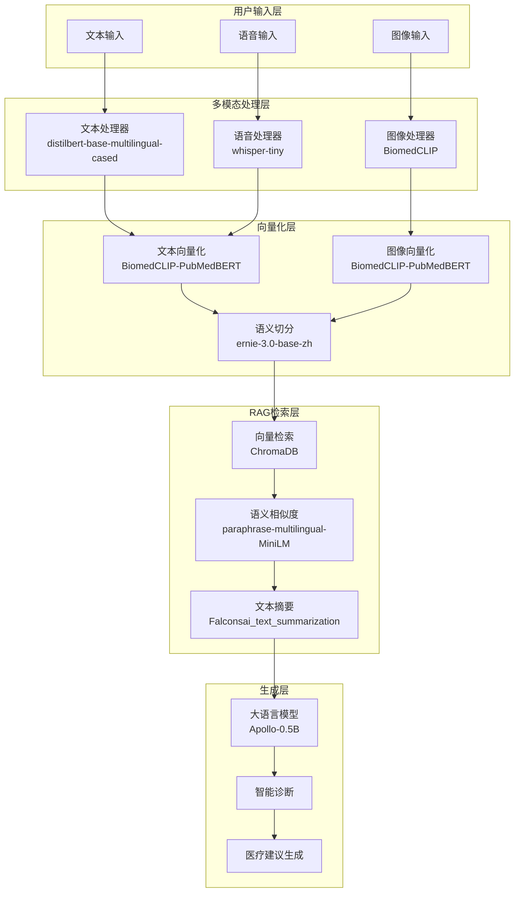

# 智诊通多模态系统 - 模型使用流程图

## 整体架构图



## 详细使用流程

### 1. 输入处理阶段

#### 文本输入处理

```
用户文本 → distilbert-base-multilingual-cased → 文本分类和质量评估
```

#### 语音输入处理

```
用户语音 → whisper-tiny → 语音转文本 → 文本处理
```

#### 图像输入处理

```
用户图像 → BiomedCLIP-PubMedBERT → 图像特征提取和分类
```

### 2. 向量化处理阶段

#### 文本向量化

```
处理后的文本 → BiomedCLIP-PubMedBERT → 512维向量
```

#### 图像向量化

```
处理后的图像 → BiomedCLIP-PubMedBERT → 512维向量
```

#### 语义切分

```
长文档 → ernie-3.0-base-zh → 语义块切分 → 768维向量
```

### 3. RAG 检索阶段

#### 向量检索

```
用户查询向量 → ChromaDB → 相似文档检索
```

#### 语义相似度计算

```
检索结果 → paraphrase-multilingual-MiniLM → 相似度排序
```

#### 内容摘要

```
检索到的长文档 → Falconsai_text_summarization → 关键信息摘要
```

### 4. 智能生成阶段

#### 大语言模型生成

```
检索到的知识 + 用户问题 → Apollo-0.5B → 医疗诊断建议
```

## 各模型详细功能

### 🤖 Apollo-0.5B (大语言模型)

- **作用**: 系统的核心推理引擎
- **使用环节**: 最终答案生成
- **功能**:
  - 理解用户医疗问题
  - 基于检索到的知识生成诊断建议
  - 提供医疗咨询和健康指导
- **配置**: 2048 最大长度，0.7 温度，支持医疗领域对话

### 🔍 BiomedCLIP-PubMedBERT_256-vit_base_patch16_224 (多模态向量化)

- **作用**: 统一的多模态向量化模型
- **使用环节**: 文本和图像向量化
- **功能**:
  - 将文本转换为 512 维向量
  - 将图像转换为 512 维向量
  - 支持跨模态检索（文本查图像，图像查文本）
- **优势**: 专门针对医疗领域训练，支持中英文

### 🎤 whisper-tiny (语音识别)

- **作用**: 语音转文本
- **使用环节**: 语音输入处理
- **功能**:
  - 将用户语音转换为文本
  - 支持多种语言和方言
  - 实时语音识别
- **配置**: 16kHz 采样率，支持离线运行

### 📝 distilbert-base-multilingual-cased (文本分类)

- **作用**: 文本质量评估和分类
- **使用环节**: 文本预处理阶段
- **功能**:
  - 评估输入文本质量
  - 分类文本类型（症状描述、治疗咨询等）
  - 多语言支持
- **优势**: 轻量级，处理速度快

### 🔤 ernie-3.0-base-zh (语义切分)

- **作用**: 文档语义切分和相似度计算
- **使用环节**: 知识库构建和检索优化
- **功能**:
  - 将长文档切分为语义相关的块
  - 计算文本相似度
  - 优化检索精度
- **配置**: 512 最大长度，768 维向量

### 📄 Falconsai_text_summarization (文本摘要)

- **作用**: 长文档摘要生成
- **使用环节**: RAG 检索结果处理
- **功能**:
  - 将检索到的长文档摘要为关键信息
  - 提取医疗知识要点
  - 优化上下文长度
- **配置**: 100 最大长度，30 最小长度，支持医疗摘要

### 🔗 paraphrase-multilingual-MiniLM-L12-v2 (语义相似度)

- **作用**: 语义相似度计算
- **使用环节**: 检索结果排序
- **功能**:
  - 计算查询与文档的语义相似度
  - 对检索结果进行排序
  - 提高检索准确性
- **配置**: 512 维向量，支持多语言

## 系统工作流程

### 完整处理流程

1. **用户输入** → 多模态输入（文本/语音/图像）
2. **模态识别** → 识别输入类型并分发到对应处理器
3. **预处理** → 各模态数据清洗和标准化
4. **向量化** → 将处理后的数据转换为向量表示
5. **知识检索** → 在向量数据库中检索相关知识
6. **结果排序** → 基于相似度对检索结果排序
7. **内容摘要** → 对长文档进行摘要处理
8. **智能生成** → 基于检索到的知识生成最终回答
9. **结果输出** → 返回医疗诊断建议和健康指导

### 关键特性

- **多模态融合**: 支持文本、语音、图像的统一处理
- **医疗专业化**: 所有模型都针对医疗领域优化
- **离线运行**: 所有模型都支持本地部署
- **高效检索**: 基于向量的快速语义检索
- **智能摘要**: 自动提取关键医疗信息
- **多语言支持**: 支持中英文混合处理

这个系统通过 8 个专业模型的协同工作，实现了从多模态输入到智能医疗诊断建议的完整流程。

