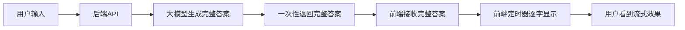
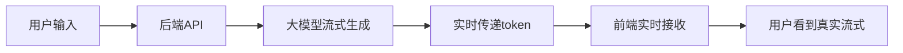
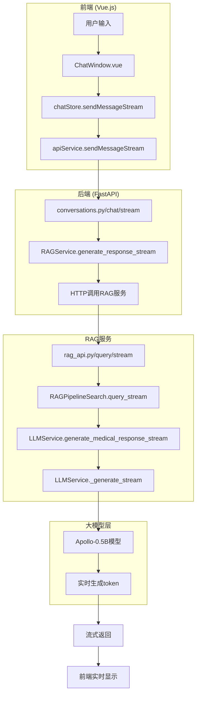

# 流式输出原理详解

## 概述

流式输出是指 AI 模型生成回答时，不是等待完整答案生成完毕后再返回，而是实时地将生成的每个 token（词元）逐步传递给前端，让用户看到"一个字一个字"的显示效果。

## 两种实现模式对比

### 1. 伪流式输出（前端控制）



**特点：**

- ✅ 实现简单
- ✅ 不依赖大模型流式支持
- ❌ 用户等待时间长
- ❌ 体验不够真实
- ❌ 无法中途停止

### 2. 真流式输出（全链路流式）



**特点：**

- ✅ 真正的实时体验
- ✅ 用户看到模型实时生成
- ✅ 可以中途停止
- ❌ 实现复杂
- ❌ 需要全链路支持

## 当前项目实现分析

### 架构图



### 技术实现细节

#### 1. 后端流式 API 实现

```python
# codes/backend/app/api/conversations.py
@router.post("/chat/stream")
async def chat_with_ai_stream():
    async def generate_stream():
        # 发送开始信号
        yield f"data: {json.dumps({'type': 'start'})}\n\n"

        # 调用RAG服务的流式生成
        async for chunk in rag_service.generate_response_stream():
            # 发送数据块
            yield f"data: {json.dumps(chunk)}\n\n"

        # 发送结束信号
        yield f"data: {json.dumps({'type': 'end'})}\n\n"

    return StreamingResponse(generate_stream(), media_type="text/event-stream")
```

#### 2. RAG 服务流式实现

```python
# codes/backend/app/services/rag_service.py
async def generate_response_stream(self):
    # 调用RAG服务
    async for chunk in rag_service.query_stream():
        # 模拟流式输出：将回复分成小块逐步发送
        chunk_size = 20  # 每次发送20个字符
        for i in range(0, len(answer), chunk_size):
            chunk = answer[i:i + chunk_size]
            yield {
                'type': 'content',
                'content': chunk,
                'full_content': full_response
            }
            await asyncio.sleep(0.1)  # 模拟延迟
```

#### 3. LLM 服务流式实现

```python
# codes/services/knowledge_retrieval_service/core/llm_service.py
def _generate_stream(self, prompt: str):
    # 流式生成
    for output in self.model.generate(inputs, **generation_config):
        new_tokens = output.sequences[0][inputs.shape[1]:]
        if len(new_tokens) > 0:
            new_text = self.tokenizer.decode(new_tokens)
            yield new_text
```

#### 4. 前端流式处理

```typescript
// codes/frontend/src/services/apiService.ts
async sendMessageStream(conversationId, message, onMessage, onError, onComplete) {
    const response = await fetch(`/api/v1/conversations/${conversationId}/messages/stream`, {
        method: 'POST',
        body: JSON.stringify(message)
    });

    const reader = response.body.getReader();
    const decoder = new TextDecoder();

    while (true) {
        const { done, value } = await reader.read();
        if (done) break;

        const chunk = decoder.decode(value);
        const lines = chunk.split('\n');

        for (const line of lines) {
            if (line.startsWith('data: ')) {
                const data = JSON.parse(line.slice(6));
                onMessage(data);
            }
        }
    }
}
```

#### 5. 前端状态管理

```typescript
// codes/frontend/src/stores/chat.ts
const sendMessageStream = async (request) => {
  await conversationApi.sendMessageStream(conversationId, message, (data) => {
    switch (data.type) {
      case "content":
        // 更新AI消息内容
        aiMessage.content = data.full_content;
        break;
      case "done":
        aiMessage.status = "sent";
        break;
    }
  });
};
```

## 关键技术点

### 1. Server-Sent Events (SSE)

```http
Content-Type: text/event-stream
Cache-Control: no-cache
Connection: keep-alive
```

**数据格式：**

```
data: {"type": "start", "message": "开始生成回复..."}

data: {"type": "content", "content": "根据您", "full_content": "根据您"}

data: {"type": "content", "content": "的症状", "full_content": "根据您的症状"}

data: {"type": "done", "full_content": "根据您的症状，建议..."}
```

### 2. 流式传输协议

- **HTTP/1.1**: 使用分块传输编码
- **WebSocket**: 双向实时通信
- **SSE**: 单向服务器推送（当前使用）

### 3. 前端流式处理

```javascript
// 使用ReadableStream API
const reader = response.body.getReader();
const decoder = new TextDecoder();

while (true) {
  const { done, value } = await reader.read();
  if (done) break;

  const chunk = decoder.decode(value, { stream: true });
  // 处理数据块
}
```

## 性能优化

### 1. 缓冲机制

```python
# 避免过于频繁的传输
chunk_size = 20  # 每次发送20个字符
await asyncio.sleep(0.1)  # 100ms延迟
```

### 2. 错误处理

```python
try:
    async for chunk in rag_service.generate_response_stream():
        yield f"data: {json.dumps(chunk)}\n\n"
except Exception as e:
    error_chunk = {
        'type': 'error',
        'message': f'生成失败: {str(e)}'
    }
    yield f"data: {json.dumps(error_chunk)}\n\n"
```

### 3. 连接管理

```python
headers={
    "Cache-Control": "no-cache",
    "Connection": "keep-alive",
    "Content-Type": "text/event-stream",
}
```

## 实际应用场景

### 1. 长文本生成

- 医学诊断报告
- 详细症状分析
- 治疗方案建议

### 2. 实时交互

- 用户可以看到 AI 思考过程
- 可以中途停止生成
- 提供更好的用户体验

### 3. 多模态支持

- 文本+图片分析
- 语音转文字+分析
- 综合多模态输入

## 总结

当前项目采用的是**真流式输出**模式，整个链路都是流式的：

1. **大模型层**：Apollo-0.5B 模型实时生成 token
2. **RAG 服务层**：将 token 流式传递给后端
3. **后端 API 层**：使用 SSE 协议流式传输
4. **前端层**：实时接收并显示

这种实现方式提供了真正的实时体验，用户看到的是 AI 模型实时生成的内容，而不是前端模拟的效果。
